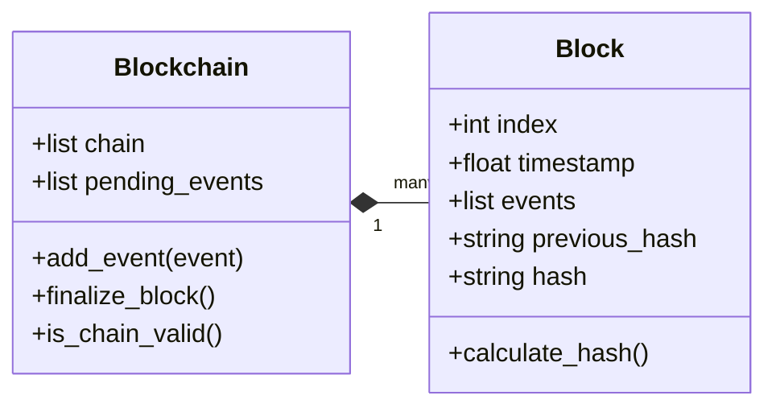

# Core Module (`hierachain/core/*`)

## Mục đích

Mô-đun Core cung cấp cấu trúc dữ liệu và thuật toán nền tảng: `Block`, `Blockchain`, schema Arrow, băm/Merkle, và tiện ích hiệu năng. Đây là lớp thấp nhất mà các tầng `hierarchical/*` dựa vào.

## Kiến trúc & khái niệm

* Block sử dụng Apache Arrow để lưu trữ Event theo dạng cột, tối ưu truy vấn/bộ nhớ.
* Blockchain quản lý Chain: tạo genesis, thêm Block/Event, kiểm tra tính hợp lệ và thống kê.
* Schema chuẩn hoá cấu trúc Event và Block để tương thích đa ngôn ngữ.
* Hash/Merkle đảm bảo tính toàn vẹn dữ liệu, phục vụ tạo Proof ở cấp Sub-Chain.



## API công khai (Public API)

### Block

file: `hierachain/core/block.py`

Chữ ký quan trọng (rút gọn, dạng mô tả):

```python
class Block:
  __init__(index, events, timestamp=None, previous_hash="", nonce=0, merkle_root=None, creator_id=None, signature=None)
  events  # property: trả về pyarrow.Table
  calculate_merkle_root()
  calculate_hash()
  get_events_by_entity(entity_id)
  get_events_by_type(event_type)
  to_event_list()
  validate_structure()
  to_dict()
  from_dict(data)
```

Ví dụ tối thiểu:

```python
# Ví dụ (không đầy đủ import):
  from hierachain.core.block import Block
  events = [{
      "entity_id": "PROD-001",
      "event": "production_complete",
      "timestamp": 1703088000.0,
      "details": {"quantity": 100},  # sẽ được chuẩn hoá thành Map(str,str)
      "data": b"{}",
  }]
  blk = Block(index=1, events=events, previous_hash="<genesis-hash>")
  blk_hash = blk.calculate_hash()
```

### Blockchain

file: `hierachain/core/blockchain.py`

Chữ ký quan trọng:

```python
class Blockchain:
  __init__(name="Blockchain")
  create_genesis_block()
  get_latest_block()
  add_event(event)
  create_block(events=None)
  add_block(block)
  finalize_block()
  is_valid_new_block(block)
  is_chain_valid()
  get_events_by_entity(entity_id)
  get_events_by_type(event_type)
  get_events_by_filter(filter_func)
  get_chain_stats()
  to_dict()
  from_dict(data)
```

Ví dụ tối thiểu:

```python
from hierachain.core.blockchain import Blockchain

bc = Blockchain(name="ExampleChain")
bc.create_genesis_block()
bc.add_event({
    "entity_id": "PROD-001",
    "event": "quality_checked",
    "timestamp": 1703089000.0,
    "details": {"status": "ok"},
    "data": b"{}",
})
bc.finalize_block()  # đóng block hiện tại (nếu đủ điều kiện)
assert bc.is_chain_valid()
```

### Schemas

file: `hierachain/core/schemas.py`

Event schema (rút gọn):

```python
EVENT_SCHEMA = schema([
  ('entity_id', string),
  ('event', string),
  ('timestamp', float64),
  ('details', map<string, string>),
  ('data', binary),
])
```

Block header schema và transaction schema cũng được định nghĩa nhằm chuẩn hoá lưu trữ và tương thích liên ngôn ngữ.

### Caching

file: `hierachain/core/caching.py`

Hệ thống caching nâng cao với nhiều chính sách loại bỏ và hỗ trợ TTL:

```python
class AdvancedCache:
  __init__(max_size=10000, eviction_policy="lru")  # lru, lfu, fifo, ttl
  get(key) -> Any | None
  set(key, value, ttl=None)
  delete(key)
  clear()
  get_stats() -> dict  # hits, misses, hit_ratio, size
  cleanup_ttl()

class BlockchainCacheManager:
  __init__(chain, config=None)
  get_block(chain_name, index)       # 42x faster khi cached
  get_entity_events(entity_id, chain_type="all")  # 18.9x faster
  get_events_for_block(chain_name, index)
  get_cache_stats()
  warm_cache(entity_ids)
  optimize_cache()
  shutdown()
```

Ví dụ:

```python
from hierachain.core.caching import BlockchainCacheManager

cache_mgr = BlockchainCacheManager(hierarchy_manager, config={
    "block_cache_size": 1000,
    "entity_cache_size": 5000,
    "default_ttl": 300  # 5 phút
})
events = cache_mgr.get_entity_events("PROD-001")  # cached lookup
```

### Domain Contract

file: `hierachain/core/domain_contract.py`

Hệ thống hợp đồng miền với quản lý vòng đời và versioning:

```python
class ContractStatus(Enum):
  DEVELOPMENT, TESTING, ACTIVE, DEPRECATED, DISABLED, ARCHIVED

class DomainContract:
  __init__(contract_id, name, version="1.0.0", domain_type="generic")
  # Lifecycle
  activate(); deprecate(reason); disable(reason)
  get_status_info()
  # Versioning
  upgrade_version(new_version, migration_func=None)
  # Execution
  execute(action, params, context=None) -> result
  register_handler(action, handler_func)
  # Storage
  storage.set(key, value); storage.get(key)
  # Events
  get_execution_history(limit=100)
```

Ví dụ:

```python
from hierachain.core.domain_contract import DomainContract

contract = DomainContract("supply_contract", "Supply Chain Contract", version="1.0.0")
contract.register_handler("validate_shipment", validate_fn)
contract.activate()
result = contract.execute("validate_shipment", {"shipment_id": "SHIP-001"})
```

### Parallel Engine

file: `hierachain/core/parallel_engine.py`

Xử lý song song với worker pools và các chính sách xử lý chuyên biệt:

```python
class ProcessingPolicy(Enum):
  DEFAULT, VALIDATION, INDEXING, BATCH, PRIORITY

class ParallelProcessingEngine:
  __init__(max_workers=None, chunk_size=100)
  # Processing
  process_batch(data_batch, processor_func, policy="default") -> list[ProcessingResult]
  process_chunks(data, processor_func, policy="default")
  # Block operations
  parallel_validate_blocks(blocks) -> list[ProcessingResult]
  parallel_index_events(events)
  parallel_hash_blocks(blocks)
  # Pool management
  create_worker_pool(pool_name, max_workers, pool_type="thread")
  register_policy(policy_name, policy_func)
  get_engine_stats()
  shutdown()
```

Ví dụ:

```python
from hierachain.core.parallel_engine import ParallelProcessingEngine

engine = ParallelProcessingEngine(max_workers=8, chunk_size=50)
results = engine.parallel_validate_blocks(blocks)
engine.shutdown()
```

## Cấu hình

* Core không yêu cầu cấu hình riêng biệt; các tuỳ chọn thường ở tầng trên (ví dụ `hierachain/config/settings.py`) hoặc tại Sub-Chain/Ordering.

## Tính năng & hạn chế

* Tính năng:

  * Lưu trữ sự kiện bằng Apache Arrow, hiệu quả bộ nhớ.
  * Băm và Merkle root xác định (deterministic) để phục vụ proof.
  * Truy vấn theo entity/type/filter trên chuỗi.

* Hạn chế/ghi chú:

  * Payload `data` dạng nhị phân; người dùng cần tự tuần tự hoá phù hợp.
  * `details` chuẩn hoá về Map(str,str); giá trị phi chuỗi sẽ được chuyển thành chuỗi.

## Bảo mật & quyền truy cập

* Bảo mật ở lớp Core chủ yếu liên quan tính toàn vẹn (hash/Merkle). Kiểm soát truy cập nằm ở tầng `security/*` và `api/*`.

## Xử lý lỗi & khắc phục

* Các lớp chuỗi (Sub-Chain/Main Chain) kết hợp cơ chế `journal`, `rollback_manager`, `recovery_engine` ở tầng `error_mitigation/*`.

## Hiệu năng

* Apache Arrow (cột) giúp giảm overhead chuyển đổi và tăng tốc truy vấn.
* Hash/Merkle tối ưu hoá để tính toán nhanh trên danh sách sự kiện.

## FAQ

!!! question "Tại sao dùng Arrow?"

    Giảm chi phí chuyển đổi, tăng hiệu quả bộ nhớ và phù hợp khối lượng sự kiện lớn.

!!! question "Có thể nhúng dữ liệu tuỳ ý?"

    Có, qua trường `data` (binary). Khuyến nghị giới hạn kích thước và tuần tự JSON/binary hợp lý.

## Liên quan

* Kiến trúc tổng quan: [Tổng quan](../architecture/overview.md)
* Thuật ngữ: [Thuật ngữ](../glossary.md)

---

??? info "Thông tin kỹ thuật bổ sung (Metadata)"

    **FACT**

    * `Block` (Arrow Table nội bộ) và các phương thức: `calculate_hash`, `calculate_merkle_root`, `to_event_list`, `validate_structure`, ... (xem `core/block.py`).
    * `Blockchain` cung cấp: `create_genesis_block`, `add_event`, `finalize_block`, `is_chain_valid`, `get_chain_stats`, ... (xem `core/blockchain.py`).
    * Schema sự kiện/block nằm tại `core/schemas.py` (bao gồm `get_event_schema`, `get_block_header_schema`, `get_transaction_schema`, `get_block_schema`).
    * Caching: `core/caching.py` (`AdvancedCache`, `BlockchainCacheManager` với hiệu năng tăng 18-42x khi cached).
    * Domain Contract: `core/domain_contract.py` (`DomainContract` với lifecycle, versioning, storage).
    * Parallel Engine: `core/parallel_engine.py` (`ParallelProcessingEngine`, `WorkerPool` với đa chính sách xử lý).

    **DECISION**

    * Chuẩn hoá sự kiện qua Arrow Schema để tương thích đa ngôn ngữ và tối ưu hiệu năng.
    * Duy trì hash/Merkle xác định phục vụ bằng chứng ở tầng Hierarchical.

    **ASSUMPTION**

    * Người dùng cung cấp sự kiện có đầy đủ trường cần thiết theo schema.
    * Ứng dụng tầng trên chịu trách nhiệm kiểm soát truy cập và xác thực.

    **INVARIANT**

    * Hàm băm và merkle root phải xác định với cùng dữ liệu đầu vào.
    * Chuỗi hợp lệ khi tất cả liên kết `previous_hash` nối nhau chính xác và mỗi block vượt qua kiểm chứng cấu trúc.

    **EDGE CASES**

    * Sự kiện thiếu trường bắt buộc → `validate_structure` hoặc logic thêm block cần phát hiện và từ chối.
    * Giá trị `details` phi chuỗi → sẽ được chuyển sang chuỗi; cần chú ý khi so sánh.
