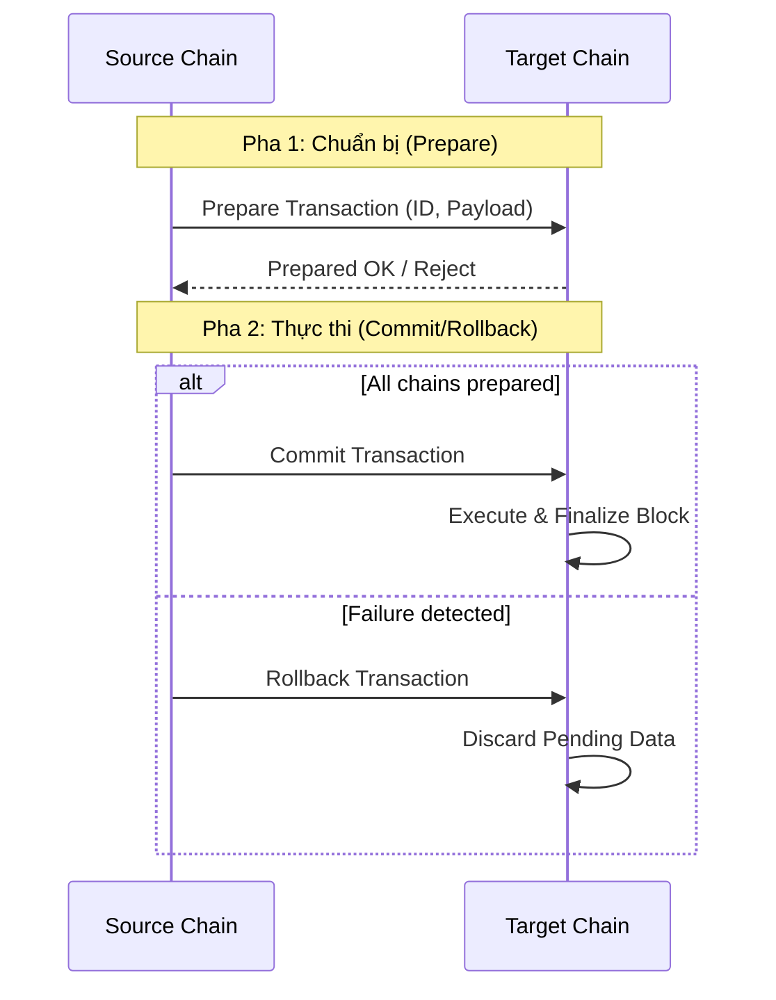

# Domains Module (`hierachain/domains/*`)

## Tổng quan

Module **Domains** là lớp trung gian quan trọng kết nối hạ tầng Blockchain lõi với các quy trình nghiệp vụ thực tế của doanh nghiệp. Nó cung cấp các khuôn mẫu (templates) chuẩn hóa để xây dựng các chuỗi nghiệp vụ (Sub-Chains), quản lý vòng đời của các thực thể (Entities), và đảm bảo tính nhất quán dữ liệu trên toàn hệ thống HieraChain.

---

## Các thành phần cốt lõi

<div class="grid cards" markdown>

*   :material-link-variant:{ .lg .middle } __Business Chains__

    ---

    __Files__: `base_chain.py`, `domain_chain.py`

    * Lớp trừu tượng cho các quy trình nghiệp vụ chuyên biệt.
    * Tích hợp sẵn quản lý trạng thái thực thể (Registration, Status Update).
    * Cơ chế **Two-Phase Commit (2PC)** cho giao dịch xuyên chuỗi.

*   :material-calendar-check:{ .lg .middle } __Enterprise Events__

    ---

    __Files__: `base_event.py`, `domain_event.py`

    * Chuẩn hóa sự kiện doanh nghiệp: Approval, Quality Check, Compliance.
    * Tự động xác thực cấu trúc sự kiện theo quy tắc Ledger.
    * Factory functions để tạo sự kiện nhanh chóng và chính xác.

*   :material-shield-search:{ .lg .middle } __Integrity Utils__

    ---

    __Files__: `cross_chain_validator.py`, `entity_tracer.py`

    * **Cross-Chain Validator**: Phát hiện mâu thuẫn logic giữa các chuỗi.
    * **Entity Tracer**: Truy vết toàn bộ lịch sử của một đối tượng trên mọi Sub-Chain.
    * **Compliance Scanner**: Quét và ngăn chặn thuật ngữ tiền mã hóa.

</div>

---

## Quản lý Nghiệp vụ (Domain Management)

### Vòng đời thực thể (Entity Lifecycle)

Mọi `DomainChain` đều hỗ trợ quản lý trạng thái thực thể một cách tự động thông qua các trình xử lý sự kiện (Event Handlers) mặc định:

1.  **Registration**: Đăng ký thực thể mới vào chuỗi nghiệp vụ.
2.  **Status Tracking**: Theo dõi trạng thái hiện tại (ví dụ: `In Production`, `Quality Passed`, `Shipped`).
3.  **Resource Allocation**: Gắn kết tài nguyên (nhân lực, máy móc, nguyên liệu) với thực thể.
4.  **Compliance Monitoring**: Ghi nhận các kết quả kiểm tra tuân thủ quy định.

### Chỉ số vận hành (Operation Metrics)

Hệ thống tự động theo dõi các KPI quan trọng thông qua `OperationMetricsTracker`:
*   **Success Rate**: Tỷ lệ hoàn thành công việc thành công.
*   **Quality Pass Rate**: Tỷ lệ đạt kiểm tra chất lượng.
*   **Approval Rate**: Tỷ lệ phê duyệt từ cấp quản lý.
*   **Compliance Violations**: Số lượng vi phạm quy trình được phát hiện.

---

## Cơ chế Giao dịch Hai pha (Two-Phase Commit - 2PC)

Để đảm bảo tính nhất quán khi thực hiện các hoạt động ảnh hưởng đến nhiều chuỗi khác nhau, `DomainChain` tích hợp giao thức 2PC:



---

## Kiểm soát Tuân thủ và Bảo mật

### Ngăn chặn Thuật ngữ Tiền mã hóa (Cryptocurrency Terminology)

Theo triết lý HieraChain, `CrossChainValidator` thực hiện quét nghiêm ngặt và đánh dấu các vi phạm nếu phát hiện thuật ngữ liên quan đến tiền mã hóa trong dữ liệu sự kiện:
*   **Danh sách cấm**: `transaction`, `mining`, `coin`, `token`, `wallet`, `address`, `amount`, `fee`, v.v.
*   **Hành động**: Ghi nhận vi phạm vào báo cáo tuân thủ hệ thống (`Ledger_compliance`).

### Truy vết xuyên chuỗi (Cross-Chain Tracing)

`EntityTracer` cho phép người quản trị tái hiện lại toàn bộ "hành trình" của một thực thể qua nhiều phòng ban/chuỗi khác nhau:

```python
from hierachain.domains.generic.utils.entity_tracer import EntityTracer

tracer = EntityTracer(hierarchy_manager)
# Lấy lịch sử thực thể "ORDER-789" trên toàn bộ hệ thống
trace_results = tracer.trace_entity_across_chains("ORDER-789")

for chain_name, events in trace_results.items():
    print(f"Hoạt động tại {chain_name}: {len(events)} sự kiện.")
```

---

## Các loại sự kiện chuẩn hóa

| Loại sự kiện | Vai trò nghiệp vụ | Các trường chi tiết (Details) |
| :--- | :--- | :--- |
| `operation_start` | Bắt đầu quy trình | `operation_type`, `operator_id` |
| `quality_check` | Kiểm tra chất lượng | `check_type`, `check_result`, `inspector_id` |
| `approval` | Phê duyệt quản lý | `approval_type`, `approval_status`, `approver_id` |
| `compliance_check` | Kiểm tra tuân thủ | `compliance_type`, `compliance_status`, `regulation_ref` |
| `resource_assigned` | Phân bổ tài nguyên | `resource_id`, `resource_type`, `allocation_type` |

---

## Liên quan

*   [Hệ thống Phân cấp (Hierarchical)](./hierarchical.md)
*   [Cấu trúc Blockchain Lõi (Core)](./core.md)
*   [Hướng dẫn Tích hợp ERP](../integration/erp_adapters.md)
