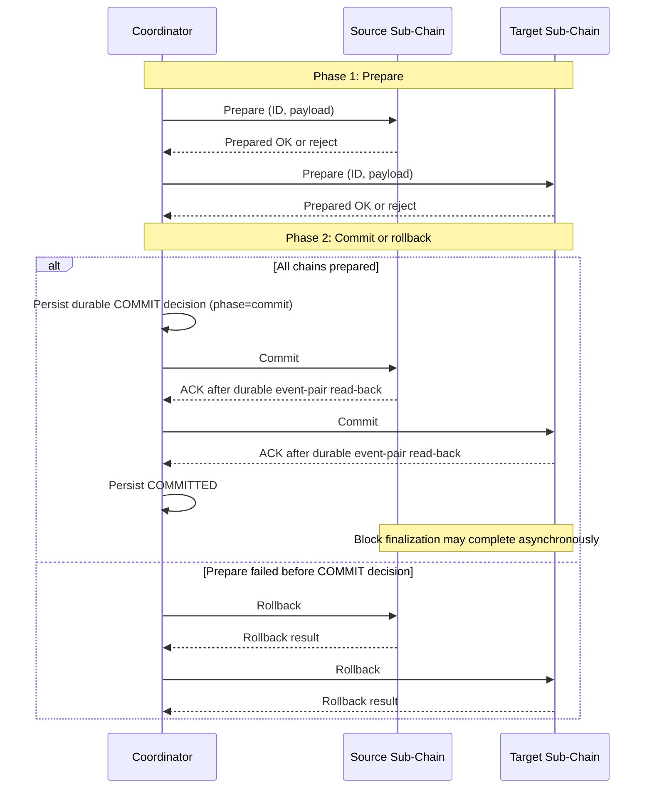

# Domains Module (`hierachain/domains/*`)

## 1. Tổng quan

Module `domains` kết nối hạ tầng chuỗi khối cốt lõi với logic nghiệp vụ doanh nghiệp. Module cung cấp các lớp cơ sở cho các Sub-Chain chuyên biệt, hàm tạo sự kiện chuẩn hóa, công cụ hỗ trợ vòng đời thực thể và tiện ích truy vết liên chuỗi.

## 2. Các thành phần cốt lõi

Các thành phần được tổ chức thành ba gói con dưới `hierachain/domains/`:

### 2.1 Chuỗi nghiệp vụ (`chains/base_chain.py`, `chains/domain_chain.py`)

* `BaseChain`: Lớp cơ sở trừu tượng quản lý trạng thái chuỗi, sổ đăng ký thực thể và quy trình xử lý sự kiện.
* `DomainChain`: Triển khai cụ thể hỗ trợ thao tác nghiệp vụ, kiểm tra tính hợp lệ của thao tác và trình quản lý giao dịch.
* `chains/metrics.py`: Theo dõi tổng số thao tác và các tỷ lệ tổng hợp; không ghi nhận độ trễ thực thi.

### 2.2 Sự kiện doanh nghiệp (`events/base_event.py`, `events/event_creators.py`)

* `BaseEvent`: Lớp cơ sở cho các sự kiện nghiệp vụ có cấu trúc kèm kiểm tra lược đồ.
* `event_creators.py`: Các hàm tiện ích tạo đối tượng sự kiện cho các thao tác: `create_quality_check`, `create_approval`, `create_resource_allocation` và `create_status_update`.

### 2.3 Tiện ích toàn vẹn (`utils/cross_chain_validator.py`, `utils/entity_tracer.py`)

* `CrossChainValidator`: Đánh giá tính nhất quán giữa các chuỗi con và kiểm tra thuật ngữ tiền mã hóa bị cấm.
* `EntityTracer`: Tái hiện đầy đủ lịch sử của thực thể xuyên suốt các chuỗi trong hệ thống.
* `utils/compliance_checker.py`: Kiểm tra tham số tuân thủ đối chiếu với quy định.

## 3. Quản lý nghiệp vụ và vòng đời thực thể

`DomainChain` cung cấp sẵn các bước chuyển vòng đời:

1. Đăng ký: Gắn định danh `entity_id` duy nhất với loại thực thể và thuộc tính metadata.
2. Cập nhật trạng thái: Theo dõi các trạng thái tuần tự (`in_progress`, `quality_approved`, `completed`).
3. Phân bổ tài nguyên: Theo dõi tài nguyên đã phân công và đã giữ chỗ. `assigned` thêm vào `allocated_resources` (và bỏ giữ chỗ); `reserved` thêm vào `reserved_resources`; `released` xóa khỏi một trong hai danh sách; `transferred` chuyển tài nguyên đã phân công sang thực thể đã đăng ký khác theo `details.target_entity_id`. Chuyển trạng thái không hợp lệ bị từ chối trước khi gửi event.
4. Chỉ số vận hành: `OperationMetricsTracker` cung cấp tổng số thao tác và các tỷ lệ tổng hợp, không có độ trễ hoặc phân nhóm theo loại thao tác.

Sự kiện nghiệp vụ yêu cầu thực thể đã đăng ký. `register_entity` lưu dữ liệu ban đầu được cung cấp trong event đăng ký của Sub-Chain để có thể dựng lại registry sau khi khởi động lại; dữ liệu này trở thành nội dung sổ cái nên không được chứa bí mật. Event đăng ký cũ không có `initial_data` chỉ khôi phục metadata đăng ký mà hệ thống hỗ trợ.

Dữ liệu ban đầu của thực thể dùng JSON chuẩn với số hữu hạn. Giá trị số nguyên Python, kể cả lớn hơn 64 bit, được khôi phục chính xác trong giới hạn chuyển đổi số nguyên đã cấu hình của Python. Định danh số cần đi qua client có khoảng số nguyên nhỏ hơn nên dùng chuỗi. Giá trị không được hỗ trợ khiến `register_entity` trả về `False` trước khi ghi event đăng ký.

Event bắt đầu và hoàn tất thao tác được thêm vào sổ cái, đồng thời cập nhật projection trong bộ nhớ dưới khóa của chain. Khi event bắt đầu được chấp nhận, `current_operation` được đặt nên thao tác bắt đầu khác của cùng thực thể bị từ chối cho đến khi hoàn tất. Event nghiệp vụ trả `False` đã bị từ chối trước khi thêm. Trả `True` có nghĩa ordering service đã chấp nhận event; điều đó không có nghĩa signed block đã finalize hoặc lưu bền vững. Nếu handler chạy sau khi thêm event bị lỗi, event vẫn được chấp nhận, lỗi được ghi log và `domain_projection_healthy` chuyển thành `false`. Sau đó các lần ghi domain bị từ chối cho tới khi `rebuild_domain_state()` thành công. Rebuild chỉ chạy lại projection built-in có tính xác định; nếu lịch sử có custom handler thì hệ thống báo không thể tự phục hồi handler đó, vì chạy lại có thể lặp side effect bên ngoài.

Bộ đếm thao tác hoàn tất được dựng lại từ các event thao tác đã chấp nhận. Các bộ đếm chi tiết của `OperationMetricsTracker` chỉ tồn tại trong tiến trình và trở về zero sau khi khởi động lại. Participant 2PC giữ snapshot sâu của payload đã xác thực khi prepare. `pending_transactions` trả snapshot tách rời; prepare lặp chỉ thành công khi payload và vai trò participant đều khớp. Kiểm tra proof đánh dấu event thiếu `sub_chain_name`, `proof_hash` hoặc `timestamp` là không nhất quán. Event có `details` sai cấu trúc được báo lỗi cấu trúc và bỏ qua trong lượt phân tích logic thay vì gây exception.

## 4. Điều phối Two-Phase Commit (2PC)

Các thao tác phối hợp giữa nhiều Sub-Chain thực thi qua giao thức Two-Phase Commit:


```mermaid
sequenceDiagram
    participant Coordinator
    participant Source as Source Sub-Chain
    participant Target as Target Sub-Chain

    Note over Coordinator, Target: Phase 1: Prepare
    Coordinator->>Source: Prepare (ID, payload)
    Source-->>Coordinator: Prepared OK or reject
    Coordinator->>Target: Prepare (ID, payload)
    Target-->>Coordinator: Prepared OK or reject

    Note over Coordinator, Target: Phase 2: Commit or rollback
    alt All chains prepared
        Coordinator->>Coordinator: Persist durable COMMIT decision (phase=commit)
        Coordinator->>Source: Commit
        Source-->>Coordinator: ACK after durable event-pair read-back
        Coordinator->>Target: Commit
        Target-->>Coordinator: ACK after durable event-pair read-back
        Coordinator->>Coordinator: Persist COMMITTED
        Note over Source, Target: Block finalization may complete asynchronously
    else Prepare failed before COMMIT decision
        Coordinator->>Source: Rollback
        Source-->>Coordinator: Rollback result
        Coordinator->>Target: Rollback
        Target-->>Coordinator: Rollback result
    end
```

Sau khi ghi bền quyết định COMMIT, nếu thiếu ACK từ participant thì thao tác ở trạng thái `IN_DOUBT` để forward recovery tiếp tục. Coordinator không rollback quyết định commit đã được lưu bền vững.

## 5. Tuân thủ và truy vết liên chuỗi

### Lọc thuật ngữ tiền mã hóa

`CrossChainValidator` quét dữ liệu sự kiện để đảm bảo quy định về thuật ngữ doanh nghiệp. Nếu phát hiện các từ như `coin`, `token`, `mining` hoặc `wallet` trong dữ liệu nghiệp vụ, validator sẽ đánh dấu sự kiện vi phạm quy định.

### Truy vết thực thể liên chuỗi

`EntityTracer` tổng hợp các sự kiện của một thực thể trên toàn bộ Sub-Chain:

```python
from hierachain.domains.utils.entity_tracer import EntityTracer

tracer = EntityTracer(hierarchy_manager)
trace_results = tracer.trace_entity("ORDER-789")

print(f"Total events found: {trace_results['total_events']}")
for chain_name, summary in trace_results.get("chain_details", {}).items():
    print(f"Activity at {chain_name}: {summary['total_events']} events")
```

## 6. Các loại thao tác chuẩn hóa

| Loại thao tác | Vai trò nghiệp vụ | Các trường bắt buộc |
| :--- | :--- | :--- |
| `quality_check` | Kiểm tra chất lượng | `check_type`, `check_result` |
| `approval` | Phê duyệt quản lý | `approval_type`, `approver_id` |
| `resource_allocation` | Phân bổ tài nguyên | `resource_type`, `resource_id` |
| `compliance_check` | Kiểm tra tuân thủ | `compliance_type` |

## Liên quan

* [Hierarchical Module](./hierarchical.md)
* [Xây dựng Logic Miền Nghiệp vụ](../how-to/write-domain-contracts.md)
* [Tích hợp ERP](../workflows/erp-integration.md)
