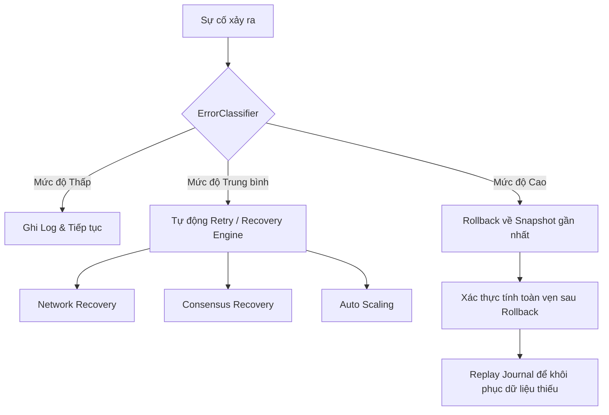

# Error Mitigation Module (`hierachain/error_mitigation/*`)

## Tổng quan

Module **Error Mitigation** đóng vai trò là "lưới an toàn" của HieraChain, đảm bảo hệ thống luôn duy trì tính toàn vẹn và khả năng tự phục hồi (resilience) trước các sự cố phần cứng, phần mềm hoặc mạng. Hệ thống này kết hợp các kỹ thuật ghi nhật ký bền vững (Durability), phân loại lỗi thông minh và các kịch bản phục hồi tự động.

---

## Kiến trúc Phòng thủ Đa tầng

<div class="grid cards" markdown>

*   :material-shield-check:{ .lg .middle } __Validation Layer__

    ---

    __Files__: `validator.py`, `data_validator.py`

    * **Validator**: Kiểm tra cấu trúc Block/Event theo Ledger guidelines.
    * **DataValidator**: Xác thực sâu logic nghiệp vụ, schema Arrow và tính hợp lệ của dữ liệu đầu vào.

*   :material-notebook-edit:{ .lg .middle } __Durable Journaling__

    ---

    __File__: `journal.py`

    * Sử dụng **Apache Arrow** để ghi nhật ký giao dịch với tốc độ cực cao.
    * Cơ chế **Append-only** đảm bảo dữ liệu không bị ghi đè.
    * Đảm bảo tính bền vững (Persistence) trước khi sự kiện được commit vào chuỗi.

*   :material-history:{ .lg .middle } __Rollback & Snapshots__

    ---

    __File__: `rollback_manager.py`

    * Quản lý các điểm khôi phục (Snapshots) cho toàn bộ hệ thống hoặc từng thành phần.
    * Tự động tạo snapshot định kỳ (Auto-snapshot).
    * Xác thực tính toàn vẹn của dữ liệu trước khi thực hiện rollback.

*   :material-auto-fix:{ .lg .middle } __Adaptive Recovery__

    ---

    __File__: `recovery_engine.py`

    * Tự động xử lý lỗi mạng (Network Recovery) và phân đoạn mạng (Partition Detection).
    * Phục hồi trạng thái đồng thuận (Consensus Recovery) khi Leader gặp sự cố.
    * Tích hợp **AutoScaler** để mở rộng tài nguyên dựa trên tải hệ thống.

</div>

---

## Chiến lược Phân loại Lỗi (Error Classification)

Lớp `ErrorClassifier` không chỉ log lỗi mà còn đưa ra các chiến lược ứng phó (Mitigation Strategies) dựa trên mức độ nghiêm trọng:

| Mức độ | Ý nghĩa | Hành động đề xuất |
| :--- | :--- | :--- |
| **INFO / WARNING** | Thông tin hoặc lỗi nhẹ | Log & Continue |
| **ERROR** | Lỗi xử lý giao dịch | RETRY / REJECT |
| **CRITICAL** | Lỗi dữ liệu / nhất quán | ROLLBACK & QUARANTINE |
| **FATAL** | Lỗi hệ thống nghiêm trọng | EMERGENCY SHUTDOWN |

---

## Nhật ký Giao dịch (Transaction Journal)

HieraChain sử dụng **Apache Arrow** IPC format cho Journaling để đạt được hiệu năng tối ưu:

1.  **Durable Write**: Sự kiện được ghi xuống disk và thực hiện `fsync` trước khi tiếp tục.
2.  **Schema Enforcement**: Đảm bảo mọi bản ghi trong journal đều tuân thủ schema sự kiện lõi.
3.  **Replay Ability**: Khi hệ thống khởi động lại sau sự cố, Journal có thể "diễn lại" (replay) các sự kiện chưa được commit để khôi phục trạng thái.

```python
from hierachain.error_mitigation.journal import TransactionJournal

# Khởi tạo journal an toàn (chống Path Traversal)
journal = TransactionJournal(storage_dir="data/journal")

# Ghi sự kiện bền vững
journal.log_event(event_dict)
```

---

## Quy trình Khắc phục Sự cố (Recovery Workflow)

Khi một lỗi được phát hiện, hệ thống sẽ thực hiện luồng xử lý sau:



---

## Quản lý Điểm khôi phục (Snapshot Management)

`RollbackManager` hỗ trợ nhiều loại Snapshot khác nhau:

*   **CONFIGURATION**: Chỉ backup các tệp cấu hình hệ thống.
*   **CHAIN_STATE**: Backup trạng thái của Main Chain và các Sub-Chains.
*   **CONSENSUS_STATE**: Lưu trữ View Number và thông tin Leader hiện tại.
*   **FULL_SYSTEM**: Chụp ảnh toàn bộ trạng thái hệ thống.

---

## Liên quan

*   [Hệ thống Lưu trữ (Storage)](./adapters.md)
*   [Kiến trúc Lõi (Core)](./core.md)
*   [Hệ thống Cluster](./cluster.md)
