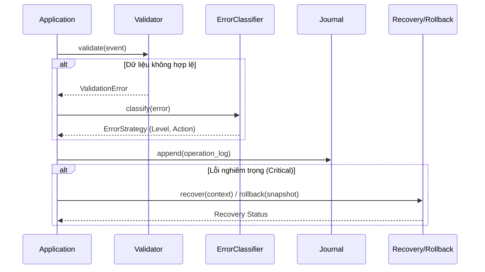

# Error Mitigation Module

## Mục đích

Giảm thiểu tác động của lỗi và hỗ trợ phục hồi an toàn khi vận hành: xác thực dữ liệu đầu vào, phân loại lỗi, ghi journal bền vững, cơ chế rollback/trả về trạng thái hợp lệ và recovery theo kịch bản.

## Kiến trúc & khái niệm

* Validator: `hierachain/error_mitigation/validator.py`, `data_validator.py` — kiểm tra tính hợp lệ dữ liệu/sự kiện.
* Phân loại lỗi: `error_classifier.py` — xác định mức độ/rủi ro để chọn chiến lược xử lý.
* Journal: `journal.py` — ghi log giao dịch/hoạt động bền vững để khôi phục.
* Rollback: `rollback_manager.py` — hoàn tác world state về mốc an toàn.
* Recovery: `recovery_engine.py` — quy trình phục hồi theo loại sự cố (mạng, DB, đồng thuận...).

## API công khai (mô tả khái quát)

```yaml
Validator/DataValidator:
  validate(event|tx) -> Result(errors, warnings)

ErrorClassifier:
  classify(error) -> {level, action}

Journal:
  append(entry)
  replay(from_offset)

RollbackManager:
  snapshot()
  rollback(to_snapshot)

RecoveryEngine:
  recover(context)  # chọn kịch bản phù hợp
```

### Luồng xử lý lỗi (Workflow)



### Ví dụ triển khai

```python
from hierachain.error_mitigation.validator import DataValidator
from hierachain.error_mitigation.error_classifier import ErrorClassifier
from hierachain.error_mitigation.journal import Journal
from hierachain.error_mitigation.rollback_manager import RollbackManager

def handle_transaction(tx_data):
    # 1. Validate Input
    validator = DataValidator()
    validation_result = validator.validate(tx_data)

    if not validation_result.is_valid:
        # 2. Classify Error nếu có vấn đề
        classifier = ErrorClassifier()
        strategy = classifier.classify(validation_result.error)
        
        # 3. Xử lý theo chiến lược (ví dụ: Rollback)
        if strategy.action == "ROLLBACK":
            # Ghi nhận sự kiện vào Journal trước khi tác động
            journal = Journal()
            journal.append({
                "event": "rollback_triggered", 
                "reason": str(validation_result.error),
                "strategy": strategy.level
            })
            
            # Thực hiện Rollback về điểm an toàn
            rollback_mgr = RollbackManager()
            success = rollback_mgr.rollback(to_snapshot="last_safe_checkpoint")
            return f"Rolled back: {success}"
            
    return "Transaction processed"
```

## Tính năng & hạn chế

* Tính năng: từng lớp độc lập, có thể cắm vào pipeline ghi block.
* Hạn chế: cần cấu hình chiến lược cụ thể theo môi trường/SLAs.

## Bảo mật & quyền truy cập

* Journal chứa dữ liệu nhạy cảm có thể cần mã hoá/kiểm soát quyền đọc.

## Hiệu năng

* Journal nên batch/async để giảm độ trễ.
* Rollback cần ảnh hưởng atomically tới world state và cache.

## Liên quan

* Storage: [Storage](storage.md)
* Guides/Khả năng tin cậy: (sẽ thêm) [Độ tin cậy](../guides/reliability.md)

---

??? info "Thông tin kỹ thuật bổ sung (Metadata)"

    **FACT**

    * Các tệp hiện diện: `hierachain/error_mitigation/{validator.py, data_validator.py, error_classifier.py, journal.py, rollback_manager.py, recovery_engine.py}`.

    **DECISION**

    * Tách vai trò rõ: validate → classify → journal → rollback/recover.
    * Cho phép cấu hình chính sách theo mức rủi ro.

    **ASSUMPTION**

    * Ứng dụng triển khai backpressure khi lỗi lặp lại.
    * Môi trường cung cấp storage bền cho journal.

    **INVARIANT**

    * Rollback phải đưa hệ thống về trạng thái hợp lệ đã được snapshot.
    * Journal ghi trước các thao tác quan trọng để đảm bảo khả năng khôi phục.

    **EDGE CASES**

    * Journal hỏng/mất một phần: cần checksum và cơ chế bỏ qua entry hỏng an toàn.
    * Rollback giữa chừng: đảm bảo idempotent và không làm hỏng thêm trạng thái.
