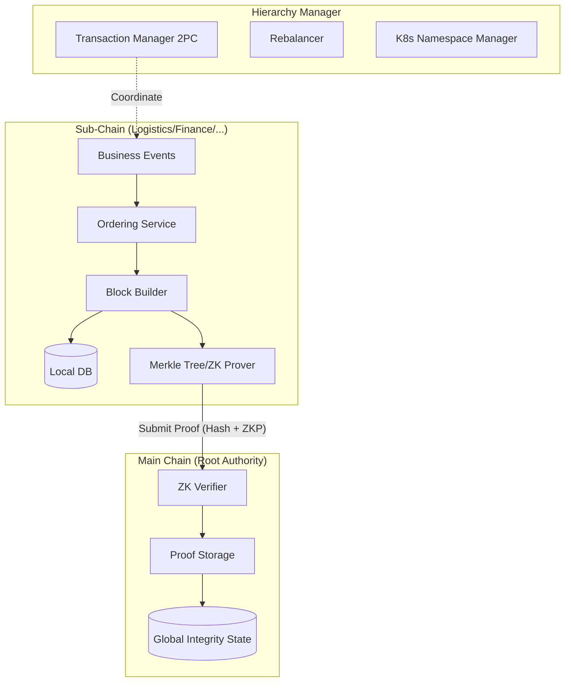

# Hierarchical Module (`hierachain/hierarchical/*`)

## Tổng quan

Module **Hierarchical** là "trái tim" kiến trúc của HieraChain, hiện thực hóa mô hình blockchain hai tầng (Two-Tier Blockchain) được thiết kế riêng cho cấu trúc doanh nghiệp. Nó cho phép tách biệt dữ liệu nghiệp vụ chi tiết (tại Sub-Chains) khỏi bằng chứng xác thực toàn cục (tại Main Chain), đảm bảo tính riêng tư, hiệu năng cao và khả năng mở rộng không giới hạn.

---

## Các thành phần nền tảng

<div class="grid cards" markdown>

*   :material-link-variant:{ .lg .middle } __Main Chain (Root of Trust)__

    ---

    __File__: `main_chain.py`

    * Đóng vai trò "CEO" của hệ thống, chỉ lưu trữ các bằng chứng (Proofs).
    * Tích hợp **Zero-Knowledge Proof (ZKP)** để xác thực không cần tiết lộ dữ liệu.
    * Sử dụng đồng thuận PoA/PoF để tối ưu hóa tốc độ xác thực doanh nghiệp.

*   :material-source-branch:{ .lg .middle } __Sub-Chain (Execution Layer)__

    ---

    __File__: `sub_chain.py`

    * Mỗi Sub-Chain phục vụ một miền nghiệp vụ (Domain) hoặc một bộ phận cụ thể.
    * Thực thi logic nghiệp vụ, đóng gói Block và tạo Proof định kỳ.
    * Đảm bảo dữ liệu domain chi tiết luôn được cô lập cục bộ.

*   :material-file-tree:{ .lg .middle } __Hierarchy Manager (Orchestrator)__

    ---

    __File__: `hierarchy_manager.py`

    * Điều phối toàn bộ vòng đời của các chuỗi và tổ chức trong mạng lưới.
    * Quản lý các kênh (Channels), dữ liệu riêng tư và giao dịch xuyên chuỗi.
    * Cung cấp các báo cáo tổng thể về tính toàn vẹn của toàn hệ thống.

*   :material-shield-account:{ .lg .middle } __Multi-Org & Channels__

    ---

    __Files__: `multi_org.py`, `channel.py`, `private_data.py`

    * **Multi-Org**: Quản lý nhiều tổ chức tham gia với cấu hình MSP riêng.
    * **Channels**: Cô lập dữ liệu hoàn toàn giữa các nhóm tổ chức cụ thể.
    * **Private Data**: Lưu trữ dữ liệu nhạy cảm off-chain, chỉ chia sẻ mã băm (hash).

</div>

---

## Kiến trúc Luồng Dữ liệu (System Workflow)

Mô hình phân cấp đảm bảo rằng dữ liệu chi tiết không bao giờ bị "rò rỉ" lên lớp xác thực toàn cục:



---

## Khả năng Mở rộng & Quản lý Hạ tầng

### 1. Sub-Chain Rebalancer (`rebalancer.py`)
Tự động giám sát tải hệ thống và thực hiện chia tách (split) Sub-Chain khi lượng giao dịch vượt ngưỡng (Threshold EPS), đảm bảo hiệu năng không bị nghẽn:
 
* **Chiến lược**: Hash-based, Time-based, Load-based.
*   **Cơ chế**: Di chuyển thực thể sang chuỗi mới một cách mượt mà.

### 2. Kubernetes Namespace Manager (`k8s_namespace_manager.py`)
Tích hợp trực tiếp với hạ tầng Cloud-Native để cô lập hoàn toàn tài nguyên (CPU, RAM, Network) của mỗi Sub-Chain trong một Namespace riêng biệt.

---

## Giao dịch Xuyên chuỗi (Cross-Chain Transactions)

HieraChain sử dụng giao thức **Two-Phase Commit (2PC)** thông qua `CrossChainTransactionManager` để đảm bảo tính nguyên tử (Atomicity) khi thực hiện các hoạt động liên quan đến nhiều Sub-Chain:

```python
# Ví dụ khởi tạo giao dịch xuyên chuỗi
tx_id = hierarchy_manager.initiate_cross_chain_transaction(
    source_chain_name="supply_chain",
    dest_chain_name="finance_chain",
    payload={"asset_id": "INV-100", "action": "settle_payment"}
)
```

---

## Bảo mật và Quyền riêng tư nâng cao

### Xác thực không tiết lộ (ZK Proofs)
Main Chain hỗ trợ chế độ xác thực nghiêm ngặt, yêu cầu mọi Sub-Chain phải gửi kèm bằng chứng ZK. Điều này chứng minh rằng:

1.  Trạng thái mới của Sub-Chain là kết quả hợp lệ từ trạng thái cũ.
2.  Mọi quy tắc nghiệp vụ đã được tuân thủ mà không cần Main Chain phải đọc dữ liệu thô.

### Dữ liệu riêng tư (Private Data Collections)

Cho phép các thành viên trong một chuỗi chia sẻ dữ liệu nhạy cảm mà ngay cả các thành viên khác trong cùng chuỗi đó (nhưng không thuộc Collection) cũng không thể đọc được.

---

## API công khai quan trọng

### HierarchyManager

*   `create_sub_chain(name, domain_type)`: Tạo chuỗi nghiệp vụ mới.
*   `create_organization(org_id, name)`: Đăng ký tổ chức tham gia mạng lưới.
*   `create_channel(channel_id, org_ids)`: Thiết lập kênh cô lập dữ liệu.
*   `get_system_integrity_report()`: Báo cáo sức khỏe toàn hệ thống.

### MainChain

*   `add_proof(sub_chain, proof_hash, metadata, zk_proof)`: Tiếp nhận bằng chứng từ Sub-Chain.
*   `verify_proof(proof_hash, sub_chain)`: Kiểm tra tính hợp lệ của một bằng chứng.

---

## Liên quan

*   [Đồng thuận BFT (BFT Consensus)](../consensus/bft_consensus.md)
*   [Dịch vụ Sắp xếp (Ordering Service)](../consensus/ordering.md)
*   [Module Domains (Business Logic)](./domains.md)
