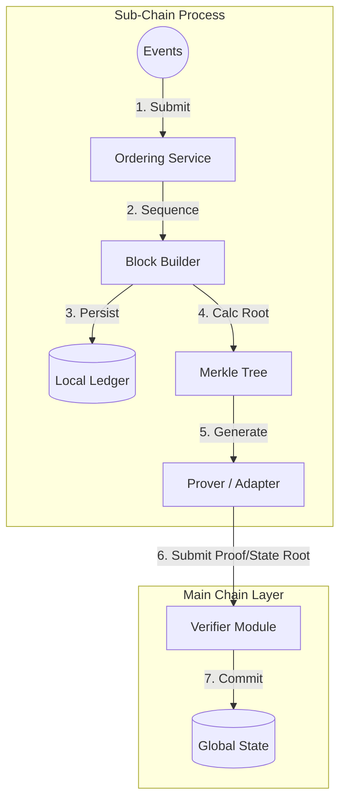

# Hierarchical Module (`hierachain/hierarchical/*`)

## Mục đích

Mô-đun Hierarchical hiện thực kiến trúc phân cấp: nhiều Sub-Chain (mỗi chuỗi phục vụ một domain nghiệp vụ) được giám sát bởi một Main Chain (chỉ lưu Proof). `HierarchyManager` giúp điều phối vòng đời Sub-Chain và quy trình gửi Proof.

## Kiến trúc & khái niệm

<div class="grid cards" markdown>

* :material-link-variant:{ .lg .middle } __Main Chain__

    ---

    __File__: `hierachain/hierarchical/main_chain.py`

    * Lưu trữ và xác minh Proof do các Sub-Chain gửi lên.
    * Không chứa dữ liệu domain chi tiết — chỉ giữ hash/Merkle root và metadata liên quan.

* :material-source-branch:{ .lg .middle } __Sub-Chain__

    ---

    __File__: `hierachain/hierarchical/sub_chain.py`

    * Tiếp nhận Event domain, Ordering, đóng gói thành Block; tạo Proof (dựa trên Merkle/Hash) và gửi lên Main Chain.

* :material-file-tree:{ .lg .middle } __Hierarchy Manager__

    ---

    __File__: `hierachain/hierarchical/hierarchy_manager.py`

    * Quản lý danh mục Sub-Chain, hỗ trợ gửi Proof thủ công/tự động, kiểm tra tính nhất quán chéo chuỗi.

* :material-order-bool-ascending:{ .lg .middle } __Ordering Service & BFT Consensus__

    ---

    Đồng thuận đa tầng với `hierachain/hierarchical/consensus/bft_consensus.py` (BFT) và Ordering Service.

    → Xem chi tiết tại [Ordering](../consensus/ordering.md) và [BFT Consensus](../consensus/bft_consensus.md)

</div>

Sơ đồ (rút gọn):



## API công khai (Public API)

Lưu ý: Tên hàm dưới đây mang tính mô tả nhóm hành vi phổ biến; xem chữ ký chính xác trong mã nguồn tương ứng.

* Main Chain (vai trò điển hình) — Đăng ký sub-chain; thêm Proof; xác minh Proof; truy vấn Proof theo sub-chain; đóng block chính khi cần.
* Sub-Chain (vai trò điển hình) — Thêm Event; gom/đóng Block; khởi tạo Ordering; tạo & gửi Proof lên Main Chain.
* Hierarchy Manager (vai trò điển hình) — Tạo/xoá/liệt kê sub-chain; thêm Event theo tên sub-chain; gửi Proof thủ công; bật/tắt gửi Proof định kỳ.

Ví dụ tối thiểu:

```python
from hierachain.hierarchical import hierarchy_manager

mgr = hierarchy_manager.HierarchyManager()
mgr.create_sub_chain("supply_chain", "generic")

# Cách 1: Sử dụng start_operation qua HierarchyManager
success = mgr.start_operation("supply_chain", "PROD-001", "production_complete", {
  "quantity": 100
})

# Cách 2: Lấy SubChain trực tiếp để add_event
sub_chain = mgr.get_sub_chain("supply_chain")
if sub_chain:
    event_id = sub_chain.add_event({
      "entity_id": "PROD-001",
      "event": "quality_check",
      "details": {"status": "passed"}
    })

proof_success = mgr.submit_proof_to_main_chain("supply_chain")
print(success, proof_success)
```

## Cấu hình

* Tần suất gửi Proof tự động (nếu hỗ trợ) cấu hình qua `HierarchyManager`.
* Thiết lập Consensus/Ordering Event ở tầng dưới (`config/settings.py`, `consensus/ordering_service.py`).

## Tính năng & hạn chế

* Tính năng:

  * Phân tách dữ liệu: Sub-Chain giữ dữ liệu domain; Main Chain chỉ lưu Proof.
  * Hỗ trợ Ordering/Consensus trước khi đóng Block để đảm bảo thứ tự xác định.
  * Khả năng mở rộng theo chiều ngang bằng cách thêm Sub-Chain theo domain.

* Hạn chế/ghi chú:

  * Cần cơ chế đồng bộ thời gian hợp lý để phục vụ kiểm toán.
  * Việc gửi proof phụ thuộc độ tin cậy mạng; cần retry/idempotency.

## Bảo mật & quyền truy cập

* Tích hợp với `hierachain/security/*` để xác thực (MSP, API Key) và kiểm soát truy cập (Policy/Resource Guard).
* Dữ liệu riêng tư (Private Data) có thể xử lý ở cấp Sub-Chain (ví dụ `hierachain/hierarchical/private_data.py`), chỉ xuất proof ra Main Chain.

## Xử lý lỗi & khắc phục

* Kết hợp `hierachain/error_mitigation/*` (journal, rollback, recovery) để phục hồi Block/Event khi lỗi I/O hoặc mạng.
* Khi neo Proof thất bại, cần chiến lược retry có idempotency.

## Hiệu năng

* Gom batch Event theo Block giúp giảm overhead gửi Proof.
* Sử dụng Merkle/Hash xác định để Proof ngắn gọn, dễ xác minh.
* Ordering Service tối ưu hoá throughput khi lưu lượng Event cao.

### Proof Aggregation

file: `hierarchical/proof_aggregation.py`

Gộp proof từ nhiều Sub-Chain để giảm tải Main Chain:

```python
class ProofAggregator:
  __init__(batch_size=10, batch_timeout=30.0, compression_enabled=True, use_mock=True)
  # Thêm proof
  add_proof(sub_chain_id, proof: bytes, block_index, state_root, metadata=None)
  # Gộp proof
  aggregate() -> AggregatedProof | None
  verify_aggregated_proof(agg_proof) -> bool
  # Query
  get_pending_count()
  get_latest_aggregation() -> AggregatedProof | None
  get_stats()
  # Callback
  set_callback(on_complete)
```

Ví dụ:

```python
from hierachain.hierarchical.proof_aggregation import ProofAggregator

aggregator = ProofAggregator(batch_size=5, batch_timeout=60.0)
aggregator.add_proof("supply_chain", proof_bytes, block_idx=10, state_root="abc123")
aggregator.add_proof("logistics_chain", proof_bytes2, block_idx=15, state_root="def456")
# Khi đủ batch_size hoặc timeout, proofs sẽ tự động gộp
agg_proof = aggregator.aggregate()  # Force aggregate
```

### Sub-Chain Rebalancer

__File__: `hierachain/hierarchical/rebalancer.py`

Tự động chia tách Sub-Chain khi tải vượt ngưỡng:

```python
class SplitStrategy(Enum):
  HASH_BASED, TIME_BASED, ROUND_ROBIN, LOAD_BASED

class SubChainRebalancer:
  __init__(
    threshold_eps=1000,      # Events per second threshold
    check_interval=60.0,
    min_events_for_split=5000,
    cooldown_seconds=300.0,
    split_strategy=SplitStrategy.HASH_BASED
  )
  # Đăng ký/huỷ đăng ký sub-chain
  register_subchain(sub_chain_id, subchain)
  unregister_subchain(sub_chain_id)
  # Giám sát
  start_monitoring()
  stop_monitoring()
  check_threshold(sub_chain_id) -> bool
  # Chia tách
  split_sub_chain(sub_chain) -> SplitResult
  # Metrics
  get_metrics(sub_chain_id) -> RebalanceMetrics
  get_all_metrics() -> dict
  get_stats()
```

Ví dụ:

```python
from hierachain.hierarchical.rebalancer import SubChainRebalancer, SplitStrategy

rebalancer = SubChainRebalancer(
    threshold_eps=10000,
    split_strategy=SplitStrategy.HASH_BASED
)
rebalancer.set_hierarchy_manager(hierarchy_manager)
rebalancer.register_subchain("supply_chain", supply_chain_instance)
rebalancer.start_monitoring()
# Khi tải vượt ngưỡng, sub-chain sẽ tự động chia tách
```

### Cross-Chain Transaction Manager

__File__: `hierarchical/transaction_manager.py`

Quản lý giao dịch xuyên chuỗi với giao thức Two-Phase Commit (2PC):

```python
class TransactionState(Enum):
  PENDING, PREPARED, COMMITTED, ROLLED_BACK, FAILED

class CrossChainTransactionManager:
  __init__(hierarchy_manager)
  initiate_transaction(source_chain_name, dest_chain_name, payload) -> tx_id
  get_transaction(tx_id) -> CrossChainTransaction | None
```

Ví dụ:

```python
from hierachain.hierarchical.transaction_manager import CrossChainTransactionManager

tx_mgr = CrossChainTransactionManager(hierarchy_manager)
tx_id = tx_mgr.initiate_transaction(
    source_chain_name="supply_chain",
    dest_chain_name="logistics_chain",
    payload={"asset_id": "PROD-001", "action": "transfer"}
)
# 2PC: Prepare → Commit/Rollback
tx = tx_mgr.get_transaction(tx_id)
```

### Kubernetes Namespace Manager

__File__: `hierarchical/k8s_namespace_manager.py`

Quản lý K8s namespace để cô lập sub-chain:

```python
class K8sNamespaceManager:
  __init__(prefix="hrc-subchain-", kubeconfig_path="", use_mock=True)
  create_namespace(sub_chain_id, labels=None) -> bool
  delete_namespace(sub_chain_id) -> bool
  get_namespace_status(sub_chain_id) -> NamespaceStatus
  provision_sub_chain_deployment(config: DeploymentConfig) -> bool
  list_managed_namespaces() -> dict
```

Ví dụ:

```python
from hierachain.hierarchical.k8s_namespace_manager import K8sNamespaceManager

k8s_mgr = K8sNamespaceManager(prefix="hrc-", use_mock=False)
k8s_mgr.create_namespace("supply_chain", labels={"env": "prod"})
```

---

## BFT Consensus (Byzantine Fault Tolerance)

Cơ chế đồng thuận chịu lỗi Byzantine (BFT) bảo đảm tính nhất quán cho mô-đun Phân cấp và xử lý chống lỗi độc hại. Nội dung chi tiết của thuật toán này đã được tách ra thành một module chuyên biệt để dễ dàng tra cứu riêng.

→ __Xem toàn bộ chi tiết tài liệu tại__: [BFT Consensus](../consensus/bft_consensus.md)

## Tích hợp Ordering & BFT

### Sub-Chain với Ordering Service

```python
from hierachain.hierarchical.sub_chain import SubChain
from hierachain.consensus.ordering.service import OrderingService

# Khởi tạo Ordering Service
ordering_config = {"batch_size": 100, "batch_timeout": 2.0}
ordering_service = OrderingService(config=ordering_config)

# Khởi tạo Sub-Chain với Ordering
sub_chain = SubChain(
    sub_chain_id="supply_chain",
    domain_type="generic",
    ordering_service=ordering_service
)

# Submit event → Ordering → Block
event_id = sub_chain.add_event({
    "entity_id": "PROD-001",
    "event": "production_complete",
    "details": {"quantity": 100}
})
```

### Sub-Chain với BFT Consensus

```python
from hierachain.hierarchical.sub_chain import SubChain
from hierachain.consensus import BFTConsensus

# Khởi tạo BFT
bft = BFTConsensus(
    node_id="node_1",
    all_nodes=["node_1", "node_2", "node_3", "node_4"],
    key_pair=key_pair,
    chain=None,  # Will be set later
    f=1
)

# Khởi tạo Sub-Chain với BFT
sub_chain = SubChain(
    sub_chain_id="supply_chain",
    domain_type="generic",
    consensus=bft
)
bft.chain = sub_chain

# Submit event → BFT consensus → Block
event_id = sub_chain.add_event({
    "entity_id": "PROD-001",
    "event": "production_complete",
    "details": {"quantity": 100}
})
```

## FAQ

!!! question "Tại sao Main Chain không lưu dữ liệu domain?"

    Giảm rò rỉ dữ liệu, tối ưu chi phí và tập trung vào tính toàn vẹn.

!!! question "Có thể thêm Sub-Chain mới động không?"

    Có, qua `HierarchyManager` (theo API thực tế hiện tại).

## Liên quan

* Tổng quan kiến trúc: [Tổng quan](../architecture/overview.md)
* Ordering Service: [Ordering Service](../consensus/ordering.md)
* Mô-đun Core: [Core](core.md)
* Thuật ngữ: [Thuật ngữ](../glossary.md)

---

??? info "Thông tin kỹ thuật bổ sung (Metadata)"

    **FACT**

    * Các tệp: `hierachain/hierarchical/{main_chain.py, sub_chain.py, hierarchy_manager.py, channel.py, multi_org.py, private_data.py}` và `hierachain/hierarchical/consensus/*` (vai trò BFT Consensus), `hierachain/consensus/ordering/service.py` (vai trò Ordering).
    * Proof Aggregation: `hierarchical/proof_aggregation.py` (`ProofAggregator` gộp proof từ nhiều sub-chain).
    * Rebalancer: `hierarchical/rebalancer.py` (`SubChainRebalancer` tự động chia tách khi tải vượt ngưỡng).
    * Main Chain giữ Proof/metadata; Sub-Chain giữ dữ liệu domain và tạo Proof; Hierarchy Manager điều phối — phản ánh trực tiếp bố cục mô-đun.

    **DECISION**

    * Tài liệu ưu tiên mô tả luồng kỹ thuật, liên kết tệp thật; tránh kể chuyện.
    * Nhất quán thuật ngữ theo glossary; phân tách dữ liệu (data separation) là nguyên tắc cốt lõi.

    **ASSUMPTION**

    * Đồng hồ hệ thống đủ đồng bộ để timestamp phục vụ kiểm toán.
    * Hạ tầng mạng ổn định; có cơ chế retry/idempotency cho gửi proof.

    **INVARIANT**

    * Main Chain không lưu dữ liệu domain chi tiết.
    * Proof phải xác định (deterministic) và có thể xác minh lại từ dữ liệu block Sub-Chain.
    * Block đã commit là bất biến.

    **EDGE CASES**

    * Mất kết nối trong lúc neo proof → retry có idempotency, tránh trùng lặp.
    * Sự kiện out-of-order → ordering phải bảo đảm thứ tự trước khi đóng block.
    * Lệch đồng hồ hệ thống → có thể ảnh hưởng kiểm toán, cần đồng bộ thời gian.
