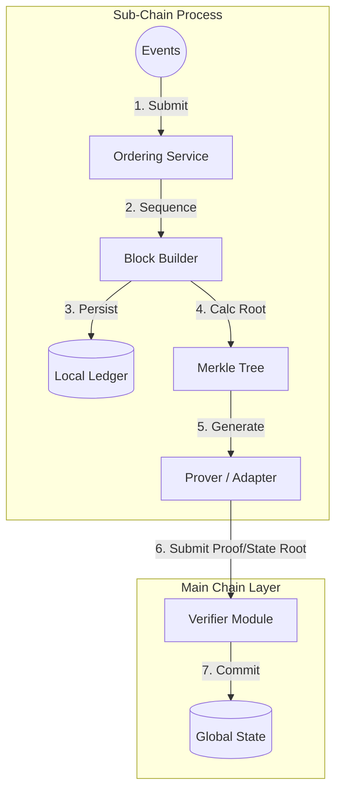
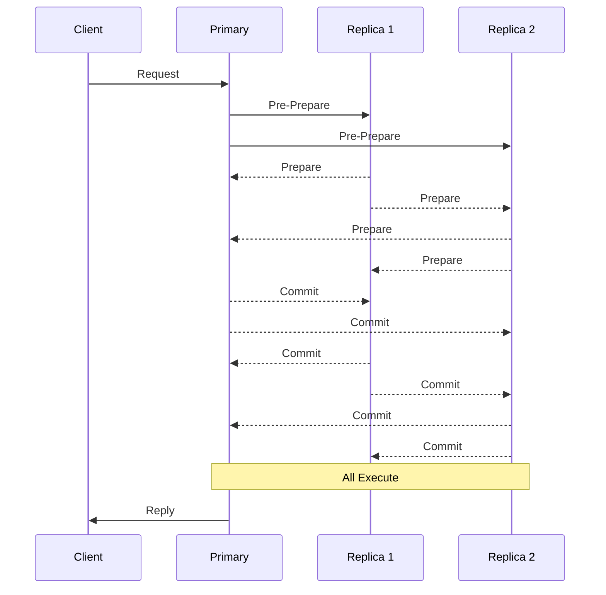

# Hierarchical (`hierachain/hierarchical/*`)

## Mục đích

Mô-đun Hierarchical hiện thực kiến trúc phân cấp: nhiều Sub-Chain (mỗi chuỗi phục vụ một domain nghiệp vụ) được giám sát bởi một Main Chain (chỉ lưu Proof). `HierarchyManager` giúp điều phối vòng đời Sub-Chain và quy trình gửi Proof.

## Kiến trúc & khái niệm

<div class="grid cards" markdown>

* :material-link-variant:{ .lg .middle } __Main Chain__

    ---

    __File__: `hierachain/hierarchical/main_chain.py`

    * Lưu trữ và xác minh Proof do các Sub-Chain gửi lên.
    * Không chứa dữ liệu domain chi tiết — chỉ giữ hash/Merkle root và metadata liên quan.

* :material-source-branch:{ .lg .middle } __Sub-Chain__

    ---

    __File__: `hierachain/hierarchical/sub_chain.py`

    * Tiếp nhận Event domain, Ordering, đóng gói thành Block; tạo Proof (dựa trên Merkle/Hash) và gửi lên Main Chain.

* :material-file-tree:{ .lg .middle } __Hierarchy Manager__

    ---

    __File__: `hierachain/hierarchical/hierarchy_manager.py`

    * Quản lý danh mục Sub-Chain, hỗ trợ gửi Proof thủ công/tự động, kiểm tra tính nhất quán chéo chuỗi.

* :material-order-bool-ascending:{ .lg .middle } __Ordering Service & BFT Consensus__

    ---

    Đồng thuận đa tầng với `hierachain/hierarchical/consensus/bft_consensus.py` (BFT) và Ordering Service.

    → Xem chi tiết tại [Ordering](ordering.md)

</div>

Sơ đồ (rút gọn):



## API công khai (Public API)

Lưu ý: Tên hàm dưới đây mang tính mô tả nhóm hành vi phổ biến; xem chữ ký chính xác trong mã nguồn tương ứng.

* Main Chain (vai trò điển hình) — Đăng ký sub-chain; thêm Proof; xác minh Proof; truy vấn Proof theo sub-chain; đóng block chính khi cần.
* Sub-Chain (vai trò điển hình) — Thêm Event; gom/đóng Block; khởi tạo Ordering; tạo & gửi Proof lên Main Chain.
* Hierarchy Manager (vai trò điển hình) — Tạo/xoá/liệt kê sub-chain; thêm Event theo tên sub-chain; gửi Proof thủ công; bật/tắt gửi Proof định kỳ.

Ví dụ tối thiểu:

```python
from hierachain.hierarchical import hierarchy_manager

mgr = hierarchy_manager.HierarchyManager()
mgr.create_sub_chain("supply_chain", "generic")

# Cách 1: Sử dụng start_operation qua HierarchyManager
success = mgr.start_operation("supply_chain", "PROD-001", "production_complete", {
  "quantity": 100
})

# Cách 2: Lấy SubChain trực tiếp để add_event
sub_chain = mgr.get_sub_chain("supply_chain")
if sub_chain:
    event_id = sub_chain.add_event({
      "entity_id": "PROD-001",
      "event": "quality_check",
      "details": {"status": "passed"}
    })

proof_success = mgr.submit_proof_to_main_chain("supply_chain")
print(success, proof_success)
```

## Cấu hình

* Tần suất gửi Proof tự động (nếu hỗ trợ) cấu hình qua `HierarchyManager`.
* Thiết lập Consensus/Ordering Event ở tầng dưới (`config/settings.py`, `consensus/ordering_service.py`).

## Tính năng & hạn chế

* Tính năng:

    * Phân tách dữ liệu: Sub-Chain giữ dữ liệu domain; Main Chain chỉ lưu Proof.
    * Hỗ trợ Ordering/Consensus trước khi đóng Block để đảm bảo thứ tự xác định.
    * Khả năng mở rộng theo chiều ngang bằng cách thêm Sub-Chain theo domain.

* Hạn chế/ghi chú:

    * Cần cơ chế đồng bộ thời gian hợp lý để phục vụ kiểm toán.
    * Việc gửi proof phụ thuộc độ tin cậy mạng; cần retry/idempotency.

## Bảo mật & quyền truy cập

* Tích hợp với `hierachain/security/*` để xác thực (MSP, API Key) và kiểm soát truy cập (Policy/Resource Guard).
* Dữ liệu riêng tư (Private Data) có thể xử lý ở cấp Sub-Chain (ví dụ `hierachain/hierarchical/private_data.py`), chỉ xuất proof ra Main Chain.

## Xử lý lỗi & khắc phục

* Kết hợp `hierachain/error_mitigation/*` (journal, rollback, recovery) để phục hồi Block/Event khi lỗi I/O hoặc mạng.
* Khi neo Proof thất bại, cần chiến lược retry có idempotency.

## Hiệu năng

* Gom batch Event theo Block giúp giảm overhead gửi Proof.
* Sử dụng Merkle/Hash xác định để Proof ngắn gọn, dễ xác minh.
* Ordering Service tối ưu hoá throughput khi lưu lượng Event cao.

### Proof Aggregation

file: `hierarchical/proof_aggregation.py`

Gộp proof từ nhiều Sub-Chain để giảm tải Main Chain:

```python
class ProofAggregator:
  __init__(batch_size=10, batch_timeout=30.0, compression_enabled=True, use_mock=True)
  # Thêm proof
  add_proof(sub_chain_id, proof: bytes, block_index, state_root, metadata=None)
  # Gộp proof
  aggregate() -> AggregatedProof | None
  verify_aggregated_proof(agg_proof) -> bool
  # Query
  get_pending_count()
  get_latest_aggregation() -> AggregatedProof | None
  get_stats()
  # Callback
  set_callback(on_complete)
```

Ví dụ:

```python
from hierachain.hierarchical.proof_aggregation import ProofAggregator

aggregator = ProofAggregator(batch_size=5, batch_timeout=60.0)
aggregator.add_proof("supply_chain", proof_bytes, block_idx=10, state_root="abc123")
aggregator.add_proof("logistics_chain", proof_bytes2, block_idx=15, state_root="def456")
# Khi đủ batch_size hoặc timeout, proofs sẽ tự động gộp
agg_proof = aggregator.aggregate()  # Force aggregate
```

### Sub-Chain Rebalancer

__File__: `hierachain/hierarchical/rebalancer.py`

Tự động chia tách Sub-Chain khi tải vượt ngưỡng:

```python
class SplitStrategy(Enum):
  HASH_BASED, TIME_BASED, ROUND_ROBIN, LOAD_BASED

class SubChainRebalancer:
  __init__(
    threshold_eps=1000,      # Events per second threshold
    check_interval=60.0,
    min_events_for_split=5000,
    cooldown_seconds=300.0,
    split_strategy=SplitStrategy.HASH_BASED
  )
  # Đăng ký/huỷ đăng ký sub-chain
  register_subchain(sub_chain_id, subchain)
  unregister_subchain(sub_chain_id)
  # Giám sát
  start_monitoring()
  stop_monitoring()
  check_threshold(sub_chain_id) -> bool
  # Chia tách
  split_sub_chain(sub_chain) -> SplitResult
  # Metrics
  get_metrics(sub_chain_id) -> RebalanceMetrics
  get_all_metrics() -> dict
  get_stats()
```

Ví dụ:

```python
from hierachain.hierarchical.rebalancer import SubChainRebalancer, SplitStrategy

rebalancer = SubChainRebalancer(
    threshold_eps=10000,
    split_strategy=SplitStrategy.HASH_BASED
)
rebalancer.set_hierarchy_manager(hierarchy_manager)
rebalancer.register_subchain("supply_chain", supply_chain_instance)
rebalancer.start_monitoring()
# Khi tải vượt ngưỡng, sub-chain sẽ tự động chia tách
```

### Cross-Chain Transaction Manager

__File__: `hierarchical/transaction_manager.py`

Quản lý giao dịch xuyên chuỗi với giao thức Two-Phase Commit (2PC):

```python
class TransactionState(Enum):
  PENDING, PREPARED, COMMITTED, ROLLED_BACK, FAILED

class CrossChainTransactionManager:
  __init__(hierarchy_manager)
  initiate_transaction(source_chain_name, dest_chain_name, payload) -> tx_id
  get_transaction(tx_id) -> CrossChainTransaction | None
```

Ví dụ:

```python
from hierachain.hierarchical.transaction_manager import CrossChainTransactionManager

tx_mgr = CrossChainTransactionManager(hierarchy_manager)
tx_id = tx_mgr.initiate_transaction(
    source_chain_name="supply_chain",
    dest_chain_name="logistics_chain",
    payload={"asset_id": "PROD-001", "action": "transfer"}
)
# 2PC: Prepare → Commit/Rollback
tx = tx_mgr.get_transaction(tx_id)
```

### Kubernetes Namespace Manager

__File__: `hierarchical/k8s_namespace_manager.py`

Quản lý K8s namespace để cô lập sub-chain:

```python
class K8sNamespaceManager:
  __init__(prefix="hrc-subchain-", kubeconfig_path="", use_mock=True)
  create_namespace(sub_chain_id, labels=None) -> bool
  delete_namespace(sub_chain_id) -> bool
  get_namespace_status(sub_chain_id) -> NamespaceStatus
  provision_sub_chain_deployment(config: DeploymentConfig) -> bool
  list_managed_namespaces() -> dict
```

Ví dụ:

```python
from hierachain.hierarchical.k8s_namespace_manager import K8sNamespaceManager

k8s_mgr = K8sNamespaceManager(prefix="hrc-", use_mock=False)
k8s_mgr.create_namespace("supply_chain", labels={"env": "prod"})
```

---

## BFT Consensus (Byzantine Fault Tolerance)

### Tổng quan

__File__: `hierachain/hierarchical/consensus/bft/`

BFT Consensus là cơ chế đồng thuận chịu lỗi Byzantine, cho phép hệ thống hoạt động chính xác ngay cả khi có đến `f` nodes bị lỗi hoặc hành động độc hại, trong tổng số `3f + 1` nodes.

BFT implementation trong HieraChain được tách thành 6 modules chuyên biệt:

```markdown
hierachain/hierarchical/consensus/bft/
├── consensus.py        - Core BFT protocol (Pre-Prepare, Prepare, Commit)
├── cryptographic.py    - Signing, verification, hashing, ZK proofs
├── network.py          - ZMQ-based message transport
├── types.py            - Data types (BFTMessage, ConsensusState, etc.)
├── view_manager.py     - View change protocol và timer
└── __init__.py
```

### Kiến trúc BFT

#### BFT Protocol Phases

BFT consensus hoạt động theo 3 pha chính (PBFT-like):

1. __Pre-Prepare__: Primary node đề xuất operation với sequence number
2. __Prepare__: Replicas broadcast prepare messages khi nhận valid pre-prepare
3. __Commit__: Sau khi collect đủ `2f + 1` prepare, broadcast commit
4. __Execute__: Sau khi collect đủ `2f + 1` commit, execute operation



#### View Change

Khi primary node bị nghi ngờ faulty (timeout, invalid messages), replicas khởi động view change:

1. Replica timeout → send VIEW_CHANGE message với new view number
2. Collect `2f + 1` VIEW_CHANGE → new primary elected
3. New primary send NEW_VIEW với proof (collected VIEW_CHANGE messages)
4. Resume normal operation với new view number

### API công khai

#### 1. BFTConsensus - Main Class

__File__: `hierachain/hierarchical/consensus/bft/consensus.py`

```python
from hierachain.hierarchical.consensus.bft.consensus import BFTConsensus

# Khởi tạo BFT consensus
bft = BFTConsensus(
    node_id="node_1",
    all_nodes=["node_1", "node_2", "node_3", "node_4"],  # 3f+1 = 4 → f=1
    key_pair=KeyPair(private_key=..., public_key=...),
    chain=sub_chain,  # Reference to Sub-Chain
    f=1,  # Fault tolerance: 1 faulty node
    view_change_timeout=10.0,  # Timeout (giây) trước khi view change
    consensus_validator=validator,
    error_classifier=error_classifier
)

# Submit operation để consensus
operation = {
    "entity_id": "order_001",
    "event_type": "CREATE_ORDER",
    "details": {"product": "laptop", "quantity": 2}
}
bft.submit_operation(operation)

# Receive message từ network
message = receive_from_network()
bft.receive_message(message)

# Trigger view change (khi detect primary faulty)
bft.initiate_view_change(new_view=1)
```

__[INVARIANT]__ BFT chỉ commit operation khi đã collect đủ `2f + 1` messages trong mỗi phase.

#### 2. Cryptographic Operations

__File__: `hierachain/hierarchical/consensus/bft/cryptographic.py`

```python
from hierachain.hierarchical.consensus.bft.cryptographic import (
    sign_message,
    verify_message_signature,
    hash_request,
    verify_operation_zk_proof
)

# Sign BFT message
message = BFTMessage(
    message_type=MessageType.PREPARE,
    view=0,
    sequence_number=10,
    sender_id="node_1",
    timestamp=time.time(),
    data={"operation": operation}
)
sign_message(message, key_provider)

# Verify signature
public_keys = {"node_1": "-----BEGIN PUBLIC KEY-----...", ...}
is_valid = verify_message_signature(message, public_keys)

# Hash operation (deterministic)
request_hash = hash_request(operation)

# Verify ZK proof (if operation includes privacy-preserving proof)
if operation.get("zk_proof"):
    is_proof_valid = verify_operation_zk_proof(operation)
```

Cryptographic module sử dụng:

* Ed25519 cho digital signatures
* SHA-256 cho hashing
* Optional ZK proofs cho privacy (tích hợp với `security/zk_prover.py`)

#### 3. Network Transport

__File__: `hierachain/hierarchical/consensus/bft/network.py`

```python
from hierachain.hierarchical.consensus.bft.network import (
    send_via_zmq,
    broadcast,
    forward_to_primary
)

# Send message đến một node cụ thể
send_via_zmq(
    sender_node=zmq_node,
    message=bft_message,
    target_endpoint="tcp://192.168.1.10:5555"
)

# Broadcast đến tất cả replicas
broadcast(
    sender_node=zmq_node,
    message=bft_message,
    all_node_endpoints={
        "node_2": "tcp://192.168.1.11:5555",
        "node_3": "tcp://192.168.1.12:5555",
        "node_4": "tcp://192.168.1.13:5555"
    }
)

# Forward request đến primary (từ client hoặc non-primary replica)
forward_to_primary(
    sender_node=zmq_node,
    message=request_message,
    primary_endpoint="tcp://192.168.1.10:5555"
)
```

Network module dùng ZMQ (ZeroMQ) vì:

* Low latency (< 1ms overhead)
* Async message patterns (PUB/SUB, REQ/REP)
* Built-in retry và queue management

#### 4. View Change Manager

__File__: `hierachain/hierarchical/consensus/bft/view_manager.py`

```python
from hierachain.hierarchical.consensus.bft.view_manager import (
    validate_view_change_proof,
    start_view_change_timer
)

# Validate VIEW_CHANGE proof từ new primary
proof = [
    {"sender_id": "node_2", "view": 1, "message_type": "VIEW_CHANGE", ...},
    {"sender_id": "node_3", "view": 1, "message_type": "VIEW_CHANGE", ...},
    {"sender_id": "node_4", "view": 1, "message_type": "VIEW_CHANGE", ...}
]

is_valid_proof = validate_view_change_proof(
    view=1,
    proof=proof,
    f=1,  # Fault tolerance
    node_public_keys=public_keys,
    verify_sig_func=lambda msg: verify_message_signature(msg, public_keys)
)

# Start view change timer
def on_timeout():
    bft.initiate_view_change(new_view=current_view + 1)

timer = start_view_change_timer(
    timeout=10.0,  # 10 giây
    handler=on_timeout
)

# Cancel timer khi receive valid message từ primary
if receive_valid_preprepare():
    timer.cancel()
```

View change proof phải chứa ít nhất `2f + 1` valid VIEW_CHANGE messages.

#### 5. BFT Data Types

__File__: `hierachain/hierarchical/consensus/bft/types.py`

```python
from hierachain.hierarchical.consensus.bft.types import (
    MessageType,
    ConsensusState,
    BFTMessage,
    ConsensusError
)

# Message types
class MessageType(Enum):
    REQUEST = "request"
    PRE_PREPARE = "pre_prepare"
    PREPARE = "prepare"
    COMMIT = "commit"
    VIEW_CHANGE = "view_change"
    NEW_VIEW = "new_view"

# Consensus states
class ConsensusState(Enum):
    IDLE = "idle"
    PRE_PREPARED = "pre_prepared"
    PREPARED = "prepared"
    COMMITTED = "committed"
    VIEW_CHANGING = "view_changing"

# BFT Message (dataclass)
@dataclass
class BFTMessage:
    message_type: MessageType
    view: int
    sequence_number: int
    sender_id: str
    timestamp: float
    signature: str
    data: dict[str, Any]
    nonce: str = ""
```

### Luồng xử lý BFT

#### Normal Case (No Faults)

1. __Client submit operation__
2. __Primary (view leader) receives request__
    * Assign sequence number (`seq++`)
    * Create `PRE_PREPARE` message
    * Sign message
    * Broadcast to all replicas
3. __Replicas receive PRE_PREPARE__
    * Validate message (signature, view, seq)
    * Check operation validity
    * If valid → Change state to `PRE_PREPARED`
    * Create `PREPARE` message
    * Sign and broadcast to all
    * Store `PRE_PREPARE`
4. __All nodes (including primary) collect PREPARE__
    * Wait for `2f` PREPARE messages (+ own = `2f+1`)
    * Validate each `PREPARE`
    * If quorum reached → Change state to `PREPARED`
    * Create `COMMIT` message
    * Sign and broadcast to all
5. __All nodes collect COMMIT__
    * Wait for `2f` COMMIT messages (+ own = `2f+1`)
    * Validate each `COMMIT`
    * If quorum reached → Change state to `COMMITTED`
    * Execute operation
6. __Operation executed on chain__
    * `_execute_consensus_operation(chain, operation, seq, view)`

Quorum formula:

* Pre-Prepare: 1 (chỉ từ primary)
* Prepare: `2f + 1` (bao gồm cả node hiện tại)
* Commit: `2f + 1` (bao gồm cả node hiện tại)

#### View Change (Primary Failure)

1. __Replica timeout → No PRE_PREPARE received__
2. __Initiate view change__
    * `new_view = current_view + 1`
    * Create `VIEW_CHANGE` message
        * Include last stable checkpoint
        * Include prepared operations (if any)
    * Sign message
    * Broadcast to all nodes
3. __New primary__ (determined by: `primary_id = view % n`)
    * Collect `VIEW_CHANGE` messages
    * Wait for `2f + 1` `VIEW_CHANGE`
    * Create `NEW_VIEW` message
        * Include collected `VIEW_CHANGE` as proof
        * Re-propose pending operations
        * Sign and broadcast
4. __Replicas receive NEW_VIEW__
    * Validate proof (`2f + 1` valid signatures)
    * Verify new primary ID (`view % n`)
    * If valid → Accept new view
    * Resume normal operation

Multiple concurrent view changes:

* Chỉ accept NEW_VIEW với proof hợp lệ
* Nếu nhận VIEW_CHANGE cho view cũ hơn → ignore
* Nếu nhận VIEW_CHANGE cho view mới hơn → join view change

### Cấu hình BFT

```python
BFT_CONFIG = {
    "f": 1,                          # Fault tolerance (f < n/3)
    "view_change_timeout": 10.0,     # Timeout (s) trước view change
    "message_timeout": 5.0,          # Timeout cho message validity
    "checkpoint_interval": 100,      # Checkpoint mỗi 100 operations
    "strictness": "high",            # "high" | "medium" | "low"
    "enable_zk_proofs": False,       # Enable ZK proof verification
    "max_failures_before_recovery": 3,  # Max failures trước auto recovery
    "auto_recovery": True            # Auto trigger view change
}
```

### Tính năng & Hạn chế

#### ✅ Tính năng

* __Byzantine Fault Tolerance__: Chịu được tới `f` nodes faulty (trong `3f+1` nodes)
* __Deterministic ordering__: Sequence number đảm bảo order nhất quán
* __View change protocol__: Tự động recovery khi primary faulty
* __Cryptographic security__: Ed25519 signatures cho authentication
* __Error classification__: Track và classify node behaviors (slow, malicious, etc.)
* __ZK proof support__: Optional privacy-preserving operations

#### ⚠️ Hạn chế

* __Overhead__: Yêu cầu `3f+1` messages per phase → high communication cost
* __Latency__: 3-phase protocol → ~3x network round-trips
* __Scalability__: Hiệu suất giảm khi số nodes tăng (O(n²) messages)
* __Synchrony assumption__: Cần network timing assumptions (bounded delays)
* __View change cost__: View change có latency cao (~seconds)

BFT phù hợp cho:

* High-security requirements (banking, healthcare)
* Small to medium clusters (4-20 nodes)
* Can tolerate higher latency for stronger guarantees

### Performance Metrics

 Benchmark trên cluster 4 nodes (f=1), LAN 1Gbps:

```
Configuration:
- 4 nodes (3f+1, f=1)
- Block size: 100 operations
- Network: 1Gbps LAN, < 1ms latency

Results:
- Throughput: ~800-1200 ops/s
- Latency (per operation): 15-25ms
- View change time: 2-5s
- Message overhead: ~12 messages per operation (3 phases × 4 nodes)
```

### Best Practices

1. __Network topology__: Đặt nodes trong cùng datacenter/region để giảm latency
2. __Clock synchronization__: Dùng NTP để đồng bộ thời gian (< 100ms skew)
3. __Monitor view changes__: Frequent view changes → indicator of network issues
4. __Checkpoint regularly__: Enable checkpoints để cleanup old messages
5. __Tune timeouts__: Balance between false positives (unnecessary view changes) và detection speed

## Tích hợp Ordering & BFT

### Sub-Chain với Ordering Service

```python
from hierachain.hierarchical.sub_chain import SubChain
from hierachain.consensus.ordering.service import OrderingService

# Khởi tạo Ordering Service
ordering_config = {"batch_size": 100, "batch_timeout": 2.0}
ordering_service = OrderingService(config=ordering_config)

# Khởi tạo Sub-Chain với Ordering
sub_chain = SubChain(
    sub_chain_id="supply_chain",
    domain_type="generic",
    ordering_service=ordering_service
)

# Submit event → Ordering → Block
event_id = sub_chain.add_event({
    "entity_id": "PROD-001",
    "event": "production_complete",
    "details": {"quantity": 100}
})
```

### Sub-Chain với BFT Consensus

```python
from hierachain.hierarchical.sub_chain import SubChain
from hierachain.hierarchical.consensus.bft.consensus import BFTConsensus

# Khởi tạo BFT
bft = BFTConsensus(
    node_id="node_1",
    all_nodes=["node_1", "node_2", "node_3", "node_4"],
    key_pair=key_pair,
    chain=None,  # Will be set later
    f=1
)

# Khởi tạo Sub-Chain với BFT
sub_chain = SubChain(
    sub_chain_id="supply_chain",
    domain_type="generic",
    consensus=bft
)
bft.chain = sub_chain

# Submit event → BFT consensus → Block
event_id = sub_chain.add_event({
    "entity_id": "PROD-001",
    "event": "production_complete",
    "details": {"quantity": 100}
})
```

## FAQ

!!! question "Tại sao Main Chain không lưu dữ liệu domain?"

    Giảm rò rỉ dữ liệu, tối ưu chi phí và tập trung vào tính toàn vẹn.

!!! question "Có thể thêm Sub-Chain mới động không?"

    Có, qua `HierarchyManager` (theo API thực tế hiện tại).

## Liên quan

* Tổng quan kiến trúc: [Tổng quan](../architecture/overview.md)
* Ordering Service: [Ordering Service](ordering.md)
* Mô-đun Core: [Core](core.md)
* Thuật ngữ: [Thuật ngữ](../glossary.md)

---

??? info "Thông tin kỹ thuật bổ sung (Metadata)"

    **FACT**

    - Các tệp: `hierachain/hierarchical/{main_chain.py, sub_chain.py, hierarchy_manager.py, channel.py, multi_org.py, private_data.py}` và `hierachain/hierarchical/consensus/*` (vai trò BFT Consensus), `hierachain/consensus/ordering/service.py` (vai trò Ordering).
    - Proof Aggregation: `hierarchical/proof_aggregation.py` (`ProofAggregator` gộp proof từ nhiều sub-chain).
    - Rebalancer: `hierarchical/rebalancer.py` (`SubChainRebalancer` tự động chia tách khi tải vượt ngưỡng).
    - Main Chain giữ Proof/metadata; Sub-Chain giữ dữ liệu domain và tạo Proof; Hierarchy Manager điều phối — phản ánh trực tiếp bố cục mô-đun.

    **DECISION**

    - Tài liệu ưu tiên mô tả luồng kỹ thuật, liên kết tệp thật; tránh kể chuyện.
    - Nhất quán thuật ngữ theo glossary; phân tách dữ liệu (data separation) là nguyên tắc cốt lõi.

    **ASSUMPTION**

    - Đồng hồ hệ thống đủ đồng bộ để timestamp phục vụ kiểm toán.
    - Hạ tầng mạng ổn định; có cơ chế retry/idempotency cho gửi proof.

    **INVARIANT**

    - Main Chain không lưu dữ liệu domain chi tiết.
    - Proof phải xác định (deterministic) và có thể xác minh lại từ dữ liệu block Sub-Chain.
    - Block đã commit là bất biến.

    **EDGE CASES**

    - Mất kết nối trong lúc neo proof → retry có idempotency, tránh trùng lặp.
    - Sự kiện out-of-order → ordering phải bảo đảm thứ tự trước khi đóng block.
    - Lệch đồng hồ hệ thống → có thể ảnh hưởng kiểm toán, cần đồng bộ thời gian.
