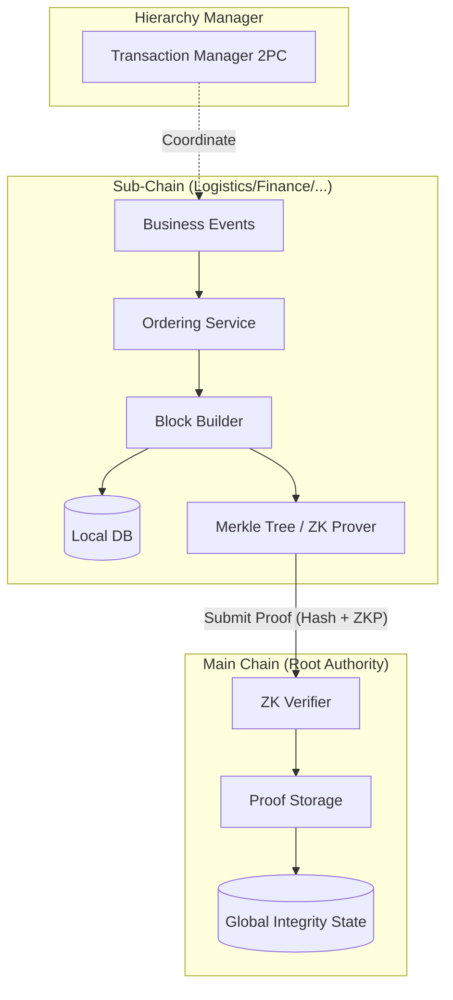

# Hierarchical Module (`hierachain/hierarchical/*`)

## 1. Tổng quan

Module `hierarchical` triển khai kiến trúc sổ cái hai tầng của HieraChain. Các chuỗi con (Sub-Chain) xử lý các sự kiện nghiệp vụ miền và lưu trữ trạng thái chi tiết tại cục bộ. Chuỗi chính (Main Chain) lưu trữ các bằng chứng mật mã và mã băm gốc do Sub-Chain gửi lên. Sự phân tách này duy trì tính riêng tư của dữ liệu nghiệp vụ, giảm tải xác thực cho Main Chain và mở rộng quy mô theo chiều ngang bằng cách phân chia tải giữa các chuỗi.

## 2. Các thành phần nền tảng

Các thành phần được tổ chức trong các gói chuyên biệt dưới `hierachain/hierarchical/`.

### 2.1 Chuỗi chính Main Chain (`main_chain/base.py`)

* Lưu trữ các bằng chứng khối mật mã thay vì dữ liệu sự kiện thô.
* Lọc đệ quy metadata đăng ký Sub-Chain trước khi lưu vào registry, authority đồng thuận hoặc event đăng ký; bản tóm tắt chỉ trả bản đã lọc.
* Xác thực các bước chuyển trạng thái bằng zero-knowledge proof khi được kích hoạt.
* Kiểm tra tính hợp lệ của các điểm neo liên chuỗi theo cơ chế đồng thuận thẩm quyền hoặc liên minh.

### 2.2 Chuỗi con Sub-Chain (`sub_chain/base.py`)

* Vận hành quy trình nghiệp vụ chuyên biệt cho từng miền hoặc phòng ban.
* Đóng gói sự kiện nghiệp vụ vào các khối và tính toán Merkle root.
* Tạo bằng chứng trạng thái định kỳ để gửi lên Main Chain.

Khởi động đọc header block và event theo thứ tự bằng một truy vấn SQL theo khoảng, vẫn kiểm tra Merkle, hash, chữ ký từ khóa tin cậy, khoảng trống index và liên kết chuỗi. Sub-Chain nhận snapshot bootstrap đã xác thực của ordering một lần thay vì đọc lại toàn chuỗi; các lần đồng bộ sau đọc storage mới. Recovery dựng lại index thực thể, index loại event và counters qua helper index chung của Blockchain, để truy vấn phản ánh sổ cái đã khôi phục.

### 2.3 Quản lý phân cấp Hierarchy Manager (`hierarchy_manager/base.py`)

* Điều phối vòng đời chuỗi, xác thực liên chuỗi và cấu hình đa tổ chức.
* Quản lý các kênh trao đổi (channel), bộ sưu tập dữ liệu riêng tư và giao dịch Two-Phase Commit (2PC).
* Tổng hợp báo cáo tính toàn vẹn hệ thống trên toàn bộ các chuỗi đã đăng ký.

Trạng thái truy cập tổ chức/thành viên/channel được lưu cùng `_revision` nội bộ. SQLite và PostgreSQL dùng ghi có điều kiện nguyên tử; Redis dùng WATCH/MULTI. Provisioning qua manager tải lại và thử tối đa ba lần khi ghi không thành công. Provisioning thành viên qua REST kiểm tra lại quyền administrator đã xác thực trong mỗi lần retry. Conflict cấu hình channel trả thất bại và rollback thay đổi cục bộ, yêu cầu endorsement mới trước khi thử lại. Thao tác đọc và kiểm tra truy cập channel làm mới trạng thái chung, giữ nguyên ledger trong RAM của channel hiện có; backend không truy cập được hoặc trạng thái đã lưu bị mất sẽ từ chối truy cập. Manager chỉ dùng bộ nhớ giữ trạng thái cục bộ.

Snapshot chưa có revision được nâng cấp khi ghi thành công lần tiếp theo. Cần nâng cấp đồng thời mọi registry writer: không hỗ trợ chạy lẫn writer cũ ghi vô điều kiện với writer có kiểm tra revision. Storage adapter tùy chỉnh phải hỗ trợ `save_hierarchy_registry(state, expected_revision=...)` và từ chối revision cũ.

### 2.4 Đa tổ chức, kênh và dữ liệu riêng tư

* `multi_org.py`: Quản lý các tổ chức thành viên, chứng chỉ và định danh MSP.
* `channel/manager.py`: Phân vùng giao tiếp giữa các nhóm tổ chức cụ thể.
* `private_data.py`: Lưu trữ dữ liệu nhạy cảm ngoài chuỗi (off-chain) và neo mã băm mật mã lên chuỗi.

## 3. Luồng dữ liệu

Dữ liệu chi tiết được lưu trữ tại Sub-Chain. Chỉ có Merkle root và bằng chứng mật mã được neo lên Main Chain:


```mermaid
graph TD
    subgraph "Sub-Chain (Logistics/Finance/...)"
        A[Business Events] --> B[Ordering Service]
        B --> C[Block Builder]
        C --> D[(Local DB)]
        C --> E[Merkle Tree / ZK Prover]
    end

    subgraph "Main Chain (Root Authority)"
        F[ZK Verifier] --> G[Proof Storage]
        G --> H[(Global Integrity State)]
    end

    E -- "Submit Proof (Hash + ZKP)" --> F
    
    subgraph "Hierarchy Manager"
        I[Transaction Manager 2PC]
    end
    
    I -. "Coordinate" .-> A
```

## 4. Thao tác liên chuỗi (2PC)

`CrossChainTransactionManager` trong `hierachain/hierarchical/transaction_manager.py` triển khai giao thức Two-Phase Commit để duy trì tính nguyên tử qua các Sub-Chain:

ACK pha của coordinator và ACK commit của participant vẫn yêu cầu đọc lại journal bền vững. Journal gốc dùng `read_since(cursor)` để decode record mới sau lượt quét lịch sử đầu tiên, kể cả record trong file đã rotate. Participant thử lại giữ ID event bền vững để tránh ghi trùng; submission không rõ kết quả làm mất hiệu lực snapshot marker. Journal tùy chỉnh chỉ có `replay()` tiếp tục dùng replay toàn bộ. Lịch sử transaction và số archive vẫn chưa có giới hạn; thay đổi này không thêm retention hay compaction.

```python
from hierachain.hierarchical.hierarchy_manager import HierarchyManager

manager = HierarchyManager()
tx_id = manager.initiate_cross_chain_transaction(
    source_chain_name="supply_chain",
    dest_chain_name="finance_chain",
    payload={"asset_id": "INV-100", "action": "settle_payment"}
)
```

## 5. Tính riêng tư và xác thực zero-knowledge

* Xác thực Main Chain: Sub-Chain có thể nộp zero-knowledge proof để chứng minh bước chuyển trạng thái hợp lệ theo quy tắc đồng thuận mà không để lộ nội dung sự kiện thô.
* Bộ sưu tập dữ liệu riêng tư: Dữ liệu nhạy cảm được giới hạn trong các node thành viên được cấp quyền, chỉ có mã băm được phát tán trên sổ cái chung.

## Liên quan

* [Consensus Module](./consensus.md)
* [Domains Module](./domains.md)
* [Hướng dẫn Two-Phase Commit](../how-to/cross-chain-transactions.md)
