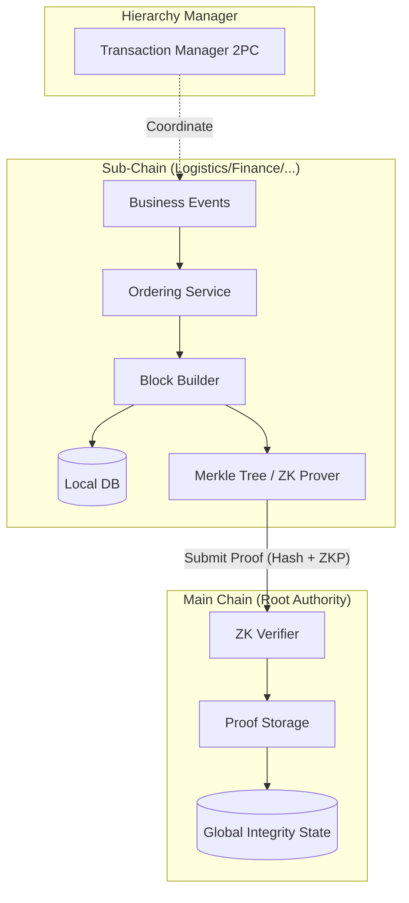

# Hierarchical Module (`hierachain/hierarchical/*`)

## 1. Tổng quan

Module `hierarchical` triển khai kiến trúc sổ cái hai tầng của HieraChain. Các chuỗi con (Sub-Chain) xử lý các sự kiện nghiệp vụ miền và lưu trữ trạng thái chi tiết tại cục bộ. Chuỗi chính (Main Chain) lưu trữ các bằng chứng mật mã và mã băm gốc do Sub-Chain gửi lên. Sự phân tách này duy trì tính riêng tư của dữ liệu nghiệp vụ, giảm tải xác thực cho Main Chain và mở rộng quy mô theo chiều ngang bằng cách phân chia tải giữa các chuỗi.

## 2. Các thành phần nền tảng

Các thành phần được tổ chức trong các gói chuyên biệt dưới `hierachain/hierarchical/`.

### 2.1 Chuỗi chính Main Chain (`main_chain/base.py`)

* Lưu trữ các bằng chứng khối mật mã thay vì dữ liệu sự kiện thô.
* Lọc đệ quy metadata đăng ký Sub-Chain trước khi lưu vào registry, authority đồng thuận hoặc event đăng ký; bản tóm tắt chỉ trả bản đã lọc.
* Cung cấp hook xác thực ZK; tạo và xác minh proof production chưa được triển khai.
* Kiểm tra tính hợp lệ của các điểm neo liên chuỗi theo cơ chế đồng thuận thẩm quyền hoặc liên minh.

### 2.2 Chuỗi con Sub-Chain (`sub_chain/base.py`)

* Vận hành quy trình nghiệp vụ chuyên biệt cho từng miền hoặc phòng ban.
* Đóng gói sự kiện nghiệp vụ vào các khối và tính toán Merkle root.
* Tạo bằng chứng trạng thái định kỳ để gửi lên Main Chain.

Khởi động đọc header block và event theo thứ tự bằng một truy vấn SQL theo khoảng, vẫn kiểm tra Merkle, hash, chữ ký từ khóa tin cậy, khoảng trống index và liên kết chuỗi. Sub-Chain nhận snapshot bootstrap đã xác thực của ordering một lần thay vì đọc lại toàn chuỗi; các lần đồng bộ sau đọc storage mới. Recovery dựng lại index thực thể, index loại event và counters qua helper index chung của Blockchain, để truy vấn phản ánh sổ cái đã khôi phục.

`validate_cross_chain_consistency()` so sánh hash tip của từng Sub-Chain với proof MainChain mới nhất đã lưu bền vững. Thiếu proof hoặc proof không khớp luôn làm `overall_consistent` thành `false`. Nếu tip đã tiến lên nhưng khoảng gửi proof cấu hình chưa hết, kết quả của chain đó là `consistent: false, pending: true`; `pending` giải thích thời gian chờ theo lịch nhưng không xác nhận tip chưa được neo. Proof MainChain chỉ được tính là điểm neo sau khi signed block vượt qua bước đọc lại từ storage bền vững.

### 2.3 Quản lý phân cấp Hierarchy Manager (`hierarchy_manager/base.py`)

* Điều phối vòng đời chuỗi, xác thực liên chuỗi và cấu hình đa tổ chức.
* Quản lý các kênh trao đổi (channel), bộ sưu tập dữ liệu riêng tư và giao dịch Two-Phase Commit (2PC).
* Tổng hợp báo cáo tính toàn vẹn hệ thống trên toàn bộ các chuỗi đã đăng ký.

`HierarchyManager` vẫn là coordinator công khai, sở hữu tài nguyên, trạng thái chung và lock. Module nội bộ `recovery.py` replay và xác thực lịch sử chuỗi bền vững; `registry.py` xử lý snapshot quyền truy cập, migration, ghi có điều kiện, refresh và rollback. `organization.py` tạo view thành viên/channel, còn `validation.py` tạo báo cáo tính toàn vẹn. Các helper dùng chung trạng thái của coordinator, không tạo registry hay storage owner thứ hai. Signature method, thứ tự recovery, hook cleanup và hợp đồng storage hiện có được giữ lại.

#### Ranh giới hỗ trợ tính năng

| Tính năng | Hành vi hiện tại |
| :--- | :--- |
| Registry tổ chức/thành viên/channel | SQLite/PostgreSQL lưu bền vững và kiểm tra revision; chế độ memory tường minh chỉ giữ dữ liệu tạm. |
| Gán tổ chức vào chain | `assign_organization_to_chain()` trả `False`; ID hợp lệ ghi cảnh báo thao tác chưa được hỗ trợ. Method không cấp quyền. Cấu hình thành viên và policy của channel để kiểm soát truy cập channel. |
| Private collection | Object thư viện có data store trong bộ nhớ; manager không persist collection vào registry. Ghi private data qua REST trả HTTP 501. |
| ZK proof | Hash mock là fixture phát triển. Tạo/xác minh production chưa triển khai; xem [phạm vi ZK](../security/decentralized-zkp.md). |
| Connector ERP theo hãng | Fixture SAP/Oracle/Dynamics yêu cầu opt-in mô phỏng tường minh. Ứng dụng cung cấp transport thật; xem [Integration](./integration.md). |
| Thực thi contract | Đăng ký contract qua REST lưu metadata; thực thi trả HTTP 501. |

`get_cross_chain_statistics()["cross_chain_operations"]` là trường dự phòng hiện trả `0`, không phải số operation hoàn tất đã đo. Có method facade hay tùy chọn cấu hình chưa đủ để xác nhận tính năng hoạt động xuyên suốt.

Metadata truy cập tổ chức/thành viên/channel được lưu cùng `_revision` nội bộ và `_channel_ledger_version: 1`. Registry snapshot không chứa lịch sử ledger của channel. SQLite và PostgreSQL dùng ghi có điều kiện nguyên tử. Các helper Redis adapter hỗ trợ record của channel, nhưng Redis vẫn bị từ chối làm ledger backend của manager vì các hợp đồng lưu signed block/proof khác chưa hoàn chỉnh. Provisioning qua manager tải lại và thử tối đa ba lần khi ghi không thành công. Provisioning thành viên qua REST kiểm tra lại quyền administrator đã xác thực trong mỗi lần retry. Conflict cấu hình channel trả thất bại và rollback thay đổi cục bộ, yêu cầu endorsement mới trước khi thử lại. Thao tác đọc và kiểm tra truy cập channel làm mới metadata chung và chỉ đọc record chưa xử lý của channel được yêu cầu, giữ nguyên object channel; backend không truy cập được hoặc trạng thái đã lưu bị mất sẽ từ chối truy cập. Manager chỉ dùng bộ nhớ giữ trạng thái cục bộ.

Registry snapshot cũ chứa ledger được kiểm tra và chuyển đổi trong quá trình recovery. Việc thay registry và tạo record khởi đầu cho từng channel được commit nguyên tử; migration thất bại giữ nguyên snapshot cũ. Cần nâng cấp đồng thời mọi registry writer và dừng writer cũ trước migration: không hỗ trợ chạy lẫn writer dùng snapshot với writer ghi nối tiếp. Storage adapter tùy chỉnh phải hỗ trợ `save_hierarchy_registry(state, expected_revision=..., channel_ledgers=...)`, khởi tạo nguyên tử các ledger seed được cung cấp và từ chối revision cũ. Adapter cũng phải triển khai `append_channel_record(channel_id, record, expected_sequence=..., expected_registry_revision=...)` và `load_channel_records(channel_id, after_sequence=...)`.

Submission channel ghi nối tiếp một event record bền vững trước khi trả thành công; lỗi storage trả HTTP 503 và không thay đổi pending events hay bộ đếm. Mỗi lần append kiểm tra nguyên tử cả revision quyền truy cập trong registry và sequence của channel, nên worker có trạng thái cũ không thể ghi đè lịch sử hoặc append bằng snapshot quyền đã bị thu hồi. Finalization ghi nối tiếp một signed block record tiêu thụ batch event đang chờ. SQL adapter lưu head và record của channel trong `channel_ledger_heads` và `channel_ledger_records`; các helper Redis dùng list riêng từng channel với kiểm tra WATCH/MULTI. Ghi event giữ nguyên metadata registry và không serialize block cũ hay các channel khác. Finalization chỉ ghi batch block mới.

Restart replay record của channel, khôi phục pending events, kiểm tra từng finalized block bằng trusted keys và batch pending tương ứng, rồi dựng lại bộ đếm submission. Các lần refresh sau chỉ áp dụng suffix mới và cập nhật bộ đếm tăng dần. Suffix không hợp lệ giữ nguyên trạng thái ledger cục bộ. Query vẫn chỉ trả finalized blocks; ACK nhận event chưa đồng nghĩa đã finalize. Channel tạo trực tiếp và manager chỉ dùng memory vẫn là dữ liệu tạm. Việc xác thực toàn bộ khi startup, bộ nhớ ledger và dữ liệu record giữ lại vẫn tăng theo lịch sử; thay đổi này chưa có retention/compaction. Thao tác truy cập cục bộ vẫn giữ registry lock của manager.

### 2.4 Đa tổ chức, kênh và dữ liệu riêng tư

* `multi_org.py`: Quản lý các tổ chức thành viên, chứng chỉ và định danh MSP.
* `channel/manager.py`: Phân vùng giao tiếp giữa các nhóm tổ chức cụ thể.
* `private_data.py`: Cung cấp collection mã hóa trong bộ nhớ và helper hash; lưu bền vững và tự động neo vào ledger cần tích hợp từ ứng dụng gọi.

## 3. Luồng dữ liệu

Dữ liệu chi tiết được lưu trữ tại Sub-Chain. Merkle root và proof block có chữ ký được neo lên Main Chain. Nhánh ZK tùy chọn trong luồng thiết kế này chỉ có triển khai mock:


```mermaid
graph TD
    subgraph "Sub-Chain (Logistics/Finance/...)"
        A[Business Events] --> B[Ordering Service]
        B --> C[Block Builder]
        C --> D[(Local DB)]
        C --> E[Merkle Tree / ZK Prover]
    end

    subgraph "Main Chain (Root Authority)"
        F[ZK Verifier] --> G[Proof Storage]
        G --> H[(Global Integrity State)]
    end

    E -- "Submit Proof (Hash + ZKP)" --> F
    
    subgraph "Hierarchy Manager"
        I[Transaction Manager 2PC]
    end
    
    I -. "Coordinate" .-> A
```

## 4. Thao tác liên chuỗi (2PC)

Coordinator chiếm quyền ghi journal khi được dùng lần đầu. Manager chỉ dùng registry/channel có thể chia sẻ SQL registry mà không mở writer 2PC nếu chưa có lịch sử coordinator. Lịch sử `data/transactions` đã tồn tại được khôi phục lúc startup và giữ lease độc quyền. Đường dẫn journal 2PC hoặc SubChain dùng chung vẫn cần một writer sở hữu; khả năng ghi registry đồng thời không cung cấp nhiều writer ordering/coordinator.

Gọi `HierarchyManager.close()` khi chủ sở hữu kết thúc. Hàm đóng orderer của sub-chain, coordinator đã mở và storage mà không tạo journal chưa dùng. `SubChain.stop()` xử lý các block đã commit rồi giải phóng orderer và lease, cho phép instance thay thế khôi phục cùng đường dẫn. Validation entity theo dõi operation và status riêng cho từng chain.

`CrossChainTransactionManager` trong `hierachain/hierarchical/transaction_manager.py` triển khai giao thức Two-Phase Commit để duy trì tính nguyên tử qua các Sub-Chain:

ACK pha của coordinator và ACK commit của participant vẫn yêu cầu đọc lại journal bền vững. Journal gốc dùng `read_since(cursor)` để decode record mới sau lượt quét lịch sử đầu tiên, kể cả record trong file đã rotate. Participant thử lại giữ ID event bền vững để tránh ghi trùng; submission không rõ kết quả làm mất hiệu lực snapshot marker. Journal tùy chỉnh chỉ có `replay()` tiếp tục dùng replay toàn bộ. Lịch sử transaction và số archive vẫn chưa có giới hạn; thay đổi này không thêm retention hay compaction.

```python
from hierachain.hierarchical.hierarchy_manager import HierarchyManager

manager = HierarchyManager()
tx_id = manager.initiate_cross_chain_transaction(
    source_chain_name="supply_chain",
    dest_chain_name="finance_chain",
    payload={"asset_id": "INV-100", "action": "settle_payment"}
)
```

## 5. Tính riêng tư và xác thực zero-knowledge

* Xác thực Main Chain: Proof block có chữ ký và điểm neo Merkle là luồng toàn vẹn đã triển khai. Proof ZK mock không chứng minh tính đúng đắn của bước chuyển trạng thái hay tính riêng tư zero-knowledge; ZK production chưa khả dụng.
* Bộ sưu tập dữ liệu riêng tư: Thư viện cung cấp payload mã hóa trong bộ nhớ và kiểm tra tổ chức. Ứng dụng phải tích hợp lưu bền vững và neo hash; ghi qua REST chưa triển khai.

## Liên quan

* [Consensus Module](./consensus.md)
* [Domains Module](./domains.md)
* [Hướng dẫn Two-Phase Commit](../how-to/cross-chain-transactions.md)

## Projection entity và root của proof

Sub-Chain khởi tạo `WorldState` từ genesis cục bộ trước khi đồng bộ startup. Rehydration xóa projection và áp dụng lịch sử đã persist đúng một lần; đồng bộ lặp lại với tip không đổi không tăng event count của entity.

`WorldState.get_state_root()` băm projection entity hiện tại để phục vụ chẩn đoán. Metadata proof liên cấp và public inputs ZK dùng Merkle root của event trong block: root block trước và root block mới nhất (hoặc fallback genesis/hash hiện có tại vị trí tương ứng). Vì vậy anchor giữ contract về event trong block, không phải root projection entity. Thay đổi commitment này cần migration riêng cho schema proof và verifier.
