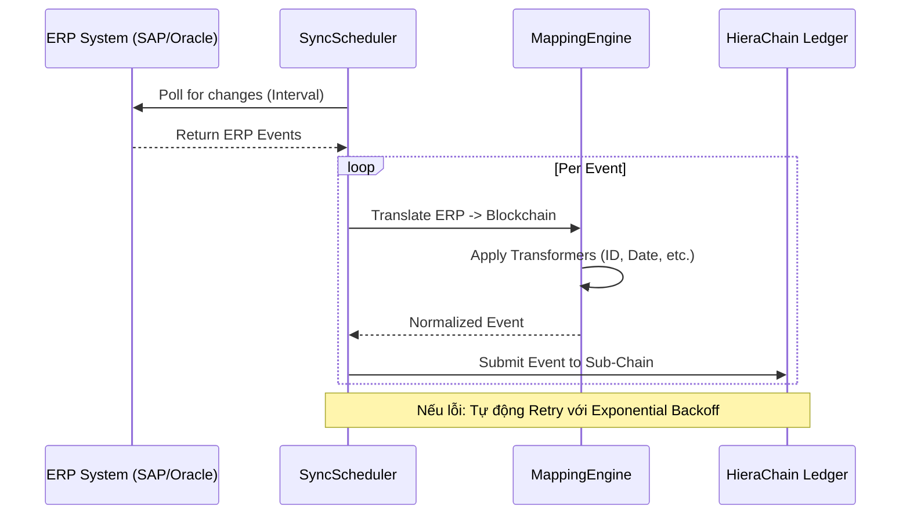

# Integration Module (`hierachain/integration/*`)

## Tổng quan

Module **Integration** là "cánh cửa" cho phép HieraChain hoạt động như một lớp bổ sung (Plugin Layer) cho hạ tầng Web2 hiện có của doanh nghiệp. Nó cung cấp các công cụ mạnh mẽ để kết nối, trích xuất và chuẩn hóa dữ liệu từ các hệ thống ERP hàng đầu thế giới (SAP, Oracle, Microsoft Dynamics) vào sổ cái blockchain với hiệu suất cao nhất.

---

## Các thành phần cốt lõi

<div class="grid cards" markdown>

*   :material-sync:{ .lg .middle } __ERP Integration Ledger__

    ---

    __File__: `erp_ledger.py`

    * Trung tâm điều phối việc tích hợp với các hệ thống ERP.
    * **Mapping Engine**: Ánh xạ dữ liệu phức tạp từ ERP sang Blockchain.
    * **Sync Scheduler**: Lập lịch đồng bộ tự động với cơ chế Retry thông minh.

*   :material-factory:{ .lg .middle } __Enterprise Adapters__

    ---

    __File__: `enterprise.py`

    * Các bộ kết nối (Adapters) chuẩn hóa cho **SAP**, **Oracle**, và **Dynamics**.
    * Hỗ trợ cấu hình qua biến môi trường để đảm bảo bảo mật thông tin kết nối.
    * Xử lý xác thực và kết nối đến các API doanh nghiệp.

*   :material-table-column:{ .lg .middle } __Arrow Client__

    ---

    __File__: `arrow_client.py`

    * Tối ưu hóa việc trao đổi dữ liệu khối lượng lớn bằng định dạng cột **Apache Arrow**.
    * Tăng tốc độ IO và giảm mức tiêu thụ bộ nhớ khi xử lý báo cáo hoặc trích xuất dữ liệu.

*   :material-magnify-scan:{ .lg .middle } __Change Detector__

    ---

    __File__: `erp_ledger.py`

    * Tự động phát hiện sự thay đổi giữa các trạng thái dữ liệu trong ERP.
    * Chỉ ghi nhận những thay đổi có ý nghĩa (Delta) lên blockchain để tối ưu không gian lưu trữ.

</div>

---

## Công cụ Ánh xạ Dữ liệu (Mapping Engine)

Mapping Engine cho phép định nghĩa các quy tắc chuyển đổi linh hoạt cho từng trường dữ liệu:

| Transformer | Chức năng | Ví dụ chuyển đổi |
| :--- | :--- | :--- |
| `date` | Chuẩn hóa định dạng thời gian | `12/04/2024` → `ISO-8601` |
| `amount` | Chuyển đổi kiểu số và tiền tệ | `5000` → `5000.0` (Float) |
| `status` | Ánh xạ trạng thái nghiệp vụ | `REQ` → `REQUESTED` |
| `id` | Thêm tiền tố định danh | `123` → `ERP_123` |
| `boolean` | Chuyển đổi logic | `1/Yes/On` → `True` |

---

## Luồng Đồng bộ dữ liệu (Synchronization Flow)

Hệ thống sử dụng `SyncScheduler` để đảm bảo dữ liệu blockchain luôn được cập nhật từ ERP:



---

## Ví dụ Triển khai

### 1. Cấu hình Mapping cho SAP
```python
sap_mapping = {
    "entity_id": "material.document_number",
    "event": {
        "source_path": "material.event_type",
        "transformer": "status",
        "params": {"mapping": {"GR": "GOODS_RECEIPT"}}
    },
    "details.quantity": {
        "source_path": "material.qty",
        "transformer": "amount"
    }
}
```

### 2. Khởi chạy Đồng bộ tự động
```python
from hierachain.integration.erp_ledger import ERPIntegrationLedger

ledger = ERPIntegrationLedger()
# Bắt đầu đồng bộ profile 'SAP_Logistics' mỗi 60 giây
ledger.start_scheduled_sync(
    profile_name="SAP_Logistics",
    interval_seconds=60,
    chain=sub_chain_instance
)
```

---

## Hiệu năng và Bảo mật

*   **Hiệu năng**: Sử dụng `ThreadPoolExecutor` để xử lý đồng bộ nhiều profile ERP cùng lúc mà không gây nghẽn.
*   **Bảo mật**: Thông tin định danh và mật khẩu ERP được quản lý qua biến môi trường (ví dụ: `HRC_SAP_PASSWORD`), tuân thủ nguyên tắc không lưu secret trong mã nguồn.
*   **Tính bền vững**: Cơ chế Retry với Exponential Backoff giúp hệ thống tự phục hồi khi kết nối ERP bị gián đoạn tạm thời.

---

## Liên quan

*   [Hệ thống Phân cấp (Hierarchical)](./hierarchical.md)
*   [Cấu trúc Blockchain Lõi (Core)](./core.md)
*   [Xử lý lỗi và Giảm thiểu rủi ro](./error-mitigation.md)
