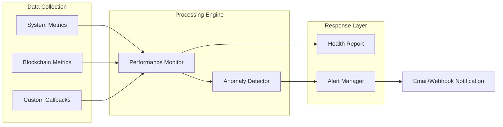

# Monitoring Module (`hierachain/monitoring/*`)

## Tổng quan

Module **Monitoring** cung cấp khả năng quan sát (Observability) 360 độ cho hệ thống HieraChain. Nó không chỉ theo dõi các chỉ số hạ tầng truyền thống (CPU, RAM, Disk) mà còn giám sát sâu các chỉ số đặc thù của blockchain như thông lượng sự kiện (throughput), thời gian đóng khối, và tỷ lệ thành công của đồng thuận BFT.

---

## Các thành phần chính

<div class="grid cards" markdown>

*   :material-monitor-dashboard:{ .lg .middle } __Performance Monitor__

    ---

    __File__: `performance_monitor.py`

    * Thu thập chỉ số thời gian thực từ hệ thống và các tiến trình HieraChain.
    * Hỗ trợ chỉ số tùy chỉnh (Custom Metrics) qua các hàm callback.
    * Tính toán **Health Score** để đánh giá sức khỏe hệ thống tức thì.

*   :material-bell-ring:{ .lg .middle } __Alert System__

    ---

    __File__: `alert_system.py`

    * Quản lý vòng đời cảnh báo: Từ phát hiện, thông báo đến xác nhận và giải quyết.
    * Hỗ trợ nhiều kênh thông báo: **Email (SMTP/TLS)** và **Webhooks**.
    * Cơ chế **Escalation** (Leo thang) tự động khi cảnh báo không được xử lý.

*   :material-graph:{ .lg .middle } __Anomaly Detector__

    ---

    __File__: `alert_system.py`

    * Phát hiện các hành vi bất thường dựa trên thuật toán **Z-Score**.
    * Phân tích lịch sử dữ liệu trong các cửa sổ thời gian (Sliding Windows) để xác định độ lệch chuẩn.
    * Giúp phát hiện sớm các cuộc tấn công DDoS hoặc nghẽn thắt nút cổ chai.

*   :material-chart-bar:{ .lg .middle } __Blockchain Metrics__

    ---

    __File__: `performance_metrics.py`

    * **Throughput**: Số lượng sự kiện xử lý trên mỗi giây (EPS).
    * **Latency**: Thời gian trung bình để một sự kiện được xác thực và đóng khối.
    * **Consensus Health**: Tỷ lệ vòng đồng thuận thành công và thời gian hội tụ.

</div>

---

## Quy trình Giám sát và Cảnh báo

Hệ thống hoạt động theo một vòng lặp liên tục để đảm bảo tính sẵn sàng cao:



---

## Chỉ số Sức khỏe Hệ thống (Health Score)

HieraChain tính toán điểm số sức khỏe tổng thể (0-100) dựa trên các trọng số và ngưỡng cảnh báo:

| Trạng thái | Điểm số | Ý nghĩa |
| :--- | :--- | :--- |
| **Excellent** | 90 - 100 | Hệ thống hoạt động hoàn hảo, không có cảnh báo. |
| **Good** | 70 - 89 | Hoạt động ổn định, có thể có một vài cảnh báo nhẹ. |
| **Poor** | < 70 | Hiệu năng bị ảnh hưởng rõ rệt, cần kiểm tra. |
| **Critical** | N/A | Có ít nhất một chỉ số ở mức **Critical Alert**. |

---

## Ví dụ Triển khai

### 1. Khởi chạy Giám sát Hiệu năng
```python
from hierachain.monitoring import PerformanceMonitor

monitor = PerformanceMonitor(config={"collection_interval": 10.0})
monitor.start_monitoring()

# Lấy báo cáo sức khỏe tức thì
health_score, status = monitor.get_health_score()
print(f"System Health: {status} ({health_score}/100)")
```

### 2. Định nghĩa Quy tắc Cảnh báo (Alert Rules)
```python
from hierachain.monitoring.alert_system import AlertRule, AlertSeverity, AlertCategory

rule = AlertRule(
    rule_id="TPS_DROP",
    name="Thông lượng giảm mạnh",
    description="Thông lượng sự kiện giảm xuống dưới mức tối thiểu",
    category=AlertCategory.PERFORMANCE,
    metric_name="event_throughput",
    condition="less_than",
    threshold=10.0,
    severity=AlertSeverity.CRITICAL,
    escalation_time=600  # Leo thang sau 10 phút nếu không xử lý
)
alert_manager.add_alert_rule(rule)
```

---

## Thông báo và Leo thang (Escalation)

Khi một cảnh báo được tạo ra mà không được **Acknowledge** (Xác nhận) trong khoảng thời gian quy định:

1.  Hệ thống sẽ tự động tăng mức độ nghiêm trọng (ví dụ từ WARNING lên CRITICAL).
2.  Gửi thông báo bổ sung đến các danh sách người nhận khẩn cấp qua kênh Email/Webhook.
3.  Ghi nhật ký chi tiết vào hệ thống Audit để phục vụ điều tra sau sự cố.

---

## Liên quan

*   [Quản lý rủi ro (Risk Management)](./risk-management.md)
*   [Bảo mật và Resource Guard](./security.md)
*   [Cấu hình hệ thống (Config)](./config.md)
