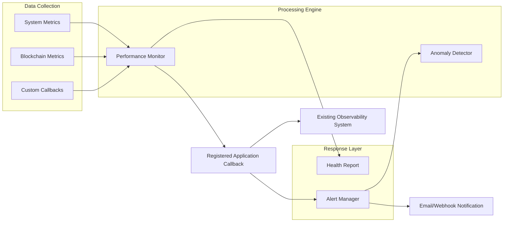

# Monitoring Module (`hierachain/monitoring/*`)

## Tổng quan

Module **Monitoring** theo dõi các chỉ số hạ tầng như CPU, RAM và dung lượng đĩa. Module cũng ghi nhận chỉ số của HieraChain, gồm thông lượng event, thời gian đóng block và tỷ lệ thành công của BFT.

Module được bật theo nhu cầu. Import `PerformanceMonitor` nạp phần thu thập metric độc lập với alerting; import `AlertManager` nạp phần cảnh báo độc lập với thu thập metric. Ứng dụng chủ quản chủ động khởi chạy và dừng monitoring, ghi nhận hoạt động ledger qua các phương thức `record_*`, và có thể đăng ký callback `add_alert_handler()` cho hệ thống observability hiện có. Thu thập, kiểm tra ngưỡng và báo cáo thuộc `PerformanceMonitor`; rule, trạng thái cảnh báo và gửi thông báo thuộc `AlertManager`.

---

## Các thành phần chính

<div class="grid cards" markdown>

*   :material-monitor-dashboard:{ .lg .middle } __Performance Monitor__

    ---

    __File__: `performance_monitor.py`

    * Thu thập chỉ số thời gian thực từ hệ thống và các tiến trình HieraChain.
    * Hỗ trợ chỉ số tùy chỉnh (Custom Metrics) qua các hàm callback.
    * Tính toán **Health Score** để đánh giá sức khỏe hệ thống tức thì.

*   :material-bell-ring:{ .lg .middle } __Alert System__

    ---

    __File__: `alert_system.py`

    * Quản lý vòng đời cảnh báo: Từ phát hiện, thông báo đến xác nhận và giải quyết.
    * Hỗ trợ nhiều kênh thông báo: **Email (SMTP/TLS)** và **Webhooks**.
    * Cơ chế **Escalation** (Leo thang) tự động khi cảnh báo không được xử lý.

*   :material-graph:{ .lg .middle } __Anomaly Detector__

    ---

    __File__: `alert_system.py`

    * Phát hiện các hành vi bất thường dựa trên thuật toán **Z-Score**.
    * Phân tích lịch sử dữ liệu trong các cửa sổ thời gian (Sliding Windows) để xác định độ lệch chuẩn.
    * Xác định các giá trị metric lệch khỏi phân bố thống kê.

</div>

---

## Quy trình Giám sát và Cảnh báo

Gọi `start_monitoring()` để bắt đầu vòng lặp thu thập. Callback cảnh báo chỉ chạy khi đã được đăng ký và `enable_alerts` được bật. Ứng dụng chủ quản truyền dữ liệu vào phần cảnh báo tùy chọn qua `check_metric()`, `create_alert()` hoặc `send_alert()`.


```mermaid
graph LR
    subgraph "Data Collection"
        A[System Metrics]
        B[Blockchain Metrics]
        C[Custom Callbacks]
    end

    subgraph "Processing Engine"
        D[Performance Monitor]
        E[Anomaly Detector]
    end

    subgraph "Response Layer"
        F[Health Report]
        G[Alert Manager]
    end

    A & B & C --> D
    D --> F
    D --> K[Registered Application Callback]
    K --> J[Existing Observability System]
    K --> G
    G --> E
    G --> H[Email/Webhook Notification]
```

---

## Chỉ số Sức khỏe Hệ thống (Health Score)

Monitor lấy trung bình điểm của các metric có dữ liệu: normal = 100, warning = 50, critical = 0. Metric chưa có dữ liệu không được tính:

| Trạng thái | Điểm số | Ý nghĩa |
| :--- | :--- | :--- |
| `excellent` | 100 | Tất cả metric có dữ liệu đều normal. |
| `warning` | Từ 50 đến dưới 100 | Có ít nhất một warning; không có metric critical. |
| `critical` | Từ 0 đến dưới 100 | Có ít nhất một metric critical. |
| `no_data` | 0 | Không có metric nào có dữ liệu. |

---

## Ví dụ Triển khai

### 1. Khởi chạy Giám sát Hiệu năng
```python
from hierachain.monitoring import PerformanceMonitor

monitor = PerformanceMonitor(config={"collection_interval": 10.0})
try:
    monitor.start_monitoring()
    health_score, status = monitor.get_health_score()
    print(f"System Health: {status} ({health_score}/100)")
finally:
    monitor.stop_monitoring()
```

### 2. Định nghĩa Quy tắc Cảnh báo (Alert Rules)
```python
from hierachain.monitoring import AlertManager
from hierachain.monitoring.alert_system import AlertRule, AlertSeverity, AlertCategory

alert_manager = AlertManager()
rule = AlertRule(
    rule_id="TPS_DROP",
    name="Sharp throughput drop",
    description="Event throughput dropped below minimum threshold",
    category=AlertCategory.PERFORMANCE,
    metric_name="event_throughput",
    condition="less_than",
    threshold=10.0,
    severity=AlertSeverity.CRITICAL,
    escalation_time=600  # Escalate after 10 minutes if not handled
)
alert_manager.add_alert_rule(rule)
```

Ứng dụng chủ quản truyền giá trị metric vào `alert_manager.check_metric("event_throughput", value)`. Hai thành phần không tự động kết nối với nhau. Với `enable_alerts=False`, monitor vẫn thu thập metric và tạo báo cáo nhưng không gọi callback cảnh báo.

---

## Thông báo và Leo thang (Escalation)

Khi một cảnh báo được tạo ra mà không được **Acknowledge** (Xác nhận) trong khoảng thời gian quy định:

1.  Bộ đếm escalation tăng và một thông báo critical được tạo.
2.  Các notifier Email/Webhook đã cấu hình nhận thông báo đó.
3.  Escalation được ghi log. Xác nhận hoặc giải quyết cảnh báo gốc sẽ hủy timer escalation đang chờ của cảnh báo đó.

---

## Liên quan

*   [Quản lý rủi ro (Risk Management)](./risk-management.md)
*   [Bảo mật và Resource Guard](./security.md)
*   [Cấu hình hệ thống (Config)](./config.md)

Với metric mặc định của PerformanceMonitor, tỷ lệ đồng thuận thành công trên 95% là bình thường, từ 95% trở xuống là warning, từ 90% trở xuống là critical. Cảnh báo critical thay thế cảnh báo active có mức thấp hơn. Gửi thông báo dùng một worker và hàng đợi tối đa 128 cảnh báo; khi đầy, hệ thống ghi nhận gửi thất bại nhưng giữ lịch sử cảnh báo. SMTP và webhook dùng timeout 10 giây. Gọi `AlertManager.close()` để ngừng nhận thông báo mới và chờ gửi hàng đợi trong giới hạn timeout; tiến trình thoát đột ngột có thể mất thông báo còn trong hàng đợi.
