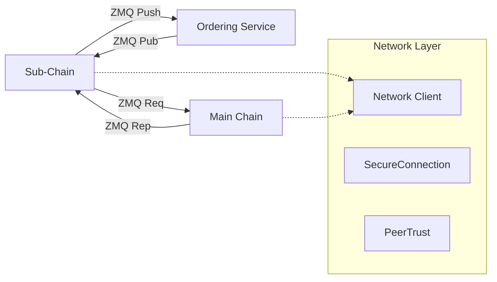

# Network (`hierachain/network/*`)

## Mục đích

Cung cấp hạ tầng truyền thông giữa các thành phần/nút của HieraChain: gửi/nhận thông điệp, thiết lập kết nối an toàn, và quản lý độ tin cậy giữa các peer.

## Kiến trúc & khái niệm

* Vận chuyển (Transport): `network/zmq_transport.py` — triển khai dựa trên ZeroMQ cho giao tiếp không đồng bộ, phù hợp mô hình pub/sub, push/pull.
* Client/Abstraction: `network/network_client.py` — bao bọc thao tác gửi/nhận, quản lý endpoint.
* Kết nối an toàn: `network/secure_connection.py` — lớp tiện ích cho bảo mật đường truyền (mã hóa/handshake ở mức ứng dụng nếu cần).
* **Message Cryptographic** (mới): `network/message_cryptographic.py` — ký và xác thực P2P messages với Ed25519, replay protection (timestamp + nonce).
* Niềm tin ngang hàng: `network/peer_trust_manager.py` — quản lý trạng thái peer (độ tin cậy, blacklist/graylist, tạm ngắt).

Sơ đồ đơn giản:



## API công khai (Public API)

Mức mô tả (rút gọn, tham khảo tên lớp/hàm trong mã nguồn):

* ZmqTransport: khởi tạo với endpoint (bind/connect), gửi (`send`), nhận (`recv`), đóng (`close`).
* NetworkClient: cấu hình danh sách endpoint, phương thức `publish`, `subscribe`, `request`, `respond` (tùy thực thi).
* SecureConnection: tạo/ký/xác minh thông điệp, bọc thêm lớp mã hóa nếu thiết lập.
* **MessageCryptographic**: ký messages (`sign_message`), verify signatures (`verify_message`), handshake signing/verification.
* PeerTrustManager: cập nhật điểm tin cậy, đánh dấu peer xấu, chính sách retry/backoff.

Ví dụ mô tả (pseudocode):

```python
from hierachain.network.zmq_transport import ZmqTransport

tx = ZmqTransport(endpoint="tcp://127.0.0.1:5555", mode="bind")
rx = ZmqTransport(endpoint="tcp://127.0.0.1:5555", mode="connect")

tx.send({"type": "event", "payload": {"entity_id": "PROD-001"}})
msg = rx.recv(timeout=1000)  # ms
```

### Message Cryptographic (Chi tiết)

**File**: `network/message_cryptographic.py`

Module cung cấp cryptographic signing và verification cho P2P messages:

```python
from hierachain.network.message_cryptographic import (
    sign_message,
    verify_message,
    sign_handshake_payload,
    verify_handshake_signature
)
from hierachain.security.security_utils import KeyPair

# Khởi tạo keypair (Ed25519)
keypair = KeyPair.generate()
sender_id = "node_1"

# 1. Sign a P2P message
payload = {
    "type": "consensus_vote",
    "block_hash": "0x123abc...",
    "vote": "approve"
}

signed_msg = sign_message(
    payload=payload,
    keypair=keypair,
    sender_id=sender_id
)

# Signed message structure:
# {
#   "payload": {...},
#   "timestamp": 1234567890.123,
#   "nonce": "uuid-string",
#   "sender_id": "node_1",
#   "signature": "hex-signature"
# }

# 2. Send via ZMQ
zmq_transport.send(signed_msg)

# 3. Receive and verify
received_msg = zmq_transport.recv()

# Get sender's public key from peer trust manager
public_key_hex = peer_trust_manager.get_public_key(
    received_msg["sender_id"]
)

# Verify signature
is_valid = verify_message(
    message=received_msg,
    public_key_hex=public_key_hex
)

if is_valid:
    # Process message
    process_consensus_vote(received_msg["payload"])
else:
    logger.warning(f"Invalid signature from {received_msg['sender_id']}")
    peer_trust_manager.record_failure(received_msg["sender_id"])

# 4. Handshake signing (for connection establishment)
handshake_data = {
    "node_id": "node_1",
    "protocol_version": "1.0",
    "capabilities": ["consensus", "storage"]
}

handshake_sig = sign_handshake_payload(handshake_data, keypair)

# Send handshake
handshake_msg = {
    **handshake_data,
    "signature": handshake_sig
}
zmq_transport.send(handshake_msg)

# Verify handshake (receiver side)
received_handshake = zmq_transport.recv()
sig = received_handshake.pop("signature")
sender_pubkey = lookup_public_key(received_handshake["node_id"])

if verify_handshake_signature(received_handshake, sig, sender_pubkey):
    print("Handshake verified, connection established")
else:
    print("Handshake failed, rejecting connection")
```

**[FACT]** Message Cryptographic features:
* **Ed25519 signatures**: Fast, secure digital signatures (128-bit security)
* **Canonical serialization**: Deterministic JSON serialization (sorted keys) for consistent signing
* **Replay protection**: Timestamp + UUID nonce prevent replay attacks
* **Handshake support**: Separate signing for connection establishment

**[INVARIANT]** Signed message structure:
* Must contain: `payload`, `timestamp`, `nonce`, `sender_id`, `signature`
* `timestamp` must be Unix timestamp (float)
* `nonce` must be unique UUID string
* `signature` must be hex-encoded Ed25519 signature

**[DECISION]** Dùng Ed25519 thay vì RSA/ECDSA vì:
* Faster signing/verification (~10x faster than RSA-2048)
* Smaller signatures (64 bytes vs 256 bytes for RSA)
* Better security properties (immunity to timing attacks)
* Native support in Python via `cryptography` library

**[EDGE CASE]** Clock skew: Nếu sender và receiver có clock skew lớn (>5 minutes), timestamp validation có thể fail. Giải pháp:
* Sync clocks với NTP
* Accept messages trong time window (±5 minutes)
* Log warnings nếu detect large clock skew

**[EDGE CASE]** Nonce collision: UUID v4 có xác suất collision ~10^-36, effectively zero cho practical purposes. Nếu cần stronger guarantee, dùng counter-based nonce + timestamp.

## Cấu hình

* Endpoint/ports do dịch vụ triển khai quyết định; có thể tham chiếu từ biến môi trường riêng (không cố định trong `settings.py`).
* Khi tích hợp Ordering Service (xem Architecture/Consensus), cấu hình phải thống nhất giữa các thành phần.

## Tính năng & hạn chế

* Tính năng:

    * Giao tiếp không đồng bộ, phù hợp throughput cao.
    * Có lớp tiện ích để tăng cứng bảo mật ở mức ứng dụng.
    * Quản lý độ tin cậy peer (tối thiểu) để giảm nhiễu.

* Hạn chế:

     * ZeroMQ không tự cung cấp cơ chế phân tán/HA hoàn chỉnh; cần bổ sung orchestration.
     * Bảo mật đầu-cuối cần cấu hình khóa/chính sách rõ ràng.

## Bảo mật & quyền truy cập

* Kết hợp với `security/*` để ký/xác minh thông điệp hoặc thiết lập khóa phiên.
* Thận trọng với cấu hình bind/connect hở Internet; triển khai trong mạng tin cậy hoặc sau lớp proxy/TLS.

## Xử lý lỗi & khắc phục

* Retry/backoff khi mất kết nối; ghi nhận sự cố vào audit/monitoring.
* Kết hợp `monitoring/*` để phát cảnh báo khi số lần lỗi vượt ngưỡng.

## Hiệu năng

* ZMQ hỗ trợ mô hình hàng đợi nhẹ; tinh chỉnh high-water mark, batch, và affinity nếu cần.
* Tách kênh nóng (hot path) và lạnh (cold path) để tránh nghẽn.

## Liên quan

* Architecture/Consensus (Ordering): [Consensus & Ordering](../architecture/consensus.md)
* Security: [Security](security.md)
* Monitoring: [Monitoring](monitoring.md)

---

??? info "Thông tin kỹ thuật bổ sung (Metadata)"

    **FACT**

    * Mã nguồn mạng: `hierachain/network/{zmq_transport.py, network_client.py, secure_connection.py, peer_trust_manager.py}`.

    **DECISION**

    * Ưu tiên ZMQ cho đơn giản và thông lượng; bảo mật ở mức ứng dụng thông qua ký/xác minh và (tùy chọn) mã hóa.

    **ASSUMPTION**

    * Môi trường triển khai cho phép mở cổng mạng liên quan; firewall đã được cấu hình.

    **INVARIANT**

    * Thông điệp phải tuần tự hóa xác định trước khi ký/xác minh.
    * Cấu hình endpoint nhất quán giữa các thành phần.

    **EDGE CASES**

    * Mất kết nối lặp lại → cần backoff và chuyển kênh.
    * Peer có hành vi xấu → đưa vào blacklist tạm thời qua PeerTrustManager.
