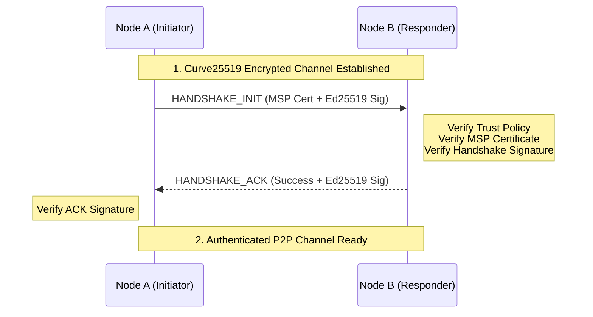

# Network Module (`hierachain/network/*`)

## Tổng quan

Module **Network** quản lý giao tiếp giữa các node HieraChain qua **ZeroMQ**. Module dùng các cơ chế mật mã để mã hóa và xác thực thông điệp.

---

## Kiến trúc Bảo mật Đa tầng (Layered Security)

HieraChain dùng ba lớp bảo vệ độc lập cho giao tiếp mạng:

<div class="grid cards" markdown>

*   :material-lock-check:{ .lg .middle } __Lớp 1: CurveZMQ (Transport)__

    ---

    __Công nghệ__: Curve25519

    * Mã hóa toàn bộ đường truyền giữa các Socket ZeroMQ.
    * Đảm bảo tính riêng tư (Privacy) và chống nghe lén trên mạng Web2.
    * Sử dụng khóa ephemeral để đảm bảo Forward Secrecy.

*   :material-account-check:{ .lg .middle } __Lớp 2: MSP Handshake (Identity)__

    ---

    __Công nghệ__: Ed25519 + Certificates

    * Xác thực danh tính nút thông qua chứng chỉ MSP (Membership Service Provider).
    * Chỉ cho phép các nút thuộc tổ chức (Organization) hợp lệ tham gia mạng lưới.
    * Quy trình Handshake 2 bước: `INIT` và `ACK`.

*   :material-shield-sync:{ .lg .middle } __Lớp 3: Integrity & Replay Protection__

    ---

    __Công nghệ__: Ed25519 + Nonce + Timestamp

    * Mọi thông điệp P2P đều được ký số (Digital Signature).
    * Chống tấn công lặp lại (Replay Attacks) bằng cách kiểm tra Nonce duy nhất và Timestamp trong cửa sổ cho phép (60s).

</div>

---

## Các thành phần cốt lõi

### 1. ZMQ Transport (`zmq_transport.py`)
Hiện thực hóa mô hình P2P không đồng bộ sử dụng Socket **ROUTER** (để nhận) và **DEALER** (để gửi). 

*   **Truyền tải**: Dùng socket không đồng bộ; broadcast gửi tuần tự tới các peer đã đăng ký.
*   **Identity Management**: Quản lý định danh các nút ở mức socket để định tuyến chính xác.
*   **Replay buffer**: Giữ tối đa 1.000 cặp timestamp/nonce với nonce dạng chuỗi dài tối đa 128 ký tự. Khi tất cả mục vẫn nằm trong cửa sổ 60 giây, thông điệp mới bị từ chối cho đến khi có mục hết hạn.

`NetworkClient` theo dõi seed và peer đăng ký thủ công trong cùng registry. Gỡ peer cũng đóng socket DEALER gửi đi của peer đó. Peer được xem là healthy trong 60 giây đầu sau khi đăng ký; mỗi thông điệp nhận vào hợp lệ từ định danh socket đã đăng ký sẽ gia hạn khoảng này. Peer im lặng chuyển unhealthy khi đọc trạng thái hoặc danh sách peer. Chỉ báo health này không xác thực peer hay xác nhận thông điệp gửi đi đã được nhận.

### 2. Secure Connection Manager (`secure_connection.py`)
Điều phối quy trình thiết lập kết nối an toàn:

1.  Thiết lập kênh mã hóa Curve25519.
2.  Thực hiện Handshake để trao đổi và xác thực chứng chỉ MSP.
3.  Quản lý danh sách các Peer đã được xác thực (`authenticated_peers`).

### 3. Peer Trust Manager (`peer_trust_manager.py`)
Quản lý độ tin cậy của các nút lân cận:

*   **Policy Enforcement**: Áp dụng các chính sách `strict` (chỉ cho phép allowlist) hoặc `discovery` (cho phép tự động khám phá).
*   **Reputation**: Đánh dấu và ngắt kết nối với các Peer có hành vi xấu (sai chữ ký, gửi thông điệp rác).

---

## Quy trình Thiết lập Kết nối An toàn (Secure Handshake)


```mermaid
sequenceDiagram
    participant NodeA as Node A (Initiator)
    participant NodeB as Node B (Responder)

    Note over NodeA, NodeB: 1. Curve25519 Encrypted Channel Established
    
    NodeA->>NodeB: HANDSHAKE_INIT (MSP Cert + Ed25519 Sig)
    
    Note right of NodeB: Verify Trust Policy<br/>Verify MSP Certificate<br/>Verify Handshake Signature
    
    NodeB-->>NodeA: HANDSHAKE_ACK (Success + Ed25519 Sig)
    
    Note left of NodeA: Verify ACK Signature
    
    Note over NodeA, NodeB: 2. Authenticated P2P Channel Ready
```

---

## Ví dụ sử dụng

### 1. Khởi tạo Node Bảo mật
```python
from hierachain.network.secure_connection import SecureConnectionManager

# Khởi tạo manager tích hợp MSP
secure_node = SecureConnectionManager(
    node_id="node_001",
    port=5001,
    msp=msp_instance,
    identity_mgr=identity_instance
)

await secure_node.start()
```

### 2. Gửi thông điệp có ký số
```python
# Tự động ký và gửi qua kênh đã mã hóa
payload = {"event": "block_proposal", "data": {...}}
await secure_node.send_secure("peer_002", payload)
```

---

## Cấu hình P2P (Environment Variables)

| Biến môi trường | Chức năng | Giá trị khuyến nghị (Prod) |
| :--- | :--- | :--- |
| `HRC_P2P_TRUST_POLICY` | Chính sách tin cậy | `strict` |
| `HRC_P2P_REQUIRE_SIGNATURES` | Bắt buộc chữ ký Ed25519 | `true` |
| `HRC_P2P_PEER_ALLOWLIST` | Danh sách Peer ID tin cậy | (Danh sách ID cụ thể) |

---

## Liên quan

*   [Bảo mật và MSP (Security)](./security.md)
*   [Đồng thuận BFT (Consensus)](../consensus/bft_consensus.md)
*   [Giám sát mạng (Monitoring)](./monitoring.md)
