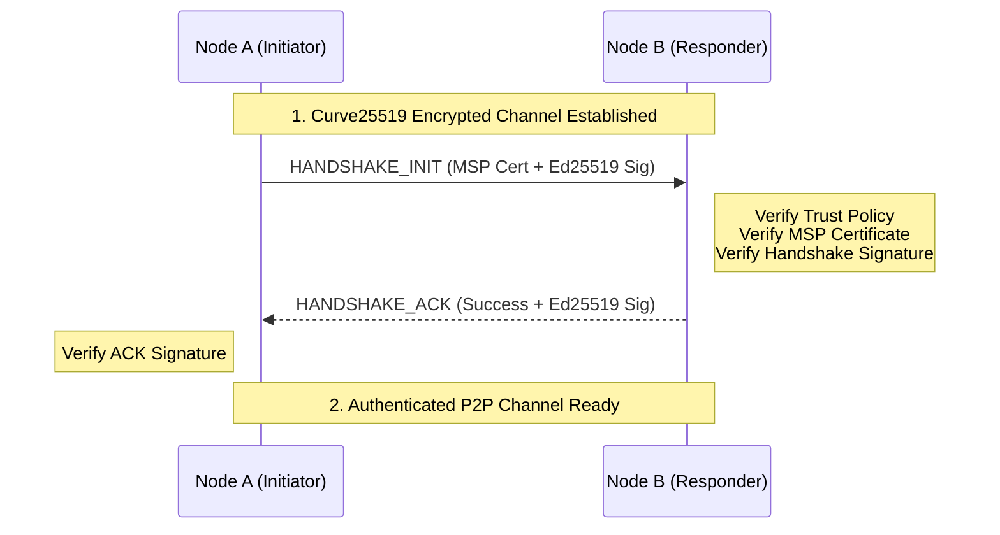

# Network Module (`hierachain/network/*`)

## Tổng quan

Module **Network** quản lý giao tiếp giữa các node HieraChain qua **ZeroMQ**. `SecureConnectionManager` cung cấp tùy chọn mã hóa transport bằng CurveZMQ, MSP handshake và kiểm tra chữ ký thông điệp. `NetworkClient` của API server tạo trực tiếp `ZmqNode`, nên luồng này không tự chạy handshake hoặc kiểm tra chữ ký của manager.

---

## Kiến trúc Bảo mật Đa tầng (Layered Security)

`SecureConnectionManager` cung cấp các thành phần bảo mật này khi ứng dụng sử dụng nó; chúng không tự động hoạt động trên mọi kết nối `NetworkClient`:

<div class="grid cards" markdown>

*   :material-lock-check:{ .lg .middle } __Lớp 1: CurveZMQ (Transport)__

    ---

    __Công nghệ__: Curve25519

    * Mã hóa đường truyền giữa các socket ZeroMQ khi được cấu hình với transport key cục bộ và public key của peer.
    * Đảm bảo tính riêng tư (Privacy) và chống nghe lén trên mạng Web2.
    * `SecureConnectionManager` tạo CurveZMQ keypair cho transport; `NetworkClient` riêng của API server dùng các transport key được cấu hình cho `ZmqNode`.

*   :material-account-check:{ .lg .middle } __Lớp 2: MSP Handshake (Identity)__

    ---

    __Công nghệ__: Ed25519 + Certificates

    * Xác thực danh tính nút qua chứng chỉ MSP (Membership Service Provider) khi handshake được chạy.
    * Chỉ cho phép các nút thuộc tổ chức (Organization) hợp lệ tham gia mạng lưới.
    * Quy trình Handshake 2 bước: `INIT` và `ACK`.
    * Ràng buộc subject và khóa ký của chứng chỉ còn hiệu lực với routing ID
      ZeroMQ và danh tính tổ chức đã đăng ký.

*   :material-shield-sync:{ .lg .middle } __Lớp 3: Integrity & Replay Protection__

    ---

    __Công nghệ__: Ed25519 + Nonce + Timestamp

    * Kiểm tra chữ ký thông điệp dữ liệu do `require_signatures` điều khiển; mặc định là `False` trong base, development và test settings, và `True` trong `ProductionSettings`.
    * Chống tấn công lặp lại (Replay Attacks) bằng cách kiểm tra Nonce duy nhất và Timestamp trong cửa sổ cho phép (60s).
    * Chữ ký handshake được kiểm tra riêng; các thông điệp này có `timestamp` và `nonce` đã ký, được replay gate của transport chấp nhận.

</div>

---

## Các thành phần cốt lõi

### 1. ZMQ Transport (`zmq_transport.py`)
Hiện thực hóa mô hình P2P không đồng bộ sử dụng Socket **ROUTER** (để nhận) và **DEALER** (để gửi). 

*   **Truyền tải**: Dùng socket không đồng bộ; broadcast gửi tuần tự tới các peer đã đăng ký.
*   **Identity Management**: Quản lý định danh các nút ở mức socket để định tuyến chính xác.
*   **Replay buffer**: Giữ tối đa 1.000 cặp timestamp/nonce với nonce dạng chuỗi dài tối đa 128 ký tự. Khi tất cả mục vẫn nằm trong cửa sổ 60 giây, thông điệp mới bị từ chối cho đến khi có mục hết hạn.

`NetworkClient` theo dõi seed và peer đăng ký thủ công trong cùng registry. Gỡ peer cũng đóng socket DEALER gửi đi của peer đó. Peer được xem là healthy trong 60 giây đầu sau khi đăng ký; mỗi thông điệp nhận vào hợp lệ từ định danh socket đã đăng ký sẽ gia hạn khoảng này. Peer im lặng chuyển unhealthy khi đọc trạng thái hoặc danh sách peer. Chỉ báo health này không xác thực peer hay xác nhận thông điệp gửi đi đã được nhận.

### 2. Secure Connection Manager (`secure_connection.py`)
Điều phối quy trình thiết lập kết nối an toàn:

1.  Thiết lập kênh mã hóa Curve25519.
2.  Thực hiện Handshake để trao đổi và xác thực chứng chỉ MSP.
3.  Quản lý danh sách các Peer đã được xác thực (`authenticated_peers`).

`NetworkClient` của API server hiện không nối manager này vào transport `ZmqNode`.

### 3. Peer Trust Manager (`peer_trust_manager.py`)
Quản lý độ tin cậy của các nút lân cận:

*   **Policy Enforcement**: Hỗ trợ `open` và `strict`. `open` tin cậy peer trừ khi peer nằm trong blocklist; `strict` yêu cầu peer có trong allowlist.
*   **Peer lists**: Allowlist và blocklist được quản lý tường minh; manager không chấm điểm reputation hay tự ngắt kết nối peer vì spam.
*   **Signed messages**: `SecureConnectionManager` loại bỏ chữ ký thông điệp dữ liệu không hợp lệ khi bật kiểm tra chữ ký.

---

## Quy trình Thiết lập Kết nối An toàn (Secure Handshake)


```mermaid
sequenceDiagram
    participant NodeA as Node A (Initiator)
    participant NodeB as Node B (Responder)

    Note over NodeA, NodeB: 1. Curve25519 Encrypted Channel Established

    NodeA->>NodeB: HANDSHAKE_INIT (MSP Cert + Ed25519 Sig)

    Note right of NodeB: Verify Trust Policy<br/>Verify MSP Certificate<br/>Verify Handshake Signature

    NodeB-->>NodeA: HANDSHAKE_ACK (Success + Ed25519 Sig)

    Note left of NodeA: Verify ACK Signature

    Note over NodeA, NodeB: 2. Authenticated P2P Channel Ready
```

Responder gửi lại nonce của `HANDSHAKE_INIT` trong ACK đã ký. Initiator chỉ
nhận ACK khi đang có handshake gửi đi tương ứng, peer vượt qua chính sách tin
cậy đã cấu hình, và chứng chỉ ACK còn hiệu lực, được ràng buộc với routing ID
cùng khóa ký của peer. Chứng chỉ CA, bản ghi danh tính, tổ chức hoặc khóa bị
thiếu hay không khớp đều bị từ chối.

---

## Ví dụ sử dụng

### 1. Khởi tạo Node Bảo mật
```python
from hierachain.network.secure_connection import SecureConnectionManager

# Initialize manager with MSP integration
secure_node = SecureConnectionManager(
    node_id="node_001",
    port=5001,
    msp=msp_instance,
    identity_mgr=identity_instance
)

async def start_configured_node() -> None:
    await secure_node.start()
```

### 2. Gửi thông điệp có ký số
```python
# Automatically signs and sends over the encrypted channel
async def send_proposal() -> bool:
    payload = {"event": "block_proposal", "data": {"block_index": 1}}
    return await secure_node.send_secure("peer_002", payload)
```

---

## Cấu hình P2P (Environment Variables)

| Biến môi trường | Chức năng | Giá trị khuyến nghị (Prod) |
| :--- | :--- | :--- |
| `HRC_P2P_TRUST_POLICY` | Chính sách tin cậy | `strict` |
| `HRC_P2P_REQUIRE_SIGNATURES` | Bắt buộc chữ ký Ed25519 | `true` |
| `HRC_P2P_PEER_ALLOWLIST` | Danh sách Peer ID tin cậy | (Danh sách ID cụ thể) |

---

## Liên quan

*   [Bảo mật và MSP (Security)](./security.md)
*   [Đồng thuận BFT (Consensus)](../consensus/bft_consensus.md)
*   [Giám sát mạng (Monitoring)](./monitoring.md)

ZeroMQ nhận frame tối đa 1 MiB và đúng hai frame ứng dụng (định danh bên gửi và nội dung); frame thừa được đọc bỏ, không gom vào danh sách multipart Python. Kết nối secure xác minh danh tính và chữ ký trước khi lưu replay, với cache riêng tối đa 1.000 mục mỗi peer đã xác minh. Transport plain yêu cầu peer ID đã cấu hình và tách cache theo peer; không bảo đảm danh tính bằng chữ ký. Các giới hạn này cần đi cùng kiểm soát kết nối và băng thông ở tầng triển khai.
