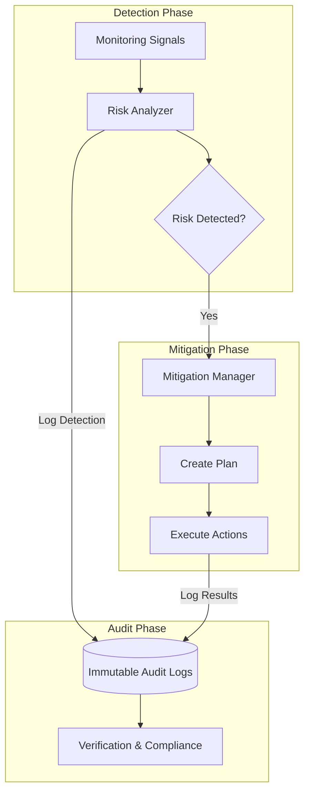

# Risk Management Module (`hierachain/risk_management/*`)

## Tổng quan

Module **Risk Management** là trung tâm kiểm soát an ninh và vận hành của HieraChain. Nó không chỉ giám sát các dấu hiệu bất thường mà còn chủ động đưa ra các chiến lược giảm thiểu (Mitigation) và ghi nhật ký kiểm toán (Audit) không thể thay đổi để đảm bảo tính minh bạch và tuân thủ cao nhất cho doanh nghiệp.

---

## Kiến trúc Quản trị Rủi ro Tập trung

Hệ thống hoạt động dựa trên sự phối hợp chặt chẽ của ba thành phần cốt lõi:

<div class="grid cards" markdown>

*   :material-magnify-scan:{ .lg .middle } __Risk Analyzer__

    ---

    __File__: `risk_analyzer.py`

    * Phân tích rủi ro đa miền: Đồng thuận, Bảo mật, Hiệu năng và Lưu trữ.
    * Đánh giá rủi ro dựa trên **Severity** (Mức độ nghiêm trọng) và **Likelihood** (Khả năng xảy ra).
    * Tự động đề xuất các khuyến nghị giảm thiểu.

*   :material-shield-airplane:{ .lg .middle } __Mitigation Manager__

    ---

    __File__: `mitigation_strategies.py`

    * Lập kế hoạch giảm thiểu (Mitigation Plan) dựa trên các rủi ro đã phát hiện.
    * Thực thi các hành động khắc phục tự động (Scale-out, Renew Certs, Backup...).
    * Quản lý độ ưu tiên và phụ thuộc giữa các hành động.

*   :material-file-lock:{ .lg .middle } __Audit Logger__

    ---

    __File__: `audit_logger.py`

    * Ghi vết toàn bộ vòng đời rủi ro theo chuẩn **JSONL**.
    * Đảm bảo tính toàn vẹn dữ liệu bằng hàm băm **SHA-256**.
    * Hỗ trợ truy vấn và tạo báo cáo phục vụ kiểm toán tuân thủ (Compliance).

</div>

---

## Vòng đời Quản lý Rủi ro (Risk Lifecycle)



---

## Phân loại Rủi ro và Ngưỡng Cảnh báo

HieraChain định nghĩa các ngưỡng (Thresholds) nghiêm ngặt để kích hoạt phân tích:

| Lĩnh vực | Chỉ số kiểm tra | Ngưỡng rủi ro |
| :--- | :--- | :--- |
| **Consensus** | Số lượng Node BFT | `< 3f + 1` (Critical) |
| **Security** | Hạn chứng chỉ (MSP) | `< 30 ngày` (High) |
| **Performance** | CPU/RAM Usage | `> 85%` (High) |
| **Storage** | Lần cuối Backup | `> 24 giờ` (High) |

---

## Ví dụ Triển khai

### 1. Thực hiện phân tích rủi ro toàn diện
```python
from hierachain.risk_management import RiskAnalyzer

analyzer = RiskAnalyzer()
# Thu thập dữ liệu hệ thống
system_snapshot = get_system_snapshot() 
risks = analyzer.perform_comprehensive_analysis(system_snapshot)

if risks['security']:
    print(f"Phát hiện {len(risks['security'])} rủi ro bảo mật!")
```

### 2. Kích hoạt kế hoạch giảm thiểu tự động
```python
from hierachain.risk_management.mitigation_strategies import MitigationManager

mitigation_mgr = MitigationManager()
# Tạo kế hoạch dựa trên danh sách rủi ro
plan = mitigation_mgr.create_mitigation_plan(risks['performance'])

# Thực thi bất đồng bộ để không ảnh hưởng luồng chính
results = mitigation_mgr.execute_mitigation_plan(plan, async_execution=True)
```

---

## Nhật ký Kiểm toán và Tính toàn vẹn

Mọi sự kiện trong module đều được lưu trữ với cấu trúc định danh duy nhất (Correlation ID) và được bảo vệ chống thay đổi:

*   **Hashing**: Mỗi bản ghi audit chứa hash SHA-256 của nội dung, cho phép phát hiện hành vi can thiệp vào log.
*   **Rotation**: Tự động xoay vòng log (100MB) và nén dữ liệu cũ để tối ưu lưu trữ.
*   **Retention**: Mặc định lưu trữ nhật ký trong 90 ngày (có thể cấu hình).

---

## Liên quan

*   [Giám sát hiệu năng (Monitoring)](./monitoring.md)
*   [Bảo mật và Danh tính (Security)](./security.md)
*   [Xử lý lỗi hệ thống (Error Mitigation)](./error-mitigation.md)
