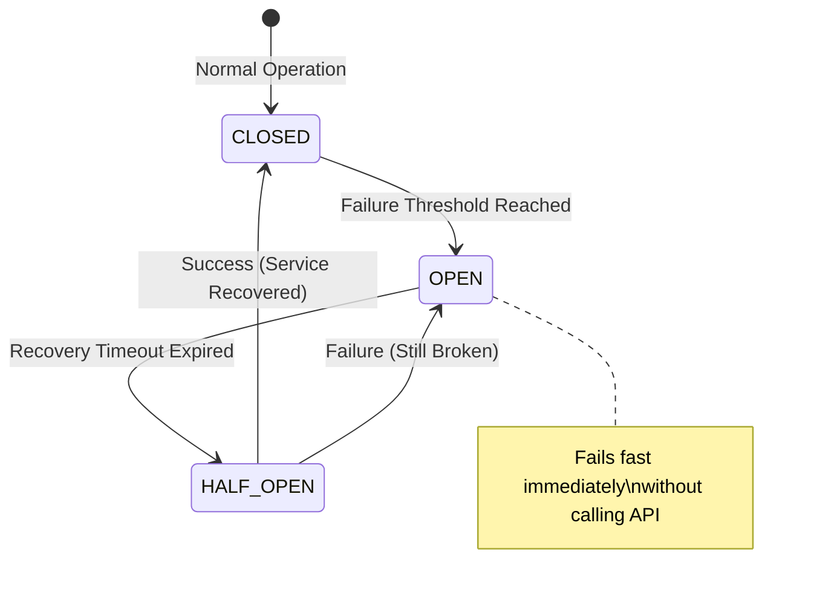

# SDK Module (`hierachain/sdk/*`)

## Tổng quan

Module **SDK** cung cấp bộ công cụ phát triển (Software Development Kit) bằng ngôn ngữ Python, giúp các ứng dụng bên ngoài tương tác với HieraChain một cách an toàn và tin cậy. Khác với việc gọi REST API thuần túy, SDK được tích hợp sẵn các cơ chế chống lỗi (Resiliency patterns) để đảm bảo ứng dụng không bị treo khi mạng gặp sự cố hoặc node đang trong chế độ bảo trì/lockdown.

---

## Các tính năng nổi bật

<div class="grid cards" markdown>

*   :material-sync:{ .lg .middle } __Dual Interface (Sync/Async)__

    ---

    * **Sync Client**: Sử dụng `requests`, phù hợp cho các script đơn giản, worker xử lý tuần tự.
    * **Async Client**: Sử dụng `aiohttp`, tối ưu cho các ứng dụng web high-concurrency (như FastAPI).

*   :material-refresh-circle:{ .lg .middle } __Thông minh & Linh hoạt__

    ---

    * **Exponential Backoff**: Tự động thử lại (Retry) với khoảng thời gian tăng dần khi gặp lỗi mạng tạm thời.
    * **Circuit Breaker**: Cơ chế "ngắt mạch" tự động để tránh làm quá tải hệ thống khi service đang lỗi.

*   :material-shield-lock:{ .lg .middle } __Nhận biết Trạng thái Hệ thống__

    ---

    * **Lockdown Awareness**: Tự động phát hiện và xử lý lỗi khi Node đang ở chế độ phong tỏa (`X-Lockdown-Mode`).
    * **Connection Pooling**: Tối ưu hóa việc tái sử dụng kết nối HTTP để giảm độ trễ.

*   :material-magnify-expand:{ .lg .middle } __Truy vấn Nâng cao__

    ---

    * **Entity Tracing**: Truy vết vòng đời thực thể xuyên suốt các chuỗi con.
    * **CID Resolution**: Tự động giải mã dữ liệu từ IPFS khi truy vấn khối.

</div>

---

## Kiến trúc Resiliency (Chống lỗi)

SDK sử dụng mô hình trạng thái (State Machine) để quản lý kết nối:



---

## Hướng dẫn sử dụng

### 1. Cấu hình Client
```python
from hierachain.sdk import HieraChainClientConfig, HieraChainClient

config = HieraChainClientConfig(
    base_url="https://api.hierachain.com",
    api_key="your_secret_key",
    max_retries=3,
    circuit_failure_threshold=5
)
```

### 2. Sử dụng Synchronous Client (Dành cho Script/CLI)
```python
with HieraChainClient(config) as client:
    # Ghi sự kiện vào chuỗi cung ứng
    result = client.submit_event(
        chain_name="supply_chain",
        event_data={
            "entity_id": "PRODUCT-123",
            "event": "quality_check",
            "details": {"status": "passed", "inspector": "QA-01"}
        }
    )
    print(f"Event ID: {result.event_id}")
```

### 3. Sử dụng Asynchronous Client (Dành cho Web/High-load)
```python
from hierachain.sdk import HieraChainAsyncClient

async def track_product():
    async with HieraChainAsyncClient(config) as client:
        # Truy vết thực thể xuyên chuỗi
        trace = await client.trace_entity("PRODUCT-123")
        for event in trace.events:
            print(f"Timestamp: {event['timestamp']} - Action: {event['event']}")
```

---

## Quản lý Lỗi (Exception Handling)

SDK định nghĩa các lớp lỗi cụ thể để ứng dụng có thể xử lý logic riêng biệt:

| Exception | Nguyên nhân | Gợi ý xử lý |
| :--- | :--- | :--- |
| `CircuitOpenError` | Hệ thống đang lỗi liên tục, SDK tạm ngừng gửi request. | Đợi một khoảng thời gian trước khi thử lại. |
| `LockdownError` | Node mục tiêu đang trong chế độ phong tỏa bảo mật. | Kiểm tra thông báo từ quản trị viên hệ thống. |
| `ServiceUnavailableError` | Server quá tải (503). | SDK sẽ tự động retry với backoff. |
| `HieraChainAPIError` | Lỗi logic từ phía API hoặc dữ liệu không hợp lệ. | Kiểm tra lại payload và quyền truy cập. |

---

## Liên quan

*   [Tài liệu API v1/v3](../reference/api-v1.md)
*   [Hệ thống bảo mật (Security)](./security.md)
*   [Quản lý rủi ro (Risk Management)](./risk-management.md)
