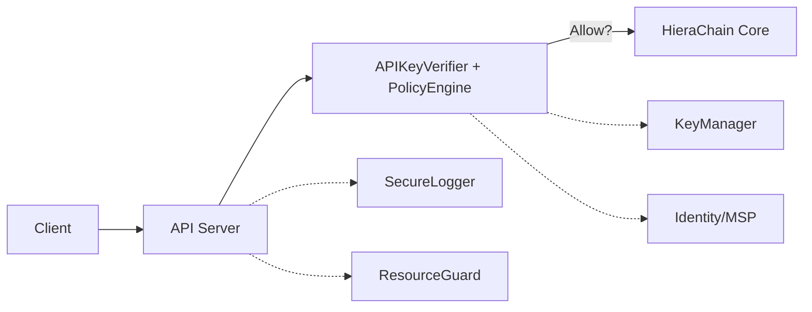

# Security (`hierachain/security/*`)

## Mục đích

Mô-đun Security cung cấp các năng lực bảo mật cấp doanh nghiệp cho HieraChain: quản trị danh tính và thành viên (MSP), quản lý khóa và API key, chính sách cấp quyền (Policy Engine), xác thực yêu cầu (API Key Verifier), bảo vệ tài nguyên (Resource Guard), ghi log an toàn (Secure Logging), quản lý chứng chỉ/CRL, kiểm tra toàn vẹn (Integrity), làm sạch dữ liệu đầu vào/ra (Sanitization), và hỗ trợ Zero‑Knowledge (ZK) cho chứng minh/truy vết tin cậy.

## Kiến trúc & khái niệm

* MSP & Identity:

  * `security/msp.py`: `HierarchicalMSP` quản trị Entity, Role, Policy và cấp phát/hủy Certificate nội bộ.
  * `security/identity.py`: `IdentityManager` quản lý Organization, User, Role, xác thực Identity và chữ ký User.

* API Key & Policy:

  * `security/key_manager.py`: `KeyManager` tạo, thu hồi, kiểm tra API Key và quyền truy cập theo resource.
  * `security/policy_engine.py`: `PolicyEngine` đánh giá tập Policy (allow/deny) trên context giàu thông tin.
  * `security/verify/api_key_verifier.py`: `APIKeyVerifier`/`ResourcePermissionChecker` tích hợp FastAPI để xác thực/ủy quyền theo API Key.

* Key Providers & Backup:

  * `security/key_provider.py`: `LocalKeyProvider`, `FileVaultProvider` (AES-GCM, dẫn xuất Key) cung cấp chữ ký và Public Key ở dạng hex.
  * `security/key_backup_manager.py`: `KeyBackupManager` sao lưu/khôi phục Key (mã hóa, hash toàn vẹn, đa vị trí, dọn dẹp vòng đời).

* Logging & Guard:

  * `security/secure_logging.py`: Logger an toàn, chuẩn hóa cấu trúc, tự động ẩn/sanitize dữ liệu nhạy cảm.
  * `security/resource_guard.py`: Middleware chặn tải khi CPU/RAM vượt ngưỡng (DoS/load‑shedding), sử dụng `monitoring/PerformanceMonitor`.

* Chứng chỉ & Toàn vẹn:

  * `security/certificate.py`: `CertificateManager`, `CertificateValidator`, CRL quản trị chứng chỉ doanh nghiệp.
  * `security/integrity.py`: `ChecksumValidator`, `verify_startup_integrity()` để xác minh toàn vẹn mã/tài sản.

* Sanitization & ZK:

  * `security/sanitization.py`: Hàm sanitize/validate cho chuỗi, dict, số, timestamp…
  * `security/zk_prover.py` và `security/verify/zk_verifier.py`: Tạo và xác minh ZK proof (mock/production mode).

Sơ đồ khái quát:



## API công khai (Public API)

### MSP (`security/msp.py`)

```python
class HierarchicalMSP:
  __init__(organization_id, ca_config)
  register_entity(entity_id, credentials, role, attributes=None)
  validate_identity(entity_id, credentials)
  authorize_action(entity_id, action, resource=None)
  revoke_entity(entity_id, reason="administrative")
  define_role(role_name, permissions, policies=None, cert_validity_days=365)
  get_entity_info(entity_id); get_audit_log(limit)
```

### Identity (`security/identity.py`)

```python
class IdentityManager:
  register_organization(org_id, name, participants=None)
  register_user(user_id, org_id, role, public_key=None)
  validate_identity(user_id, required_role=None)
  verify_user_signature(user_id, message: bytes, signature: str) -> bool
  update_user_role(user_id, new_role); remove_user(user_id)
  get_user_info(user_id); get_organization_info(org_id)
```

### API Keys, Policy, Verifier

```python
class KeyManager:  # security/key_manager.py
  create_key(user_id, permissions, app_details=None, expires_in=None) -> api_key
  is_valid(api_key) -> bool; is_revoked(api_key) -> bool
  has_permission(api_key, resource) -> bool
  revoke_key(api_key) -> bool

class PolicyEngine:  # security/policy_engine.py
  register_policy(policy); unregister_policy(policy_id)
  evaluate_policy(policy_id, context) -> {effect, reasons}
  evaluate_policy_set(set_name, context, combination_logic="all_allow")

class APIKeyVerifier:  # security/verify/api_key_verifier.py
  __call__(api_key=Security(Header)) -> context
  require_permission(resource) -> FastAPI dependency

class BruteForceProtector:  # security/brute_force_protector.py
  record_failure(ip, key_prefix="unknown") -> bool  # Returns True if locked out
  is_locked_out(ip) -> bool
  get_remaining_lockout(ip) -> float
  reset(ip); get_failure_count(ip) -> int

class MasterKeyProvider:  # security/master_key_provider.py
  get_master_key() -> bytes  # 32-byte AES-256 key
  @staticmethod check_key_file_security(key_file) -> list[warnings]
```

### Key Provider & Backup

```python
class FileVaultProvider(KeyProvider):  # security/key_provider.py
  public_key_hex(); sign(data: bytes) -> hex_signature
  @classmethod create_vault(vault_path, password)

class KeyBackupManager:  # security/key_backup_manager.py
  backup_keys(public_key, private_key, key_type="default") -> backup_id
  restore_keys(backup_id) -> (public_key, private_key)
  list_backups(key_type=None)
  verify_backup_integrity(backup_id) -> bool
```

### Certificate, Integrity, Sanitization, ZK

```python
class CertificateManager:  # security/certificate.py
  store_certificate(cert, metadata=None) -> storage_id
  validate_certificate_by_id(storage_id) -> {valid, reasons}
  revoke_certificate(storage_id, reason="unspecified")

def verify_startup_integrity(abort_on_failure=True)  # security/integrity.py

# security/sanitization.py
sanitize_for_output(data, context="general"); sanitize_string(s, context);
validate_timestamp(ts); validate_numeric_bounds(v); ...

class ZKProver / ZKVerifier  # security/zk_prover.py & security/verify/zk_verifier.py
  generate_proof(...); verify(proof, public_inputs)
```

### Chi tiết modules mới

#### Brute Force Protector

**File**: `security/brute_force_protector.py`

Module bảo vệ chống brute-force attacks trên API key authentication:

```python
from hierachain.security.brute_force_protector import BruteForceProtector

# Khởi tạo với cấu hình
protector = BruteForceProtector(config={
    "max_failures": 5,          # Max failed attempts trước lockout
    "lockout_duration": 900,    # Lockout duration (giây) = 15 phút
    "tracking_window": 300      # Time window (giây) = 5 phút
})

# Tích hợp với API key verification
def verify_api_key(api_key: str, client_ip: str) -> bool:
    # Check if IP is locked out
    if protector.is_locked_out(client_ip):
        remaining = protector.get_remaining_lockout(client_ip)
        raise HTTPException(
            status_code=429,
            detail=f"Too many failed attempts. Locked out for {remaining:.0f}s"
        )

    # Validate API key
    if not key_manager.is_valid(api_key):
        # Record failure
        is_locked = protector.record_failure(
            ip=client_ip,
            key_prefix=api_key[:8]  # First 8 chars for logging
        )
        if is_locked:
            logger.warning(f"IP {client_ip} locked out after brute-force detection")
        return False

    # Success - no need to record
    return True

# Manual reset (admin action)
protector.reset(ip="192.168.1.100")

# Check failure count
count = protector.get_failure_count(ip="192.168.1.100")
print(f"Current failures: {count}/5")
```

**[FACT]** Features:

* **In-memory tracking**: Thread-safe dict với automatic cleanup
* **Configurable thresholds**: Max failures, lockout duration, tracking window
* **Security logging**: Log brute-force patterns với SecureLogger
* **Auto-cleanup**: Periodic cleanup để prevent memory growth

**[DECISION]** BruteForceProtector dùng in-memory storage vì:

* Low latency (< 1ms lookup)
* No external dependencies
* Sufficient for single-node deployments
* Có thể extend sang Redis cho distributed systems

**[EDGE CASE]** Distributed deployment: Mỗi node có tracking riêng → attacker có thể bypass bằng cách rotate IPs across nodes. Giải pháp: dùng shared Redis store.

#### Master Key Provider

**File**: `security/master_key_provider.py`

Module quản lý master encryption key cho backup system:

```python
from hierachain.security.master_key_provider import MasterKeyProvider

# Khởi tạo với auto mode (default)
provider = MasterKeyProvider(config={
    "source": "auto",  # "env" | "file" | "auto"
    "key_file": "config/master_backup_key.key",
    "env_var": "HRC_MASTER_BACKUP_KEY",
    "environment": "product"  # "dev" | "product" | "test"
})

# Load master key
master_key = provider.get_master_key()  # 32-byte AES-256 key

# Sử dụng với KeyBackupManager
from hierachain.security.key_backup_manager import KeyBackupManager

backup_manager = KeyBackupManager(
    storage_dir="./backups",
    master_key=master_key  # From MasterKeyProvider
)

# Security checks
warnings = MasterKeyProvider.check_key_file_security(
    key_file="config/master_backup_key.key"
)
for warning in warnings:
    logger.warning(warning)
```

**Source Resolution Order** (`source="auto"`):

1. **Environment variable** (`HRC_MASTER_BACKUP_KEY`): Base64-encoded 32-byte key
2. **File** (`config/master_backup_key.key`): Raw binary or base64-encoded
3. **Auto-generate**: Generate new key và save to file

**Best Practices**:

```python
# Production: Dùng environment variable
# Set in shell:
# export HRC_MASTER_BACKUP_KEY=$(openssl rand -base64 32)

provider = MasterKeyProvider(config={
    "source": "env",  # Force env var only
    "environment": "product"
})

# Development: Dùng file
provider = MasterKeyProvider(config={
    "source": "file",
    "key_file": "config/dev_master_key.key"
})

# Testing: Auto-generate
provider = MasterKeyProvider(config={
    "source": "auto",
    "environment": "test"
})
```

**[FACT]** Security checks performed:

* **File location**: Warn nếu key file ở project root hoặc public directories
* **File permissions**: Warn nếu readable by group/others (Unix)
* **Environment**: Recommend env var cho production
* **Key length**: Validate exactly 32 bytes (AES-256)

**[INVARIANT]** Master key phải:

* Exactly 32 bytes (256 bits)
* Cryptographically random (generated via `secrets.token_bytes()`)
* Persistent across restarts
* Protected by OS-level permissions

**[EDGE CASE]** Key rotation: Để rotate master key:

1. Decrypt tất cả backups với old key
2. Generate new master key
3. Re-encrypt tất cả backups với new key
4. Update environment variable / file
5. Restart services

## Cấu hình

* Bật/tắt xác thực API key, tham số ngưỡng ResourceGuard, chế độ ZK… được lấy từ `hierachain/config/settings.py` (xem Reference/Config – sẽ thêm).
* Khuyến nghị: lưu vault/backup key tại thư mục an toàn, đặt biến môi trường cho mật khẩu và đường dẫn.

## Tính năng & hạn chế

* Tính năng:

  * Ed25519 mặc định (tạo/chứng thực chữ ký), hỗ trợ batch verify.
  * API key có thể thu hồi; phân quyền theo resource; policy engine có cache kết quả theo context.
  * FileVault (AES-GCM + KDF) cho khóa riêng; sao lưu nhiều vị trí + kiểm tra toàn vẹn.
  * Secure logging với sanitize; ResourceGuard giảm tải khi hệ thống căng thẳng.
  * Hỗ trợ ZK proof ở mức hạ tầng (mock/production mode, public inputs chuẩn hóa).

* Hạn chế/lưu ý:

  * ECDSA trong `SignatureVerifier` hiện là placeholder; mặc định dùng Ed25519.
  * ZK production phụ thuộc key/circuit ngoài; repo này thiết kế hook/placeholder.

## Bảo mật & quyền truy cập

* Đường vào API nên kèm `APIKeyVerifier` cho mọi endpoint thay đổi trạng thái (xem Reference/API v1).
* Chính sách truy cập nên được ánh xạ theo resource domain, kết hợp vai trò (MSP/Identity) và API key permissions.
* Dữ liệu nhạy cảm trong log phải đi qua `SecureLogger` hoặc sanitization trước khi ghi.

## Xử lý lỗi & khắc phục

* Các lỗi bảo mật phát sinh (khóa/CRL/Integrity/Policy) nên được phân loại và chuyển tiếp tới `error_mitigation/*` để ghi journal/rollback nếu cần.
* `KeyBackupManager` hỗ trợ khôi phục khoá sau sự cố; `integrity.verify_startup_integrity` phát hiện thay đổi bất thường trước khi khởi động.

## Hiệu năng

* `PolicyEngine` và xác thực API key được thiết kế có cache theo context và TTL hợp lý.
* `verify_batch_signatures` hỗ trợ kiểm chứng chữ ký hàng loạt.

## FAQ

* “Có thể dùng ECDSA thay Ed25519 không?” → Có thể mở rộng, hiện mặc định Ed25519; ECDSA cần hoàn thiện phần triển khai.
* “Tôi có cần ResourceGuard?” → Khuyến nghị trong môi trường public/áp lực tải cao để giảm DoS.
* “ZK production có sẵn chưa?” → API/hook sẵn sàng; cần cung cấp proving/verification key và circuit phù hợp.

## Liên quan

* Tham chiếu API v1: [API v1](../reference/api-v1.md)
* Kiến trúc tổng quan: [Tổng quan](../architecture/overview.md)
* Cấu hình (sẽ thêm): [Config](../reference/config.md)

---

??? info "Thông tin kỹ thuật bổ sung (Metadata)"

    **FACT**

    * `security/msp.py`: `HierarchicalMSP` triển khai đăng ký thực thể, xác thực danh tính, ủy quyền hành động; có audit log nội bộ.
    * `security/identity.py`: `IdentityManager` xác thực vai trò, kiểm chứng chữ ký người dùng thông qua `security_utils.verify_signature`.
    * `security/key_manager.py`: Quản lý API key (tạo, cache, thu hồi, kiểm tra quyền resource).
    * `security/policy_engine.py`: `Policy`, `PolicyRule`, `PolicyCondition`, `PolicyEngine` đánh giá context và lưu audit log.
    * `security/verify/api_key_verifier.py`: Tích hợp FastAPI Security, cung cấp dependency `require_permission(resource)`.
    * `security/key_provider.py`: `LocalKeyProvider`, `FileVaultProvider` xuất public key hex và ký dữ liệu; `create_vault` tạo kho.
    * `security/key_backup_manager.py`: Sao lưu/khôi phục khóa, kiểm tra toàn vẹn (hash), CRON dọn dẹp.
    * `security/secure_logging.py`: `SecureLogger` và `sanitize_for_log` để ẩn dữ liệu nhạy cảm trong log/audit.
    * `security/resource_guard.py`: `ResourceGuardMiddleware` chặn yêu cầu khi CPU/RAM vượt ngưỡng.
    * `security/certificate.py`: `CertificateManager`, `CertificateValidator`, CRL (thu hồi) và thống kê chứng chỉ.
    * `security/integrity.py`: `ChecksumValidator`, `verify_startup_integrity()` cho manifest hash và kiểm chứng khởi động.
    * `security/sanitization.py`: Hàm sanitize/validate cho input/output.
    * `security/zk_prover.py`, `security/verify/zk_verifier.py`: Hạ tầng tạo/xác minh ZK proof (mock/production).

    **DECISION**

    * Mặc định tiêu chuẩn chữ ký là Ed25519; ECDSA là tùy chọn mở rộng.
    * Mọi endpoint thay đổi trạng thái phải gắn dependency xác thực/ủy quyền dựa trên API key.
    * Bắt buộc sanitize dữ liệu nhạy cảm trước khi log/audit; dùng `SecureLogger`.
    * Khuyến nghị bật ResourceGuard trong môi trường sản xuất và cấu hình ngưỡng phù hợp.

    **ASSUMPTION**

    * Hệ thống có nguồn entropy an toàn để sinh khóa.
    * Mật khẩu kho/vault và khóa master backup được quản trị qua biến môi trường/secret manager.
    * Đồng hồ hệ thống đủ tin cậy để audit/timestamp có ý nghĩa.

    **INVARIANT**

    * Chữ ký số phải được kiểm chứng theo biểu diễn JSON chuẩn hóa (sort_keys, loại bỏ `signature`).
    * API key đã thu hồi không được phép truy cập bất kỳ resource nào.
    * Manifest toàn vẹn nếu bất kỳ thay đổi file được phát hiện → báo lỗi và dừng (nếu cấu hình abort).

    **EDGE CASES**

    * API key hết hạn nhưng còn cache → cần TTL hợp lý và cơ chế invalidation.
    * Vault file bị hỏng/khác phiên bản KDF → báo lỗi rõ ràng, không làm lộ khóa.
    * ZK proof ở chế độ mock không dùng cho production; phải cảnh báo rõ trong logs.
