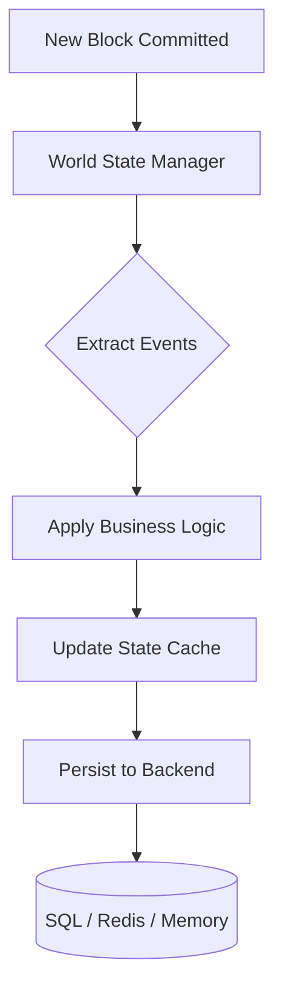

# Storage Module (`hierachain/adapters/database/*`)

## Tổng quan

Module **Storage** chịu trách nhiệm quản lý toàn bộ dữ liệu của HieraChain, từ lịch sử các khối (Blocks) và sự kiện (Events) đến trạng thái hiện tại của các thực thể nghiệp vụ (**World State**). Hệ thống được thiết kế với kiến trúc pluggable, cho phép thay đổi backend lưu trữ linh hoạt dựa trên yêu cầu về hiệu năng và quy mô của doanh nghiệp.

---

## Kiến trúc Lưu trữ Đa tầng

HieraChain chia lưu trữ thành hai lớp chính để tối ưu hóa giữa tính bền vững và tốc độ truy vấn:

*   :material-state-machine:{ .lg .middle } __World State Layer__

    ---

    __File__: `world_state.py`

    * Lưu trữ giá trị hiện tại của các thực thể (ví dụ: trạng thái của một kiện hàng).
    * Cập nhật theo thời gian thực từ các khối mới thông qua cơ chế xử lý sự kiện (`creation`, `update`, `status_change`).
    * Hỗ trợ **Caching** và **Indexing** để phản hồi truy vấn tức thì.

*   :material-database-sync:{ .lg .middle } __Persistence Layer (Adapters)__

    ---

    __File__: `adapters/database/sqlite_adapter.py`, `adapters/database/*`

    * **SQL Backend**: Lưu trữ khối và sự kiện bền vững (SQLite qua `sqlite_adapter.py`).
    * **Redis Adapter**: Tối ưu cho việc đánh chỉ mục (indexing) thực thể.
    * **File Adapter**: Lưu trữ dạng file Parquet cho dữ liệu lớn.

*   :material-cloud-sync:{ .lg .middle } __Off-chain Storage (IPFS)__

    ---

    __File__: `api/storage/ipfs_client.py`

    * Lưu trữ các dữ liệu lớn (như tài liệu đính kèm, chi tiết sự kiện phức tạp).
    * Chỉ lưu mã băm (CID) lên blockchain để tiết kiệm không gian và tối ưu hiệu năng.
    * Tích hợp mã hóa **AES-256-GCM** trước khi tải lên.

---

## Luồng xử lý Cập nhật Trạng thái

---

## Các Model dữ liệu cốt lõi (`models.py`)

HieraChain sử dụng SQLAlchemy để định nghĩa cấu trúc dữ liệu bền vững:

*   **BlockModel**: Lưu trữ index, hash, previous\_hash và metadata của khối.
*   **EventModel**: Lưu trữ chi tiết sự kiện, liên kết với block hash và entity ID.
*   **ChainStateModel**: Lưu trữ các cặp Key-Value đại diện cho trạng thái của chuỗi.

---

## Cấu hình Backend (Environment Variables)

| Biến môi trường | Ý nghĩa | Giá trị khả dụng |
| :--- | :--- | :--- |
| `HRC_STORAGE_BACKEND` | Loại backend lưu trữ | `sqlite`, `redis`, `memory`, `file` |
| `DATABASE_URL` | Chuỗi kết nối DB | `sqlite:///hierachain.db`, `postgresql://...` |
| `LOG_SQL_DETAIL` | Ghi log SQL chi tiết | `true`, `false` (Khuyến nghị `false` cho Prod) |

---

## Tính năng Nâng cao

### 1. Tính Toàn vẹn và Idempotency
`SqlStorageBackend` được thiết kế để xử lý các yêu cầu trùng lặp (Idempotency) một cách an toàn thông qua việc kiểm tra ràng buộc duy nhất (Unique Constraint), đảm bảo hệ thống luôn ổn định ngay cả khi gặp sự cố mạng gây gửi lại khối.

### 2. Truy vấn theo Chỉ mục (Indexing)
Mọi thực thể trong World State đều được tự động đánh chỉ mục theo `entity_id` và `timestamp`. Khi sử dụng Redis Adapter, các chỉ mục này được lưu dưới dạng **Sorted Sets**, cho phép truy vấn lịch sử thay đổi của một thực thể cực nhanh.

---

## Liên quan

*   [Core Module (Block & Blockchain)](./core.md)
*   [Integration (Tích hợp ERP)](./integration.md)
*   [Monitoring (Giám sát hiệu năng)](./monitoring.md)
