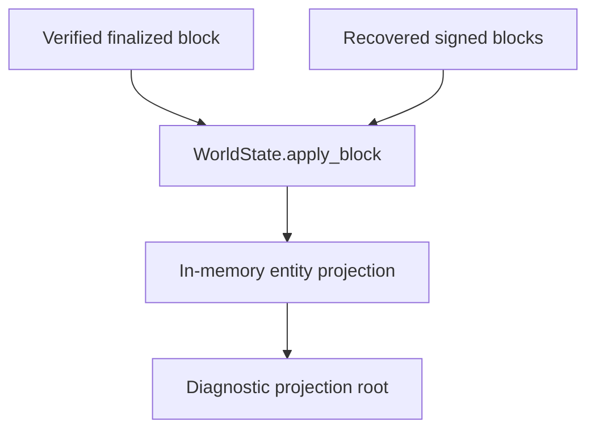

# Storage Module (`hierachain/adapters/database/*`)

## Tổng quan

Module storage quản lý toàn bộ dữ liệu HieraChain, từ lịch sử block và event tới trạng thái hiện tại của entity (World State). Thiết kế có thể cắm rút backend, nên bạn có thể đổi backend theo nhu cầu scale và hiệu năng mà không cần sửa logic nghiệp vụ.

---

## Kiến trúc lưu trữ đa tầng

HieraChain chia storage thành các lớp để cân bằng giữa độ bền và tốc độ truy vấn:

*   :material-state-machine:{ .lg .middle } __World State Layer__

    ---

    __File__: `hierachain/state/world_state.py` (`WorldState.get_entity_state()`)

    * Lưu trạng thái hiện tại của entity suy ra từ block đã finalize.
    * Cập nhật khi block được commit và có hỗ trợ cache. Codebase không định nghĩa sẵn các loại event `creation/update/status_change`.
    * `get_entity_state()` và `get_all_states()` trả snapshot sâu có thể sửa. Sửa dictionary trả về hoặc `last_details` lồng bên trong không cập nhật state nội bộ hay Merkle root; cần event đã finalize để đổi state.

*   :material-database-sync:{ .lg .middle } __Persistence Layer (Adapters)__

    ---

    __File__: `hierachain/adapters/database/sqlite_adapter.py`, `postgres_adapter.py`, `redis_adapter.py`, `sqlite_schema.py`/`postgres_schema.py`

    * **SQLite/Postgres** qua `SQLBase` + `init_database_schema()` (các bảng `chains`, `blocks`, `events`, `proofs`, `chain_state`; index composite).
    * **Redis Adapter**: `hierachain/adapters/database/redis_adapter.py` cho index theo entity. `HierarchyManager` từ chối Redis ledger storage khi khởi động cho đến khi có lưu trữ bền vững block đã ký; các helper indexing và registry vẫn có thể được dùng trực tiếp.
    * **Memory**: `HRC_STORAGE_BACKEND=memory` cho test. Không có File Adapter tích hợp sẵn. Log Parquet công bố snapshot active bền dữ liệu tối đa 1.024 bản ghi; segment đã đóng giữ bất biến trong `<path>.segments` và đọc bằng `read_parquet_log()` (bao gồm log legacy chỉ có một tệp); transaction journal dùng Arrow IPC append-only (`error_mitigation/journal.py`), không dùng để lưu chain.

*   :material-cloud-sync:{ .lg .middle } __Off-chain Storage (IPFS)__

    ---

    __File__: `api/storage/ipfs_client.py`

    * Lưu payload lớn như tài liệu và chi tiết event.
    * Chỉ lưu CID trên chain để tiết kiệm chỗ.
    * Mã hóa bằng AES-256-GCM trước khi upload.

---

## Luồng cập nhật trạng thái

```mermaid
graph TD
    A[Verified finalized block] --> B[WorldState.apply_block]
    B --> C[In-memory entity projection]
    D[Recovered signed blocks] --> B
    C --> E[Diagnostic projection root]
```

---

## Mô hình dữ liệu cốt lõi

Không có `models.py` hay `BlockModel`/`EventModel` kiểu SQLAlchemy. Bảng được tạo bằng SQL thuần trong `sqlite_schema.py`/`postgres_schema.py:init_database_schema()` với `chains`, `blocks`, `events`, `proofs`, `chain_state`. `Block` và `Blockchain` là class Python thuần trong `hierachain/core/`.

---

## Cấu hình backend

| Environment Variable | Meaning | Available Values |
| :--- | :--- | :--- |
| `HRC_STORAGE_BACKEND` / `DATABASE_URL`+`HRC_DATABASE_URL` | Storage backend / DB URL | `sqlite`, `postgres` (auto-detected from `postgres://`), `memory`; settings nhận diện `redis`, nhưng `HierarchyManager` từ chối dùng cho ledger storage |
| `HRC_LOG_SQL_DETAIL` / `HRC_LOG_FORMAT` | SQL detail / log format | `true/false`, `text/json` |

---

## Tính năng nâng cao

### Tính toàn vẹn và idempotency

`SQLiteAdapter` và `PostgresAdapter` (qua `SQLBase`) xử lý `save_block` có kiểm tra trùng `hash`/`block_hash` và xác thực liên kết `previous_hash` (`consensus/ordering/storage.py:_verify_chain_links`). `SqlStorageBackend` không tồn tại trong code hiện tại.

### Index và truy vấn

`WorldState` giữ projection entity mới nhất trong bộ nhớ và dựng lại từ block đã xác minh. Nó không tự ghi SQL hoặc Redis. Index event của chain và Redis adapter riêng hỗ trợ truy vấn lịch sử, tách biệt với projection này.

---

## Liên quan

*   [Core Module (Block & Blockchain)](./core.md)
*   [ERP Integration](./integration.md)
*   [Performance Monitoring](./monitoring.md)

Log Parquet công bố snapshot hoàn chỉnh của segment active, fsync tệp và thư mục rồi mới trả về. Mỗi segment tối đa 1.024 bản ghi; snapshot active được thay thế nguyên tử, segment đã đóng giữ bất biến. Mỗi append ghi lại tối đa một segment, làm tăng chi phí ghi. Bên đọc dùng `read_parquet_log()` cho log hiện tại và legacy.

Lịch sử proof Redis lưu mỗi lần gửi trong một phần tử JSON của list, nên hai lần gửi cùng chỉ số block vẫn giữ hash riêng. Lịch sử tham chiếu hash cũ vẫn đọc được, nhưng adapter phiên bản cũ không đọc được định dạng inline mới; cần nâng cấp bên đọc và ghi cùng lúc. Truy vấn sự kiện Redis ném `RedisStorageError` khi lệnh lỗi, bản ghi sai hoặc thiếu bản ghi đã lập chỉ mục, thay vì trả kết quả thiếu như thành công. Redis vẫn chưa được hỗ trợ để khởi động hierarchical ledger bền dữ liệu.
