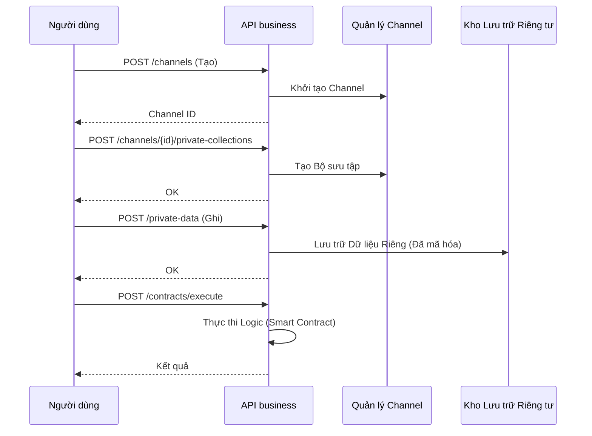

# API Business

API Busines mở rộng khả năng làm việc với các channel, dữ liệu riêng tư (private data), hợp đồng miền (domain contracts) và các tổ chức (organizations).

## Các thành phần Mã nguồn

* Định tuyến/Endpoint: `hierachain/api/business/router.py`
* Lược đồ dữ liệu (Tùy chọn): `hierachain/api/business/schemas.py`
* Tích hợp Server: `hierachain/api/server.py` (đăng ký Business router)

## Các Endpoint chính (từ mã nguồn và test)



* `GET  /api/business/health`: kiểm tra trạng thái hoạt động dịch vụ (health check).
* `POST /api/business/channels`: tạo một channel mới.
* `GET  /api/business/channels/{channel_id}`: lấy thông tin channel.
* `POST /api/business/channels/{channel_id}/private-collections`: tạo một bộ sưu tập dữ liệu riêng tư (private data collection).
* `POST /api/business/private-data`: Ghi dữ liệu riêng tư (Hỗ trợ truyền trực tiếp `value` hoặc tham chiếu qua IPFS `value_cid`).

    * `value_nonce: str | None`
    * `event_metadata: dict[str, Any]` (Entity ID, Loại sự kiện, Dấu thời gian)

* `ContractCreateRequest`

    * `contract_id: str` (Định danh duy nhất)
    * `version: str` (Phiên bản ngữ nghĩa, ví dụ: "1.0.0")
    * `implementation: str | None` (Mã nguồn Python thô)
    * `implementation_cid: str | None` (Tham chiếu IPFS)
    * `implementation_nonce: str | None`
    * `metadata: dict[str, Any]` (Miền, Chủ sở hữu, Chính sách xác thực - Endorsement Policy)
    
* `POST /api/business/contracts`: Đăng ký một hợp đồng (Hỗ trợ truyền mã nguồn thô qua `implementation` hoặc tham chiếu IPFS qua `implementation_cid`).
* `POST /api/business/contracts/execute`: thực thi một hợp đồng miền.
* `POST /api/business/organizations`: đăng ký một tổ chức mới.

*Lưu ý bổ sung: một số kịch bản test/giám sát trong `tests/integration/api_business/test_api_business.py` và `scripts/security/*` sử dụng các endpoint trên để kiểm thử bảo mật và xác minh hành vi hệ thống.*

## Ví dụ lệnh Curl

```bash
# Kiểm tra Trạng thái
curl -s http://localhost:2661/api/business/health

# Tạo channel
curl -s -X POST http://localhost:2661/api/business/channels \
  -H 'Content-Type: application/json' \
  -d '{"name": "test_channel"}'

# Tạo bộ sưu tập riêng tư cho channel
curl -s -X POST \
  http://localhost:2661/api/business/channels/test_channel/private-collections \
  -H 'Content-Type: application/json' \
  -d '{"collection": "sensitive_docs"}'

# Ghi dữ liệu riêng tư
curl -s -X POST http://localhost:2661/api/business/private-data \
  -H 'Content-Type: application/json' \
  -d '{"channel": "test_channel", "collection": "sensitive_docs", "key": "doc-001", "value": "..."}'

# Đăng ký & thực thi hợp đồng miền (domain contract)
curl -s -X POST http://localhost:2661/api/business/contracts \
  -H 'Content-Type: application/json' \
  -d '{
        "contract_id": "quality_control", 
        "version": "1.0.0",
        "implementation": "def logic()...",
        "metadata": {"domain": "mfg"}
      }'

curl -s -X POST http://localhost:2661/api/business/contracts/execute \
  -H 'Content-Type: application/json' \
  -d '{
        "contract_id": "quality_control", 
        "event": {"entity_id": "PROD-001", "event": "check", "details": {}},
        "context": {"chain": "sub_chain_1"}
      }'

# Đăng ký Tổ chức
curl -s -X POST http://localhost:2661/api/business/organizations -H 'Content-Type: application/json' -d '{"org_id": "orgA", "name": "Org A"}'
```

Nếu bật xác thực bằng API key (trong môi trường sản xuất - production), hãy thêm header tương ứng với `settings.API_KEY_NAME` (mặc định là `X-API-Key`).

## Bảo mật & Cấu hình

* Xác thực API key qua `security/verify/api_key_verifier.py` (khi `AUTH_ENABLED=true`).
* Chính sách/Định danh/Khóa/Chứng chỉ: xem trang Hướng dẫn Bảo mật và Mô-đun Bảo mật.
* Cấu hình host/port và bảo mật trong `hierachain/config/settings.py`.

## Liên quan

* API Ledger: [API Ledger](api-ledger.md)
* Kiến trúc Bảo mật: [Bảo mật (chuyên sâu)](../architecture/security.md)
* Các mô-đun: [API](../modules/api.md)
