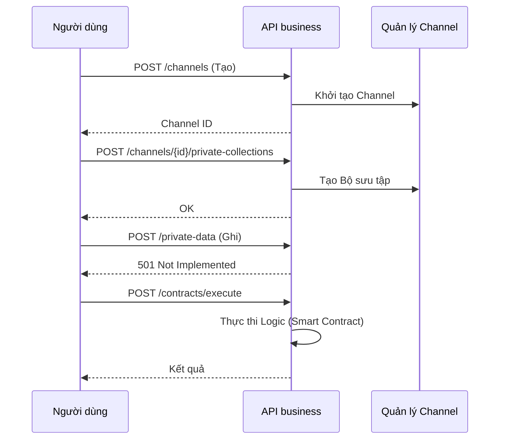

# API Business

API Business mở rộng khả năng làm việc với các channel, bộ sưu tập dữ liệu riêng tư (private data), hợp đồng miền (domain contracts) và các tổ chức (organizations). Route ghi private data hiện chưa được hỗ trợ vì chưa có kho lưu dữ liệu riêng tư.

## Các thành phần Mã nguồn

* Định tuyến/Endpoint: `hierachain/api/business/router.py`
* Lược đồ dữ liệu (Tùy chọn): `hierachain/api/business/schemas.py`
* Tích hợp Server: `hierachain/api/server.py` (đăng ký Business router)

## Các Endpoint chính (từ mã nguồn và test)


```mermaid
sequenceDiagram
    participant User as Người dùng
    participant API as API business
    participant Channel as Quản lý Channel

    User->>API: POST /channels (Tạo)
    API->>Channel: Khởi tạo Channel
    API-->>User: Channel ID

    User->>API: POST /channels/{id}/private-collections
    API->>Channel: Tạo Bộ sưu tập
    API-->>User: OK

    User->>API: POST /private-data (Ghi)
    API-->>User: 501 Not Implemented

    User->>API: POST /contracts/execute
    API->>API: Thực thi Logic (Smart Contract)
    API-->>User: Kết quả
```

* `GET  /api/business/health`: kiểm tra trạng thái hoạt động dịch vụ (health check).
* `POST /api/business/channels`: tạo một channel mới. API key cần quyền `chains` và `channels:manage`.
* `GET  /api/business/channels/{channel_id}`: lấy thông tin channel.
* `POST /api/business/channels/{channel_id}/private-collections`: tạo một bộ sưu tập dữ liệu riêng tư (private data collection).
* `POST /api/business/private-data`: hiện trả HTTP 501 với collection đã tồn tại. Endpoint không lưu `value` inline hoặc dữ liệu `value_cid`.

* `ContractCreateRequest`

    * `contract_id: str` (Định danh duy nhất)
    * `version: str` (Phiên bản ngữ nghĩa, ví dụ: "1.0.0")
    * `implementation: str | None` (Mã nguồn Python thô)
    * `implementation_cid: str | None` (Tham chiếu IPFS)
    * `implementation_nonce: str | None`
    * `metadata: dict[str, Any]` (Miền, Chủ sở hữu, Chính sách xác thực - Endorsement Policy)
    
* `POST /api/business/contracts`: Đăng ký một hợp đồng (Hỗ trợ truyền mã nguồn thô qua `implementation` hoặc tham chiếu IPFS qua `implementation_cid`).
* `POST /api/business/contracts/execute`: thực thi một hợp đồng miền.
* `POST /api/business/organizations`: đăng ký một tổ chức mới. Cần quyền `chains` và `organizations:manage`; user ID từ API key đã xác thực trở thành quản trị viên đầu tiên.
* `POST /api/business/organizations/{org_id}/members`: quản trị viên tổ chức đăng ký member với role `admin` hoặc `member`. Member ID phải trùng user ID trong API key của member đó.

*Lưu ý bổ sung: một số kịch bản test/giám sát trong `tests/integration/api_business/test_api_business.py` và `scripts/security/*` sử dụng các endpoint trên để kiểm thử bảo mật và xác minh hành vi hệ thống.*

## Cấp tài nguyên và quyền

Các endpoint cấp tài nguyên yêu cầu bật xác thực API key. Operator tin cậy gán scope `organizations:manage` và `channels:manage` khi cấp API key; các route này không tạo key. Tạo organization cũng cần scope `chains`, user ID đã xác thực trong key sẽ thành quản trị viên đầu tiên. Đăng ký member cần scope `chains` và caller phải là quản trị viên hiện có của organization. Tạo channel cần `chains` và `channels:manage`. Khi gửi event, hệ thống dùng user ID đã xác thực cùng role policy của channel.

Registry organization, member và channel được lưu và khôi phục qua SQLite hoặc PostgreSQL đã cấu hình. `HierarchyManager` từ chối Redis ledger storage khi khởi động vì Redis adapter chưa lưu bền vững block đã ký. Backend in-memory chỉ tồn tại trong process hiện tại. Giá trị private data chưa được lưu: route ghi trả HTTP 501 trước khi xử lý giá trị inline hoặc tham chiếu IPFS. `ca_config` chỉ được giữ làm metadata trong API process và chưa được dùng để xác minh chứng chỉ member. Các method channel và private collection gọi trực tiếp bằng Python nhận organization ID làm endorsement và yêu cầu caller đáng tin cậy; chúng không xác minh chữ ký endorsement.

```bash
ORG_PROVISIONER_KEY=replace-me
ORG_ADMIN_KEY=replace-me
CHANNEL_PROVISIONER_KEY=replace-me

curl -s -X POST http://localhost:2661/api/business/organizations \\
  -H 'X-API-Key: '"$ORG_PROVISIONER_KEY" \\
  -H 'Content-Type: application/json' \\
  -d '{"org_id": "orgA", "ca_config": {}}'

curl -s -X POST http://localhost:2661/api/business/organizations/orgA/members \\
  -H 'X-API-Key: '"$ORG_ADMIN_KEY" \\
  -H 'Content-Type: application/json' \\
  -d '{"member_id": "userB", "role": "member"}'

curl -s -X POST http://localhost:2661/api/business/channels \\
  -H 'X-API-Key: '"$CHANNEL_PROVISIONER_KEY" \\
  -H 'Content-Type: application/json' \\
  -d '{"channel_id": "test_channel", "organizations": ["orgA"], "policy": {"read": "MEMBER", "write": "ADMIN", "endorsement": "MAJORITY"}}'
```

Gửi event cũng cần API key có quyền `events`.

## Ví dụ lệnh Curl

```bash
# Kiểm tra Trạng thái
curl -s http://localhost:2661/api/business/health

# Tạo channel
curl -s -X POST http://localhost:2661/api/business/channels \
  -H 'Content-Type: application/json' \
  -d '{"channel_id": "test_channel", "organizations": ["orgA"], "policy": {"read": "MEMBER", "write": "ADMIN", "endorsement": "MAJORITY"}}'

# Tạo bộ sưu tập riêng tư cho channel
curl -s -X POST \
  http://localhost:2661/api/business/channels/test_channel/private-collections \
  -H 'Content-Type: application/json' \
  -d '{"name": "sensitive_docs", "members": ["orgA"], "config": {"block_to_purge": 1000, "endorsement_policy": "MAJORITY"}}'

# Private-data writes currently return HTTP 501 Not Implemented.

# Đăng ký & thực thi hợp đồng miền (domain contract)
curl -s -X POST http://localhost:2661/api/business/contracts \
  -H 'Content-Type: application/json' \
  -d '{
        "contract_id": "quality_control", 
        "version": "1.0.0",
        "implementation": "def logic()...",
        "metadata": {"domain": "mfg"}
      }'

curl -s -X POST http://localhost:2661/api/business/contracts/execute \
  -H 'Content-Type: application/json' \
  -d '{
        "contract_id": "quality_control", 
        "event": {"entity_id": "PROD-001", "event": "check", "details": {}},
        "context": {"chain": "sub_chain_1"}
      }'

# Đăng ký Tổ chức
curl -s -X POST http://localhost:2661/api/business/organizations -H 'Content-Type: application/json' -d '{"org_id": "orgA", "ca_config": {}}'
```

Nếu bật xác thực bằng API key (trong môi trường sản xuất - production), hãy thêm header tương ứng với `settings.API_KEY_NAME` (mặc định là `X-API-Key`).

## Bảo mật & Cấu hình

* Xác thực API key qua `security/verify/api_key_verifier.py` (khi `AUTH_ENABLED=true`).
* Chính sách/Định danh/Khóa/Chứng chỉ: xem trang Hướng dẫn Bảo mật và Mô-đun Bảo mật.
* Cấu hình host/port và bảo mật trong `hierachain/config/settings.py`.

## Liên quan

* API Ledger: [API Ledger](api-ledger.md)
* Kiến trúc Bảo mật: [Bảo mật (chuyên sâu)](../architecture/security.md)
* Các mô-đun: [API](../modules/api.md)

Contract đã đăng ký trả HTTP 501 từ `/api/business/contracts/execute` vì chưa có engine thực thi; contract không tồn tại trả HTTP 404. Đăng ký chỉ lưu metadata triển khai, không đồng nghĩa hỗ trợ thực thi.
