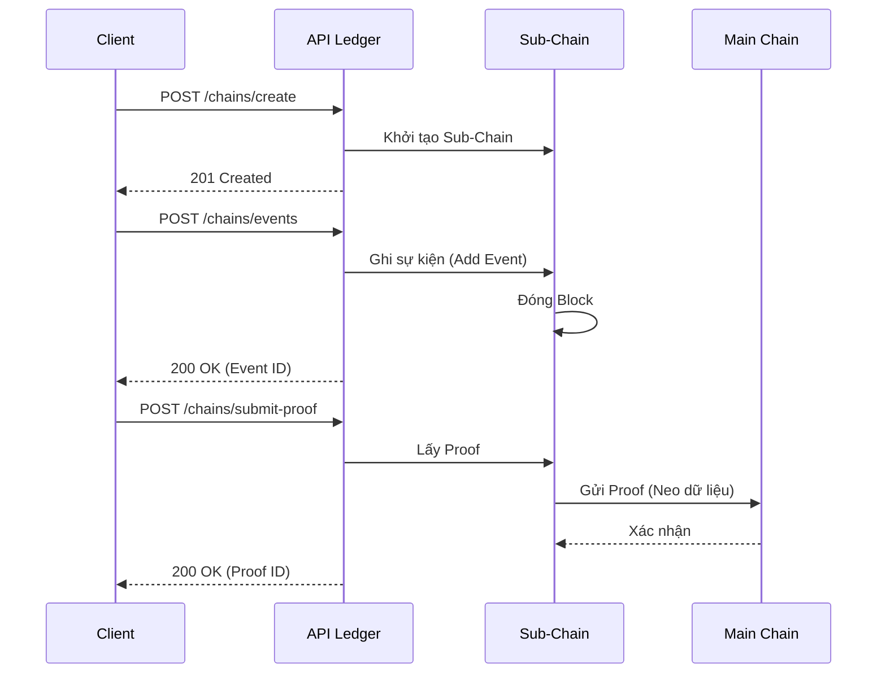

# API Ledger

## Mục đích

Mô tả các endpoint REST trong phiên bản API Ledger dùng để tương tác với HieraChain: quản lý chuỗi, ghi sự kiện, gửi bằng chứng (proof), truy vết thực thể, thống kê và truy xuất block.

#### Phụ lục: Ví dụ Gửi Sự kiện kèm IPFS

Khi doanh nghiệp cần lưu trữ các tệp tin lớn (hợp đồng PDF, ảnh sản phẩm) mà không muốn làm phình to blockchain:

1. **Bước 1**: Upload tệp lên IPFS và nhận `CID`.
2. **Bước 2**: Gửi sự kiện vào HieraChain với `details_cid`.

```bash
curl -X POST "http://localhost:2661/api/ledger/chains/supply_chain/events" \
     -H "Content-Type: application/json" \
     -H "X-API-Key: your_api_key" \
     -d '{
       "entity_id": "CONTRACT-2024-001",
       "event": "contract_signed",
       "details_cid": "QmXoypizjW3WknFiJnKLwHCnL72vedxjQkDDP1mXWo6uco",
       "details_nonce": "98765"
     }'
```

Dữ liệu này sẽ được HieraChain bảo chứng tính toàn vẹn thông qua mã băm, trong khi nội dung thực tế được lưu trữ an toàn trên mạng lưới IPFS.

## Tổng quan endpoint



* GET `/api/ledger/health`: Kiểm tra tình trạng.
* GET `/api/ledger/chains`: Liệt kê Main Chain và tất cả Sub-Chain.
* POST `/api/ledger/chains/{chain_name}/create`: Tạo Sub-Chain mới (nếu chưa có Main Chain sẽ tự tạo).
* POST `/api/ledger/chains/{chain_name}/events`: Thêm sự kiện vào Sub-Chain.
* POST `/api/ledger/chains/{chain_name}/submit-proof`: Gửi proof từ Sub-Chain lên Main Chain.
* GET `/api/ledger/chains/{chain_name}/stats`: Lấy thống kê chuỗi.
* GET `/api/ledger/chains/{chain_name}/blocks?limit=10&offset=0&resolve_cid=false`: Lấy danh sách block (có phân trang). Nếu `resolve_cid=true`, tự động tải dữ liệu chi tiết từ IPFS.
* GET `/api/ledger/chains/{chain_name}/blocks/{index_or_hash}`: Lấy chi tiết một block cụ thể.
* GET `/api/ledger/entities/{entity_id}/trace[?chain_name=...&resolve_cid=false]`: Truy vết sự kiện. Nếu `resolve_cid=true`, giải mã chi tiết sự kiện từ IPFS.

## Schema chính (trích từ `hierachain/api/ledger/schemas.py`)

* `EventRequest`

    * `entity_id: str`
    * `event_type: str`
    * `details: dict[str, Any] | None` (On-chain data)
    * `details_cid: str | None` (Off-chain CID reference)
    * `details_nonce: str | None` (Encryption nonce)
    * `details_metadata: dict[str, Any] | None`

* `EventResponse`

    * `success: bool`
    * `message: str`
    * `event_id: str | None`

* `ChainInfoResponse`

    * `name: str`
    * `type: str` ("main" | "sub")
    * `block_count: int`
    * `latest_block_hash: str | None`

* `ProofSubmissionResponse`

    * `success: bool`
    * `message: str`
    * `proof_id: str | None`

* `EntityTraceResponse`

    * `entity_id: str`
    * `chains: list[str]`
    * `events: list[dict[str, Any]]`

* `ChainStatsResponse`

    * `chain_name: str`
    * `total_blocks: int`
    * `total_events: int`
    * `proof_count: int | None`
    * `registered_sub_chains: int | None`

## Ví dụ sử dụng

Giả định server đang chạy tại `http://localhost:2661`:

### 1. Health check

```bash
curl -s http://localhost:2661/api/ledger/health
```

### 2. Tạo Sub-Chain

```bash
curl -X POST http://localhost:2661/api/ledger/chains/supply_chain/create
```

Phản hồi (201):

```json
{
  "success": true,
  "message": "Sub-chain 'supply_chain' created successfully",
  "chain_name": "supply_chain"
}
```

### 3. Thêm sự kiện vào Sub-Chain

```bash
curl -X POST http://localhost:2661/api/ledger/chains/supply_chain/events \
  -H "Content-Type: application/json" \
  -d '{
        "entity_id": "PROD-001",
        "event_type": "production_complete",
        "details": {"quantity": 100}
      }'
```

Phản hồi:

```json
{
  "success": true,
  "message": "Event added to chain 'supply_chain'",
  "event_id": "supply_chain_1_1"
}
```

### 4. Gửi proof lên Main Chain

```bash
curl -X POST http://localhost:2661/api/ledger/chains/supply_chain/submit-proof
```

Phản hồi:

```json
{
  "success": true,
  "message": "Proof submitted from 'supply_chain' to main chain",
  "proof_id": "supply_chain_1"
}
```

### 5. Lấy thông tin khối (Chi tiết)

**Endpoint**: `GET /api/ledger/chains/{chain_name}/blocks/{index_or_hash}`

Lấy dữ liệu chi tiết của một khối cụ thể bằng Index (số) hoặc Hash (chuỗi).

**Tham số Query**:

* `resolve_cid` (boolean): Nếu `True`, server sẽ giải mã các `details_cid` từ IPFS và trả về dữ liệu gốc trong trường `details`.

**Ví dụ**:
```bash
curl -X GET "http://localhost:2661/api/ledger/chains/supply_chain/blocks/10?resolve_cid=true" \
     -H "X-API-Key: your_api_key"
```

### 6. Truy vết entity trên tất cả chuỗi

```bash
curl -s "http://localhost:2661/api/ledger/entities/PROD-001/trace"
```

Hoặc giới hạn trong một chuỗi:

```bash
curl -s "http://localhost:2661/api/ledger/entities/PROD-001/trace?chain_name=supply_chain"
```

### 6. Lấy thống kê chuỗi

```bash
curl -s http://localhost:2661/api/ledger/chains/supply_chain/stats
```

### 7. Lấy block theo trang

```bash
curl -s "http://localhost:2661/api/ledger/chains/supply_chain/blocks?limit=5&offset=0"
```

## Mã trạng thái & lỗi phổ biến

* 200 OK: Thành công cho GET/POST đa số trường hợp.
* 201 Created: Tạo Sub-Chain thành công.
* 400 Bad Request: `chain_name` không hợp lệ khi tạo (chỉ cho phép `[a-zA-Z0-9_\-]`).
* 404 Not Found: Không tìm thấy chuỗi hoặc sub-chain.
* 500 Internal Server Error: Lỗi xử lý nội bộ (ví dụ lỗi khi liệt kê chuỗi, khi thêm sự kiện, gửi proof, thống kê, truy xuất blocks).

## Ghi chú triển khai (rút gọn từ `endpoints.py`)

* DI lười (lazy DI): dùng các singleton nhẹ `get_hierarchy_manager()` và `get_entity_tracer()` cho request lifecycle.
* `POST /chains/{chain_name}/events`: server sẽ đặt `timestamp = time.time()`; `details` vắng mặt sẽ thành `{}`.
* `POST /chains/{chain_name}/submit-proof`: nếu `SubChain` không có `submit_proof_to_main`, endpoint rơi vào nhánh dự phòng (mock) để tránh crash.
* `GET /chains/{chain_name}/blocks`: khi `Block` không có `to_event_list`, có fallback chuyển đổi từ Arrow Table (`to_pylist`) để an toàn.

## Liên quan

* Kiến trúc tổng quan: [Tổng quan](../architecture/overview.md)
* Hierarchical module: [Hierarchical](../modules/hierarchical.md)
* Core module: [Core](../modules/core.md)
