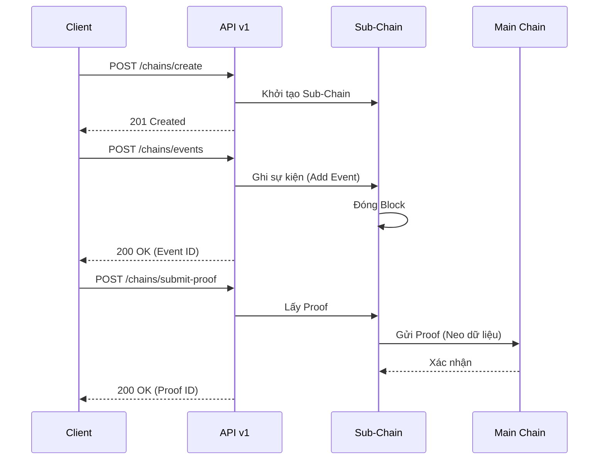

# API v1

## Mục đích

Mô tả các endpoint REST trong phiên bản API v1 dùng để tương tác với HieraChain: quản lý chuỗi, ghi sự kiện, gửi bằng chứng (proof), truy vết thực thể, thống kê và truy xuất block.

## Tổng quan endpoint



* GET `/api/v1/health` — Kiểm tra tình trạng.
* GET `/api/v1/chains` — Liệt kê Main Chain và tất cả Sub-Chain.
* POST `/api/v1/chains/{chain_name}/create` — Tạo Sub-Chain mới (nếu chưa có Main Chain sẽ tự tạo).
* POST `/api/v1/chains/{chain_name}/events` — Thêm sự kiện vào Sub-Chain.
* POST `/api/v1/chains/{chain_name}/submit-proof` — Gửi proof từ Sub-Chain lên Main Chain.
* GET `/api/v1/chains/{chain_name}/stats` — Lấy thống kê chuỗi.
* GET `/api/v1/chains/{chain_name}/blocks?limit=10&offset=0` — Lấy danh sách block (có phân trang) của một chuỗi.
* GET `/api/v1/entities/{entity_id}/trace[?chain_name=...]` — Truy vết sự kiện của một entity trong một chuỗi cụ thể hoặc trên tất cả chuỗi.

## Schema chính (trích từ `hierachain/api/v1/schemas.py`)

* `EventRequest`

    * `entity_id: str`
    * `event_type: str`
    * `details: dict[str, Any] | None`

* `EventResponse`

    * `success: bool`
    * `message: str`
    * `event_id: str | None`

* `ChainInfoResponse`

    * `name: str`
    * `type: str` ("main" | "sub")
    * `block_count: int`
    * `latest_block_hash: str | None`

* `ProofSubmissionResponse`

    * `success: bool`
    * `message: str`
    * `proof_id: str | None`

* `EntityTraceResponse`

    * `entity_id: str`
    * `chains: list[str]`
    * `events: list[dict[str, Any]]`

* `ChainStatsResponse`

    * `chain_name: str`
    * `total_blocks: int`
    * `total_events: int`
    * `proof_count: int | None`
    * `registered_sub_chains: int | None`

## Ví dụ sử dụng

Giả định server đang chạy tại `http://localhost:2661`:

### 1. Health check

```bash
curl -s http://localhost:2661/api/v1/health
```

### 2. Tạo Sub-Chain

```bash
curl -X POST http://localhost:2661/api/v1/chains/supply_chain/create
```

Phản hồi (201):

```json
{
  "success": true,
  "message": "Sub-chain 'supply_chain' created successfully",
  "chain_name": "supply_chain"
}
```

### 3. Thêm sự kiện vào Sub-Chain

```bash
curl -X POST http://localhost:2661/api/v1/chains/supply_chain/events \
  -H "Content-Type: application/json" \
  -d '{
        "entity_id": "PROD-001",
        "event_type": "production_complete",
        "details": {"quantity": 100}
      }'
```

Phản hồi:

```json
{
  "success": true,
  "message": "Event added to chain 'supply_chain'",
  "event_id": "supply_chain_1_1"
}
```

### 4. Gửi proof lên Main Chain

```bash
curl -X POST http://localhost:2661/api/v1/chains/supply_chain/submit-proof
```

Phản hồi:

```json
{
  "success": true,
  "message": "Proof submitted from 'supply_chain' to main chain",
  "proof_id": "supply_chain_1"
}
```

### 5. Truy vết entity trên tất cả chuỗi

```bash
curl -s "http://localhost:2661/api/v1/entities/PROD-001/trace"
```

Hoặc giới hạn trong một chuỗi:

```bash
curl -s "http://localhost:2661/api/v1/entities/PROD-001/trace?chain_name=supply_chain"
```

### 6. Lấy thống kê chuỗi

```bash
curl -s http://localhost:2661/api/v1/chains/supply_chain/stats
```

### 7. Lấy block theo trang

```bash
curl -s "http://localhost:2661/api/v1/chains/supply_chain/blocks?limit=5&offset=0"
```

## Mã trạng thái & lỗi phổ biến

* 200 OK — Thành công cho GET/POST đa số trường hợp.
* 201 Created — Tạo Sub-Chain thành công.
* 400 Bad Request — `chain_name` không hợp lệ khi tạo (chỉ cho phép `[a-zA-Z0-9_\-]`).
* 404 Not Found — Không tìm thấy chuỗi hoặc sub-chain.
* 500 Internal Server Error — Lỗi xử lý nội bộ (ví dụ lỗi khi liệt kê chuỗi, khi thêm sự kiện, gửi proof, thống kê, truy xuất blocks).

## Ghi chú triển khai (rút gọn từ `endpoints.py`)

* DI lười (lazy DI): dùng các singleton nhẹ `get_hierarchy_manager()` và `get_entity_tracer()` cho request lifecycle.
* `POST /chains/{chain_name}/events`: server sẽ đặt `timestamp = time.time()`; `details` vắng mặt sẽ thành `{}`.
* `POST /chains/{chain_name}/submit-proof`: nếu `SubChain` không có `submit_proof_to_main`, endpoint rơi vào nhánh dự phòng (mock) để tránh crash.
* `GET /chains/{chain_name}/blocks`: khi `Block` không có `to_event_list`, có fallback chuyển đổi từ Arrow Table (`to_pylist`) để an toàn.

## Liên quan

* Kiến trúc tổng quan: [Tổng quan](../architecture/overview.md)
* Hierarchical module: [Hierarchical](../modules/hierarchical.md)
* Core module: [Core](../modules/core.md)

---

??? info "Thông tin kỹ thuật bổ sung (Metadata)"

    **FACT**

    * Endpoint có thật trong `hierachain/api/v1/endpoints.py` như: `/health`, `/chains`, `/chains/{chain_name}/create`, `/chains/{chain_name}/events`, `/chains/{chain_name}/submit-proof`, `/chains/{chain_name}/stats`, `/chains/{chain_name}/blocks`, `/entities/{entity_id}/trace`.
    * Schema Pydantic nằm tại `hierachain/api/v1/schemas.py` (EventRequest/Response, ChainInfoResponse, ProofSubmissionResponse, EntityTraceResponse, ChainStatsResponse, ...).

    **DECISION**

    * Tài liệu ưu tiên phản ánh hành vi hiện tại của mã nguồn; ví dụ curl tối giản, không ràng buộc cơ chế xác thực cụ thể tại đây (xem thêm phần Security khi có).
    * Sử dụng định dạng JSON đơn giản, trường thời gian là số thực (epoch seconds) theo hiện trạng.

    **ASSUMPTION**

    * Server mặc định phục vụ tại `http://localhost:2661` theo README; cổng có thể thay đổi qua cấu hình.
    * Môi trường đã khởi tạo `Main Chain` khi cần, hoặc endpoint tạo Sub-Chain sẽ tự khởi tạo Main Chain nếu thiếu.

    **INVARIANT**

    * Main Chain không lưu dữ liệu domain; chỉ lưu proof/metadata.
    * Tên chuỗi hợp lệ phải an toàn (sanitize) trước khi tạo Sub-Chain.
    * Cấu trúc JSON phản hồi giữ tính nhất quán giữa các lần gọi với cùng dữ liệu đầu vào.

    **EDGE CASES**

    * `chain_name` chứa ký tự không hợp lệ → 400.
    * Sub-Chain không tồn tại khi thêm sự kiện/gửi proof → 404.
    * Thiếu `to_event_list()` trong Block → fallback Arrow Table để tránh crash.
