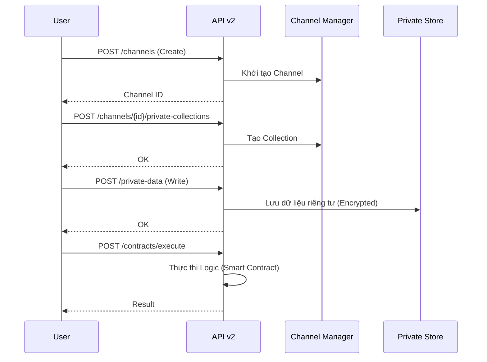

# API v2

API v2 mở rộng khả năng làm việc với kênh (channel), dữ liệu riêng tư (private data), hợp đồng domain (contracts) và tổ chức.

## Thành phần mã nguồn

* Router/Endpoints: `hierachain/api/v2/endpoints.py`
* (Có thể có) Schemas: `hierachain/api/v2/schemas.py`
* Server tích hợp: `hierachain/api/server.py` (đăng ký router v2)

## Endpoint chính (tham khảo từ mã và tests)



* `GET  /api/v2/health` — kiểm tra tình trạng service.
* `POST /api/v2/channels` — tạo kênh.
* `GET  /api/v2/channels/{channel_id}` — lấy thông tin kênh.
* `POST /api/v2/channels/{channel_id}/private-collections` — tạo bộ sưu tập dữ liệu riêng tư.
* `POST /api/v2/private-data` — Ghi dữ liệu riêng tư (Hỗ trợ `value` thô hoặc `value_cid` tham chiếu IPFS).
* `POST /api/v2/contracts` — Đăng ký hợp đồng (Hỗ trợ `implementation` thô hoặc `implementation_cid` tham chiếu IPFS).

    * `value_nonce: str | None`
    * `event_metadata: dict[str, Any]` (Entity ID, Event Type, Timestamp)

* `ContractCreateRequest`

    * `contract_id: str` (Unique identifier)
    * `version: str` (Semantic version, e.g., "1.0.0")
    * `implementation: str | None` (Python code thô)
    * `implementation_cid: str | None` (IPFS reference)
    * `implementation_nonce: str | None`
    * `metadata: dict[str, Any]` (Domain, Owner, Endorsement Policy)
    
* `POST /api/v2/contracts/execute` — thực thi hợp đồng.
* `POST /api/v2/organizations` — đăng ký tổ chức.

Gợi ý thêm: một số kịch bản test/instrumentation trong `tests/integration/api_v2/test_api_v2.py` và `scripts/security/*` sử dụng các endpoint trên để kiểm thử an toàn và hành vi.

## Ví dụ curl

```bash
# Health
curl -s http://localhost:2661/api/v2/health

# Tạo kênh
curl -s -X POST http://localhost:2661/api/v2/channels \
  -H 'Content-Type: application/json' \
  -d '{"name": "test_channel"}'

# Tạo private collection cho kênh
curl -s -X POST \
  http://localhost:2661/api/v2/channels/test_channel/private-collections \
  -H 'Content-Type: application/json' \
  -d '{"collection": "sensitive_docs"}'

# Ghi private data
curl -s -X POST http://localhost:2661/api/v2/private-data \
  -H 'Content-Type: application/json' \
  -d '{"channel": "test_channel", "collection": "sensitive_docs", "key": "doc-001", "value": "..."}'

# Đăng ký & thực thi hợp đồng domain
curl -s -X POST http://localhost:2661/api/v2/contracts \
  -H 'Content-Type: application/json' \
  -d '{
        "contract_id": "quality_control", 
        "version": "1.0.0",
        "implementation": "def logic()...",
        "metadata": {"domain": "mfg"}
      }'

curl -s -X POST http://localhost:2661/api/v2/contracts/execute \
  -H 'Content-Type: application/json' \
  -d '{
        "contract_id": "quality_control", 
        "event": {"entity_id": "PROD-001", "event": "check", "details": {}},
        "context": {"chain": "sub_chain_1"}
      }'

# Tổ chức
curl -s -X POST http://localhost:2661/api/v2/organizations -H 'Content-Type: application/json' -d '{"org_id": "orgA", "name": "Org A"}'
```

Nếu bật xác thực API key (production), thêm header theo `settings.API_KEY_NAME` (mặc định `X-API-Key`).

## Bảo mật & cấu hình

* Xác thực API key qua `security/verify/api_key_verifier.py` (khi `AUTH_ENABLED=true`).
* Chính sách/Identity/Key/Cert xem thêm trang Security và Modules/Security.
* Cấu hình host/port và bảo mật trong `hierachain/config/settings.py`.

## Liên quan

* API v1: [API v1](api-v1.md)
* Kiến trúc Bảo mật: [Bảo mật (chuyên sâu)](../architecture/security.md)
* Modules: [API](../modules/api.md)
