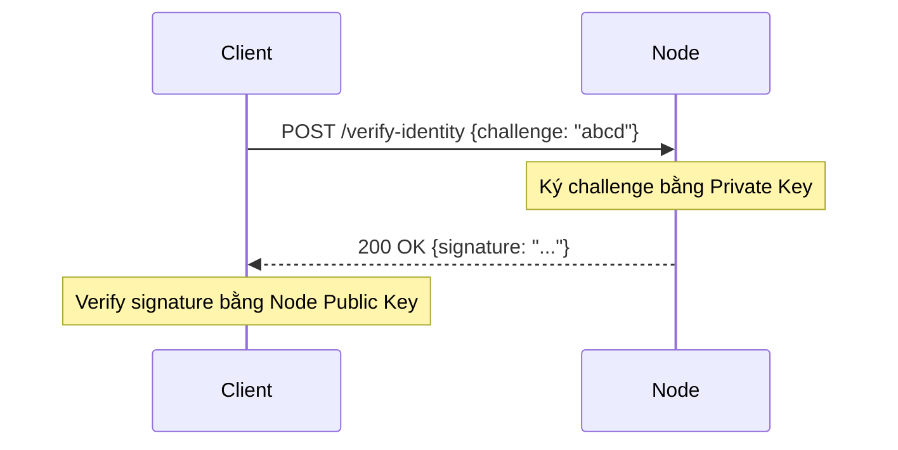

# API v3

## Mục đích

Mô tả các endpoint REST trong phiên bản API v3 (System & Admin) dùng cho các tác vụ quản trị hệ thống: xác minh danh tính node, kiểm tra trạng thái hoạt động (uptime, version, active chains).

## Tổng quan endpoint

* POST `/api/v3/verify-identity` — Xác minh danh tính node bằng cách ký vào một chuỗi challenge.
* GET `/api/v3/status` — Lấy báo cáo chi tiết về trạng thái node (version, uptime, số lượng chain đang hoạt động).

## Schema chính (trích từ `hierachain/api/v3/schemas.py`)

* `VerifyIdentityRequest`

    * `challenge: str` (Chuỗi challenge cần ký, hex encoded)

* `VerifyIdentityResponse`

    * `status: str` ("success")
    * `node_id: str` (Định danh của node)
    * `signature: str` (Chữ ký số của challenge)
    * `challenge: str` (Challenge gốc đã nhận)

* `NodeStatusResponse`

    * `status: str` ("active")
    * `version: str` (Phiên bản Ledger)
    * `chains_active: int` (Số lượng sub-chain đang hoạt động)
    * `license_active: bool` (Trạng thái bản quyền)
    * `uptime: str` (Thời gian hoạt động của hệ thống)

## Ví dụ sử dụng

Giả định server đang chạy tại `http://localhost:2661`:

### Xác minh danh tính node (Verify Identity)

Endpoint này thường được sử dụng bởi các công cụ quản lý để xác nhận node này là thành viên hợp lệ của mạng lưới.



**Request:**

```bash
curl -X POST http://localhost:2661/api/v3/verify-identity \
  -H "Content-Type: application/json" \
  -d '{
        "challenge": "abcd1234"
      }'
```

**Phản hồi (200 OK):**

```json
{
  "status": "success",
  "node_id": "node_1",
  "signature": "3045022100...", 
  "challenge": "abcd1234"
}
```

*(Lưu ý: `signature` sẽ là chuỗi hex thực tế được ký bởi private key của node)*

### Kiểm tra trạng thái node (Node Status)

Lấy thông tin tổng quan về sức khỏe và trạng thái của node.

**Request:**

```bash
curl -s http://localhost:2661/api/v3/status
```

**Phản hồi (200 OK):**

```json
{
  "status": "active",
  "version": "0.1.0",
  "chains_active": 5,
  "license_active": true,
  "uptime": "1d 2h 30m"
}
```

## Mã trạng thái & lỗi phổ biến

* 200 OK — Thành công.
* 500 Internal Server Error — Lỗi xác thực danh tính (ví dụ: lỗi crypto khi ký) hoặc lỗi nội bộ khi tính toán trạng thái.

## Ghi chú triển khai (rút gọn từ `endpoints.py`)

* **Identity Provider**: Sử dụng `LocalKeyProvider` để tải identity từ file (đường dẫn trong settings) hoặc tạo key tạm thời nếu file không tồn tại.
* **Hierarchy Manager**: Được inject vào `get_status` để đếm số lượng chain active và tính toán uptime.

## Liên quan

* Config: [Config](config.md) (Xem cấu hình `VALIDATOR_IDENTITY_PATH`)
* Security: [Security](../modules/security.md) (Về Key Provider và Identity)

---

??? info "Thông tin kỹ thuật bổ sung (Metadata)"

    **FACT**

    * Endpoint có thật trong `hierachain/api/v3/endpoints.py`: `/verify-identity`, `/status`.
    * Schema Pydantic nằm tại `hierachain/api/v3/schemas.py`.

    **DECISION**

    * API v3 tập trung vào "System & Admin", tách biệt với các thao tác chain (v1/v2).
    * Sử dụng chữ ký số để xác minh quyền sở hữu node (Proof of Possession).

    **ASSUMPTION**

    * Node đã được cấu hình identity (file key) hoặc sẽ sử dụng key tạm thời (ephemeral) nếu không tìm thấy.

    **INVARIANT**

    * `uptime` được tính từ lúc `HierarchyManager` khởi động.
    * `VerifyIdentityResponse` luôn trả lại `challenge` gốc để đối chiếu.

    **EDGE CASES**

    * Không tìm thấy file identity → Log warning và sử dụng key tạm thời (sinh mới mỗi lần khởi động), dẫn đến public key thay đổi.
    * Lỗi crypto khi ký → Trả về 500.
