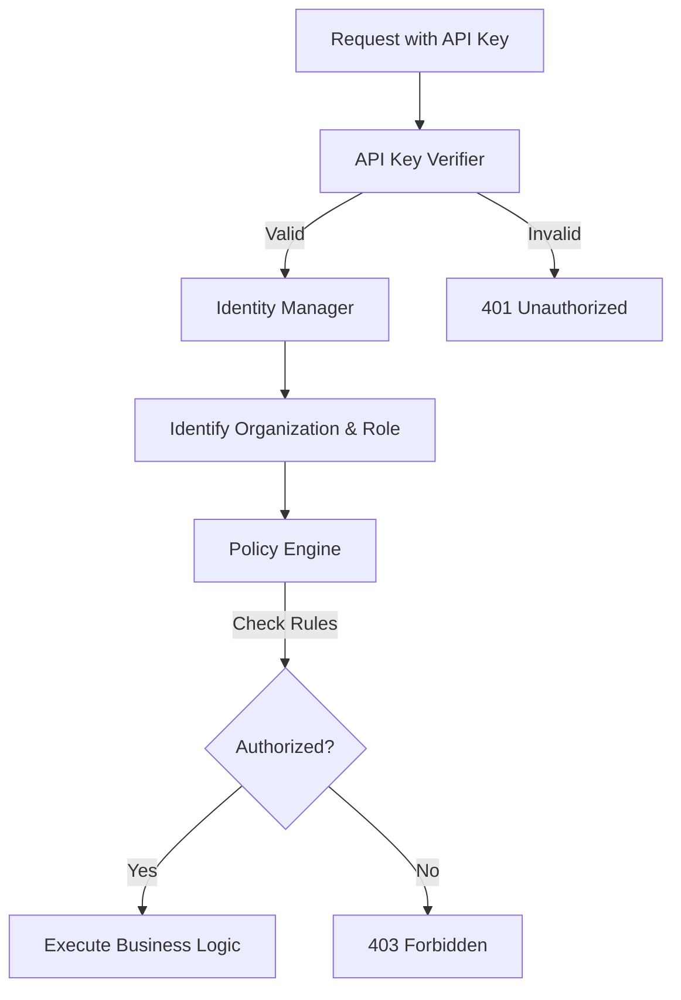

# Authorization & Access Control

Lớp bảo mật này chịu trách nhiệm xác định "Bạn là ai?" (Xác thực) và "Bạn có quyền làm gì?" (Ủy quyền) trong hệ thống HieraChain.

## 1. Membership Service Provider (MSP)

**File**: `hierachain/security/msp.py`

MSP là thành phần cốt lõi quản lý danh tính cho toàn bộ hệ thống phân cấp.

*   **Quản trị thực thể**: Quản lý `Entity`, `Role`, và `Policy`.
*   **PKI nội bộ**: Cấp phát và thu hồi chứng chỉ (Certificates) cho các nút và người dùng.
*   **Phân cấp**: Hỗ trợ mô hình MSP phân cấp phù hợp với cơ cấu tổ chức doanh nghiệp.

## 2. Identity Manager

**File**: `hierachain/security/identity.py`

Quản lý thông tin chi tiết về người dùng và tổ chức:

*   **Organization Management**: Định nghĩa các tổ chức thành viên.
*   **User Profiles**: Lưu trữ thông tin định danh, vai trò và chữ ký số Ed25519 của người dùng.
*   **Signature Verification**: Xác thực chữ ký của người dùng trên các yêu cầu và sự kiện.

## 3. Policy Engine (ABAC)

**File**: `hierachain/security/policy_engine.py`

Hệ thống kiểm soát truy cập dựa trên thuộc tính (Attribute-Based Access Control):

*   **Quy tắc linh hoạt**: Định nghĩa các quy tắc `Allow`/`Deny` dựa trên ngữ cảnh (Context) phong phú (Người dùng, Tài nguyên, Hành động, Thời gian).
*   **Đánh giá logic**: Xử lý các logic phức tạp để đưa ra quyết định truy cập cuối cùng.

## 4. API Key Verification

**File**: `hierachain/security/verify/api_key_verifier.py`

Lớp xác thực nhanh cho các yêu cầu qua API:

*   **API Key Management**: Tạo, thu hồi và kiểm tra API Key.
*   **Middleware Tích hợp**: Tự động xác thực API Key cho mọi yêu cầu HTTP vào server.
*   **Permission Mapping**: Ánh xạ API Key với các quyền hạn cụ thể trong hệ thống.

---

## Luồng Xác thực & Ủy quyền

---

## Liên quan

*   [Mã hóa và Quản lý khóa](./encryption-keys.md)
*   [Kiến trúc bảo mật](../architecture/security.md)
