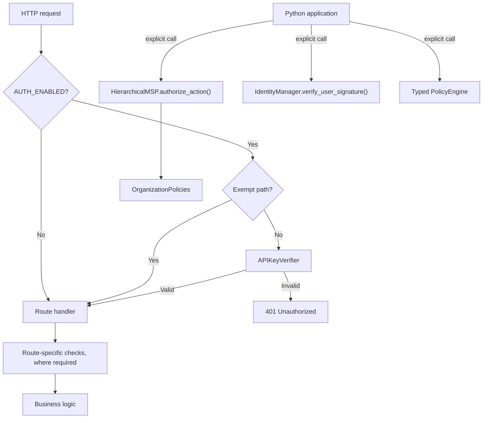

# Authorization & Access Control

Lớp bảo mật này chịu trách nhiệm xác định "Bạn là ai?" (Xác thực) và "Bạn có quyền làm gì?" (Ủy quyền) trong hệ thống HieraChain.

## 1. Membership Service Provider (MSP)

**File**: `hierachain/security/msp.py`

MSP là thành phần cốt lõi quản lý danh tính cho toàn bộ hệ thống phân cấp.

*   **Quản trị thực thể**: Quản lý `Entity`, `Role`, và `Policy`.
*   **PKI nội bộ**: Cấp phát và thu hồi chứng chỉ (Certificates) cho các nút và người dùng.
*   **Phân cấp**: Hỗ trợ mô hình MSP phân cấp phù hợp với cơ cấu tổ chức doanh nghiệp.

## 2. Identity Manager

**File**: `hierachain/security/identity.py`

Quản lý thông tin chi tiết về người dùng và tổ chức:

*   **Organization Management**: Định nghĩa các tổ chức thành viên.
*   **User Profiles**: Lưu thông tin định danh, vai trò và khóa công khai Ed25519 tùy chọn.
*   **Signature Verification**: `verify_user_signature()` kiểm tra message và chữ ký do caller cung cấp dựa trên khóa công khai đã đăng ký khi được gọi. Các handler request và event không tự động gọi hàm này.

## 3. Policy Engine (ABAC)

**File**: `hierachain/security/policy_engine.py`

Hệ thống kiểm soát truy cập dựa trên thuộc tính (Attribute-Based Access Control):

*   **Quy tắc linh hoạt**: Định nghĩa các quy tắc `Allow`/`Deny` dựa trên ngữ cảnh (Context) phong phú (Người dùng, Tài nguyên, Hành động, Thời gian).
*   **Đánh giá logic**: Xử lý các logic phức tạp để đưa ra quyết định truy cập cuối cùng.

## 4. API Key Verification

**File**: `hierachain/security/verify/api_key_verifier.py`

Lớp xác thực nhanh cho các yêu cầu qua API:

*   **API Key Lifecycle**: `KeyManager` trong `hierachain/security/key_manager.py` tạo và thu hồi key. `APIKeyVerifier` xác minh key khi xử lý request.
*   **Global HTTP Authentication**: Server chỉ cài dependency API key khi `AUTH_ENABLED` là true. Các đường dẫn trong `EXEMPT_PATHS`, gồm health, status và docs, bỏ qua bước kiểm tra key toàn cục này; các kiểm tra xác thực hoặc quyền riêng theo route vẫn có thể được áp dụng. Khi chạy production, server từ chối khởi động nếu tắt xác thực.
*   **Permission Mapping**: Ánh xạ API Key với các quyền hạn cụ thể trong hệ thống.

## Kiểm tra ủy quyền

* MSP chỉ cho phép hành động khi thực thể đang hoạt động và chứng chỉ hiện còn hiệu lực, chưa bị thu hồi. Tính hợp lệ của chứng chỉ được kiểm tra ở mỗi lần xác minh để lần kiểm tra thành công trước đó không kéo dài quyền sau khi chứng chỉ hết hạn.
* Quyền API key phải là danh sách chuỗi. Quyền wildcard là giá trị chính xác `all`; dữ liệu quyền sai định dạng sẽ bị từ chối.
* Kết quả policy trong cache gắn với phiên bản policy đã đăng ký. Các thay đổi qua `Policy.add_rule()` và `Policy.remove_rule()` có hiệu lực ở lần đánh giá tiếp theo.

---

## Luồng Xác thực & Ủy quyền

```mermaid
graph TD
    Request[HTTP request] --> Auth{AUTH_ENABLED?}
    Auth -- No --> Route[Route handler]
    Auth -- Yes --> Exempt{Exempt path?}
    Exempt -- Yes --> Route
    Exempt -- No --> Verify[APIKeyVerifier]
    Verify -- Invalid --> Error401[401 Unauthorized]
    Verify -- Valid --> Route
    Route --> Permission[Route-specific checks, where required]
    Permission --> Business[Business logic]
    PythonApp[Python application] -->|explicit call| MSP["HierarchicalMSP.authorize_action()"]
    MSP --> OrgPolicies[OrganizationPolicies]
    PythonApp -->|explicit call| Signature["IdentityManager.verify_user_signature()"]
    PythonApp -->|explicit call| Policy[Typed PolicyEngine]
```

---

## Liên quan

*   [Mã hóa và Quản lý khóa](./encryption-keys.md)
*   [Kiến trúc bảo mật](../architecture/security.md)
