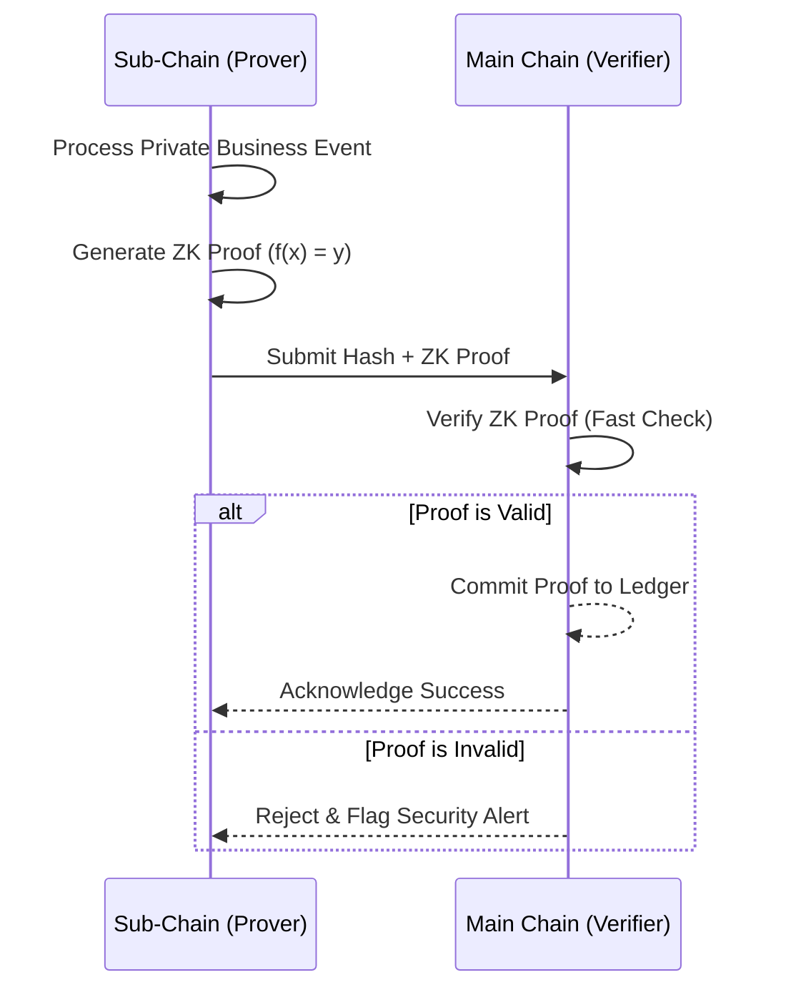

# Decentralized Zero-Knowledge Proofs

Lớp bảo mật tiên tiến nhất của HieraChain, cho phép chia sẻ bằng chứng về dữ liệu giữa các chuỗi con và chuỗi chính mà không làm lộ nội dung kinh doanh nhạy cảm.

## 1. ZK Prover

**File**: `hierachain/security/zk_prover.py`

Thành phần tạo bằng chứng tại các Sub-Chains:

*   **Proof Generation**: Tạo ra các bằng chứng toán học khẳng định rằng một sự kiện hoặc trạng thái là hợp lệ.
*   **Data Hiding**: Nội dung chi tiết của sự kiện được thay thế bằng một chuỗi định danh (Hash) duy nhất.
*   **Privacy Preservation**: Đảm bảo Main Chain không bao giờ nhìn thấy dữ liệu thô của Sub-Chains.

## 2. ZK Verifier

**File**: `hierachain/security/verify/zk_verifier.py`

Thành phần xác minh tại Main Chain:

*   **Efficient Verification**: Xác minh tính đúng đắn của bằng chứng ZK với chi phí tính toán thấp.
*   **Trustless Validation**: Cho phép Main Chain tin tưởng vào dữ liệu của Sub-Chain mà không cần quyền truy cập vào dữ liệu đó.
*   **Cross-chain Integrity**: Đảm bảo tính toàn vẹn của dữ liệu khi di chuyển giữa các tầng trong kiến trúc phân cấp.

---

## Luồng Hoạt động của ZK

---

## Ứng dụng Thực tế

*   **Báo cáo tài chính**: Chứng minh tổng doanh thu đạt ngưỡng nhất định mà không tiết lộ chi tiết từng hóa đơn.
*   **Quản lý chuỗi cung ứng**: Xác nhận một lô hàng đã qua kiểm định chất lượng mà không làm lộ công thức sản xuất bí mật.
*   **Xác thực quyền hạn**: Chứng minh một người dùng có đủ quyền thực hiện hành động mà không cần biết danh tính cụ thể của họ trên chuỗi chính.

---

## Liên quan

*   [Kiến trúc phân cấp](../modules/hierarchical.md)
*   [Authorization & Access Control](./authorization-access-control.md)
