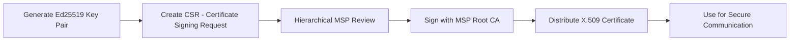

# Encryption & Keys

Lớp bảo mật này quản lý toàn bộ "bí mật" của hệ thống, bao gồm các khóa mã hóa, cặp khóa ký và chứng chỉ định danh.

## 1. Key Manager & Key Providers

**File**: `hierachain/security/key_manager.py`, `key_provider.py`

Quản lý việc tạo và sử dụng các cặp khóa:

*   **Ed25519 Support**: Sử dụng thuật toán Ed25519 cho chữ ký số tốc độ cao và bảo mật.
*   **Pluggable Providers**: Hỗ trợ nhiều nguồn cung cấp khóa khác nhau:

    *   `LocalKeyProvider`: Lưu trữ tại chỗ (In-memory).
    *   `FileVaultProvider`: Lưu trữ mã hóa trên ổ đĩa bằng **AES-256-GCM**.

*   **API Key Lifecycle**: Quản lý vòng đời đầy đủ của API Key từ lúc khởi tạo đến khi thu hồi.

## 2. Certificate Management (X.509)

**File**: `hierachain/security/certificate.py`

Quản lý danh tính số cho các nút và dịch vụ:

*   **X.509 Standards**: Tuân thủ tiêu chuẩn chứng chỉ số doanh nghiệp.
*   **mTLS Support**: Cung cấp các chứng chỉ cần thiết cho xác thực hai chiều (Mutual TLS) giữa các thành phần.
*   **CRL (Certificate Revocation List)**: Quản lý danh sách các chứng chỉ đã bị thu hồi để đảm bảo an ninh.

## 3. Key Backup & Recovery

**File**: `hierachain/security/key_backup_manager.py`

Đảm bảo khả năng phục hồi sau sự cố:

*   **Encrypted Backups**: Sao lưu khóa dưới dạng mã hóa với kiểm tra tính toàn vẹn bằng Hash.
*   **Multi-location Storage**: Hỗ trợ sao lưu tại nhiều vị trí để tránh mất mát dữ liệu.
*   **Secure Cleanup**: Quy trình xóa bỏ các bản sao lưu cũ một cách an toàn để tránh rò rỉ.

---

## Phân cấp Quản lý Khóa

HieraChain sử dụng mô hình phân cấp khóa để tối ưu bảo mật:

1.  **Master Key**: Khóa gốc dùng để mã hóa các khóa khác (thường được lưu trong môi trường bảo mật cao).
2.  **Domain Keys**: Các khóa dùng cho từng chuỗi con (Sub-Chains).
3.  **Entity/User Keys**: Các cặp khóa ký cho từng thực thể hoặc người dùng cuối.

---

## Luồng Khởi tạo Chứng chỉ

---

## Liên quan

*   [Authorization & Access Control](./authorization-access-control.md)
*   [Network Security](../modules/network.md)
