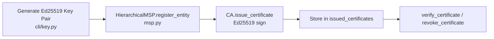

# Mã hóa và khóa

Lớp bảo mật này quản lý secret của hệ thống. Bao gồm khóa mã hóa, cặp khóa ký và chứng chỉ định danh.

## Key manager và key provider

File: `hierachain/security/key_manager.py`, `key_provider.py`

Đoạn code này tạo và sử dụng cặp khóa:

* Hỗ trợ Ed25519 cho chữ ký số nhanh và an toàn.
* Provider có thể thay thế hỗ trợ nhiều nguồn khóa:

    * `LocalKeyProvider` giữ khóa trong bộ nhớ cục bộ.
    * `FileVaultProvider` giữ dữ liệu mã hóa trên đĩa bằng Fernet, dùng AES-128-CBC với HMAC.

* `KeyManager.revoke_key()` của API server lưu bền vững API key đã thu hồi qua SQLite hoặc Redis dùng chung đã cấu hình. Kiểm tra thu hồi không dùng kết quả permission trong cache.

## Chứng chỉ và định danh (MSP)

File: `hierachain/security/msp.py` (`Certificate`, `CertificateAuthority`, `HierarchicalMSP`)

Đoạn code này quản lý định danh nội bộ nhẹ, không phải X.509:

* Chứng chỉ nội bộ là dataclass `Certificate` với `cert_id`, `subject`, `public_key`, `signature` (ký Ed25519 qua `_sign_certificate`) và kiểm tra thời hạn `is_valid()`. Không có ASN.1 X.509 và không có mTLS.
* CA có các thao tác `CertificateAuthority.issue_certificate()`, `revoke_certificate()` và `verify_certificate()`, với dictionary `issued_certificates` và set `revoked_certificates` trong bộ nhớ. `HierarchicalMSP` dùng chúng khi đăng ký tổ chức và thực thể.
* Hạn chế: thu hồi chứng chỉ MSP chỉ tồn tại trong bộ nhớ. Không có phân phối CRL, không có xác thực chuỗi X.509 và không có mutual TLS giữa các component. TLS được đặt ở reverse proxy theo quy tắc kiến trúc.

## Sao lưu và khôi phục khóa

File: `hierachain/cli/key.py`, `hierachain/security/key_provider.py` (`FileVaultProvider`)

Operator quản lý sao lưu bằng công cụ bên ngoài. Các cơ chế file khóa hiện có gồm:

* Chạy `hrc key generate --output validator_key.json` (CLI) để tạo cặp Ed25519 bằng `Ed25519PrivateKey.generate()` và ghi JSON hex `{private_key, public_key}`. File mới có mode `0600` trên POSIX; lệnh từ chối ghi đè file đã tồn tại. Các lệnh `show` và `verify` kiểm tra kết quả.
* Vault mã hóa (chỉ cho dev và test) dùng `FileVaultProvider` để mã hóa file vault bằng `PBKDF2HMAC(SHA256, 310_000 iter)` và `Fernet(AES-128-CBC+HMAC)`. Password được truyền vào constructor. Hỗ trợ HSM hoặc KMS ở production cần một `KeyProvider` riêng cho ứng dụng; runtime không có master-key provider dựng sẵn. `HRC_VAULT_TOKEN` và `HRC_VAULT_PATH` cấu hình backend Vault riêng của `SecretManager`.
* Không có sao lưu đa vị trí, không có kiểm tra toàn vẹn SHA-512 và không có tự động phân phối hay dọn dẹp. Operator phải tự sao chép `validator_key.json` hoặc `.vault` bằng công cụ sao lưu ngoài.

## Phạm vi khóa

* Việc ký block nạp node identity đầy đủ qua `HRC_VALIDATOR_IDENTITY`, gồm cặp khóa ký Ed25519 và khóa transport. File CLI chỉ chứa `private_key` và `public_key` là file provider, không phải identity đầy đủ này. Sao lưu identity cùng `HRC_BLOCK_TRUSTED_KEYS_FILE`; xem [Sao lưu khóa](../workflows/key-backup.md). `HRC_MASTER_KEY_SOURCE=env` chỉ là alias tương thích; giá trị khác và `HRC_MASTER_KEY_FILE` không rỗng bị từ chối vì chưa có master-key provider.
* API key được quản lý bởi `KeyManager` (tạo, thu hồi, phân quyền, cache qua `KeyStorage`/`KeyCacheManager`), không phải khóa ký cho từng entity.
* Không có phân cấp sẵn như Master tới Domain tới Entity. Cách ly domain dựa trên việc tách Sub-Chain và role của MSP.

## Luồng khởi tạo chứng chỉ

```mermaid
graph LR
    A[Generate Ed25519 Key Pair<br/>cli/key.py] --> B[HierarchicalMSP.register_entity<br/>msp.py]
    B --> C[CA.issue_certificate<br/>Ed25519 sign]
    C --> D[Store in issued_certificates]
    D --> E[verify_certificate / revoke_certificate]
```

## Liên quan

*   [Authorization & Access Control](./authorization-access-control.md)
*   [Network Security](../modules/network.md)
