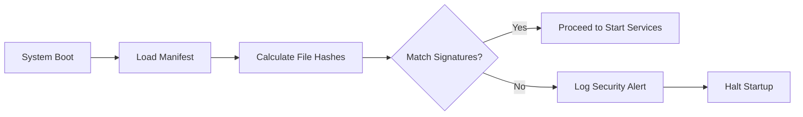

# Fault-tolerance & Integrity

Lớp bảo mật này đảm bảo hệ thống luôn hoạt động trong ngưỡng an toàn và mã nguồn thực thi không bị thay đổi trái phép.

## 1. Resource Guard (DoS Protection)

**File**: `hierachain/security/resource_guard.py`

Lá chắn thép bảo vệ tài nguyên hệ thống (CPU, RAM):

*   **Load Shedding**: Tự động từ chối các yêu cầu mới khi tài nguyên hệ thống vượt ngưỡng (ví dụ: CPU > 90%) để tránh sập toàn bộ nút.
*   **Fast Response**: Trả về lỗi `503 Service Unavailable` ngay lập tức để giảm tải cho worker xử lý.
*   **Monitoring Integration**: Sử dụng dữ liệu thời gian thực từ `PerformanceMonitor` để đưa ra quyết định bảo vệ.

## 2. Integrity Manager

**File**: `hierachain/security/integrity.py`

Kiểm tra tính toàn vẹn của hệ thống từ lúc khởi động:

*   **Executable Signing**: Kiểm tra chữ ký số hoặc mã băm (checksum) của các tệp thực thi và cấu hình quan trọng.
*   **Startup Verification**: Ngăn chặn hệ thống khởi động nếu phát hiện mã nguồn đã bị thay đổi trái phép (Tampered).
*   **Runtime Checks**: Thực hiện quét định kỳ để đảm bảo các thành phần trong bộ nhớ không bị sửa đổi.

---

## Cơ chế Bảo vệ Tài nguyên (Resource Guard)

Hệ thống sử dụng cơ chế bảo vệ 3 giai đoạn:

| Trạng thái | Ngưỡng (CPU/RAM) | Hành động |
| :--- | :--- | :--- |
| **Normal** | < 70% | Chấp nhận tất cả yêu cầu. |
| **Warning** | 70% - 90% | Bắt đầu giới hạn (Rate limit) các yêu cầu không ưu tiên. |
| **Critical** | > 90% | Từ chối toàn bộ yêu cầu mới (Load shedding) cho đến khi tài nguyên hạ nhiệt. |

---

## Luồng Kiểm tra Toàn vẹn (Integrity Flow)

---

## Liên quan

*   [Giám sát hiệu năng](../modules/monitoring.md)
*   [Xử lý lỗi hệ thống](../modules/error-mitigation.md)
