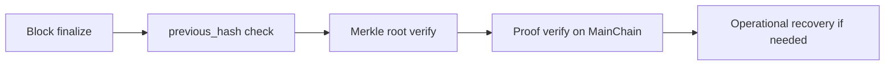

# Chịu lỗi và toàn vẹn

Giới hạn tài nguyên và kiểm tra toàn vẹn ledger chạy tại API middleware, ordering service và block verifier.

## Bảo vệ tài nguyên

* Giới hạn rate và payload nằm trong `hierachain/api/middleware.py` (`add_rate_limit`, `add_payload_limit` với `HRC_RATE_LIMIT`, `HRC_RATE_LIMIT_RPM`, `HRC_RATE_LIMIT_BACKEND`, `HRC_TRUSTED_PROXIES`). Với request POST, PUT và PATCH, middleware kiểm tra `Content-Length` hợp lệ với giới hạn 1 MiB; chỉ đếm byte qua `request.stream()` khi thiếu header này.
* `HRC_EVENT_POOL_MAX_SIZE` mặc định là 10.000 và giới hạn hàng đợi ordering. `HRC_RAM_CRITICAL_THRESHOLD` được khai báo với mặc định 95% nhưng không có runtime consumer trong `hierachain/`. Khi được gọi, `ResourceValidator` báo các ngưỡng CPU, memory và disk được cấu hình riêng; nó không thực thi ngưỡng RAM này trong ordering hay storage.
* Dùng middleware ứng dụng kết hợp giới hạn tại reverse proxy. `PerformanceMonitor` báo cáo metric; nó không cài guard CPU/RAM cho từng request.

## Kiểm tra toàn vẹn

Việc nạp và xác minh ledger dùng các cơ chế sau:

* Merkle và chain link trong `hierachain/core/block.py` và `core/merkle_tree.py` (tiền tố phân tách domain `0x01`) và `consensus/ordering/storage.py:_verify_chain_links()` (chuỗi `previous_hash`).
* Xác minh proof trong `hierachain/hierarchical/main_chain/proofs.py:_verify_proof_in_main_chain` (quét fallback) và `security/verify/block_verifier.py`.
* Cơ chế toàn vẹn runtime dùng chain link, Merkle root, xác minh proof và consensus validation. Snapshot trạng thái và rollback thuộc trách nhiệm deployment.
* `BlockVerifier.verify_chain()` kiểm tra chuỗi được truyền vào. Với chuỗi không rỗng, block đầu phải là genesis ở index `0` với `previous_hash` bằng `"0"`, và các liên kết giữa những block đã cung cấp được kiểm tra. Chuỗi rỗng trả `VALID`. API không nhận tip height hoặc hash dự kiến, nên một tiền tố hợp lệ nhưng thiếu các block phía sau vẫn có thể được chấp nhận.

```mermaid
graph LR
    A[Block finalize] --> B[previous_hash check]
    B --> C[Merkle root verify]
    C --> D[Proof verify on MainChain]
    D --> E[Operational recovery if needed]
```

## Liên quan

*   [Xử lý lỗi](../modules/error-mitigation.md)
*   [Giám sát](../modules/monitoring.md)
*   [Ghi nhật ký an toàn](./lockdown-logging.md)
