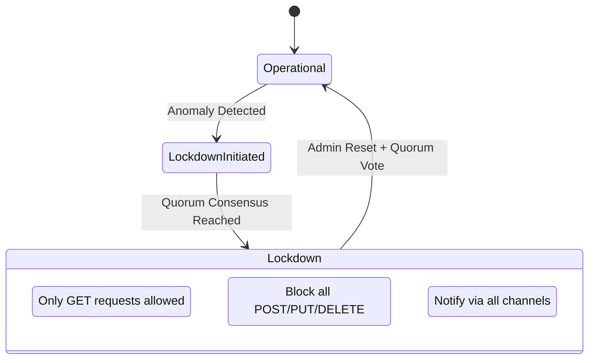

# Lockdown & Logging

Lớp bảo mật này tập trung vào việc phản ứng nhanh khi hệ thống bị xâm nhập thông qua cơ chế phong tỏa và hệ thống ghi nhật ký an toàn chống giả mạo.

## 1. Lockdown Protocol

**File**: `hierachain/cluster/lockdown_protocol.py`

Cơ chế "ngắt mạch" khẩn cấp cho toàn bộ cụm (Cluster):

*   **Kích hoạt Quorum**: Chế độ phong tỏa chỉ được kích hoạt hoặc gỡ bỏ khi có đủ số lượng nút (Quorum) đồng thuận.
*   **Trạng thái Read-only**: Khi ở chế độ Lockdown, hệ thống từ chối mọi yêu cầu thay đổi dữ liệu (Write) để bảo vệ tính toàn vẹn.
*   **HMAC Lockdown**: Sử dụng mã bí mật `HRC_CLUSTER_SECRET` để xác thực các lệnh phong tỏa giữa các nút.

## 2. Secure Logging

**File**: `hierachain/security/secure_logging.py`

Hệ thống ghi nhật ký được thiết kế chuyên biệt cho an ninh:

*   **Tamper-evident**: Mỗi bản ghi log có cấu trúc chặt chẽ, hỗ trợ phát hiện các hành vi xóa hoặc sửa đổi nhật ký.
*   **Structured Logs**: Log được ghi dưới dạng JSON để dễ dàng tích hợp với các hệ thống giám sát tập trung (SIEM).
*   **Phân quyền Log**: Các module nhạy cảm (như `security`, `consensus`) sử dụng `SecureLogger` riêng biệt với mức độ bảo vệ cao hơn.

---

## Cơ chế Phản ứng Lockdown

---

## Liên quan

*   [Phân tích rủi ro](./risk-analyzer.md)
*   [Quản trị Cluster](../modules/cluster.md)
