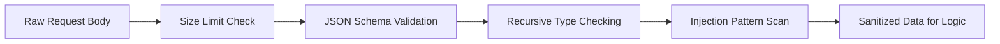

# Risk Analyzer

Lớp bảo mật này đóng vai trò là "bộ não" phân tích các hành vi đáng ngờ và "màng lọc" ngăn chặn các cuộc tấn công dữ liệu.

## 1. Risk Analyzer (Behavioral Analysis)

**File**: `hierachain/risk_management/risk_analyzer.py`

Hệ thống phân tích rủi ro dựa trên dữ liệu vận hành:

*   **Anomaly Detection**: Sử dụng thuật toán Z-score để phát hiện các thay đổi đột ngột trong tần suất yêu cầu hoặc lỗi.
*   **Threat Intelligence**: Nhận diện các mẫu tấn công phổ biến (như Brute force API key, Replay attack).
*   **Scoring System**: Đánh giá điểm rủi ro (Risk Score) cho từng Peer hoặc API Key để đưa ra biện pháp xử lý tương ứng.

## 2. Input Sanitization & Validation

**File**: `hierachain/security/sanitization.py`

Lớp phòng thủ chống lại các cuộc tấn công vào dữ liệu (Data-level attacks):

*   **Injection Protection**: Làm sạch dữ liệu đầu vào để ngăn chặn SQL Injection, NoSQL Injection và Command Injection.
*   **Nested Bomb Protection**: Giới hạn độ sâu của JSON payload để ngăn chặn các cuộc tấn công từ chối dịch vụ thông qua cấu trúc dữ liệu lồng nhau phức tạp.
*   **Type Strictness**: Đảm bảo dữ liệu đầu vào khớp hoàn toàn với schema định nghĩa, từ chối mọi trường thông tin dư thừa hoặc sai định dạng.

---

## Ma trận Phản ứng Rủi ro

Hệ thống tự động thực hiện các hành động dựa trên điểm rủi ro:

| Risk Score | Mức độ | Hành động tự động |
| :--- | :--- | :--- |
| **0.0 - 0.3** | Thấp | Chỉ ghi log bình thường. |
| **0.3 - 0.7** | Trung bình | Tăng cường xác thực (Challenge) hoặc áp dụng Rate Limit nghiêm ngặt hơn. |
| **0.7 - 1.0** | Cao | Tạm thời khóa (Blacklist) thực thể gây rủi ro và gửi cảnh báo khẩn cấp. |

---

## Luồng Làm sạch Dữ liệu (Sanitization Flow)

---

## Liên quan

*   [Quản lý rủi ro](../modules/risk-management.md)
*   [Hệ thống cảnh báo](../modules/monitoring.md)
