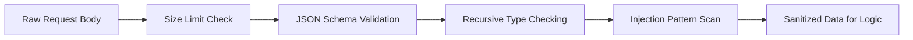

# Làm sạch Input

Lớp bảo mật này xác thực và làm sạch dữ liệu không tin cậy trước khi logic nghiệp vụ xử lý.

## Làm sạch & Xác thực Input

**File**: `hierachain/security/sanitization.py`

Lớp phòng thủ chống lại các cuộc tấn công vào dữ liệu (Data-level attacks):

*   **Injection Protection**: Làm sạch dữ liệu đầu vào để ngăn chặn SQL Injection, NoSQL Injection và Command Injection.
*   **Nested Bomb Protection**: Giới hạn độ sâu của JSON payload để ngăn chặn các cuộc tấn công từ chối dịch vụ thông qua cấu trúc dữ liệu lồng nhau phức tạp.
*   **Type Strictness**: Đảm bảo dữ liệu đầu vào khớp hoàn toàn với schema định nghĩa, từ chối mọi trường thông tin dư thừa hoặc sai định dạng.

## Luồng Làm sạch Dữ liệu (Sanitization Flow)

---

## Liên quan

*   [Ghi nhật ký kiểm toán](../modules/risk-management.md)
*   [Hệ thống cảnh báo](../modules/monitoring.md)
