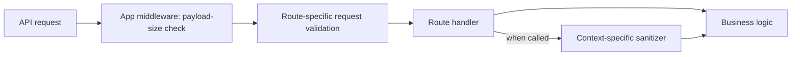

# Làm sạch Input

Module này cung cấp các phép biến đổi giá trị theo ngữ cảnh, không phải pipeline xác thực chung cho mọi request. `sanitize_string()` hỗ trợ ngữ cảnh HTML/general, log và filename; `sanitize_dict()` và `sanitize_list()` đệ quy áp dụng phép biến đổi đã chọn. `is_safe_input()` kiểm tra độ dài chuỗi và một số pattern script, JavaScript URI, template. Các helper này không xác thực theo schema ứng dụng và không cung cấp bảo vệ SQL, NoSQL hay command injection. Kiểm tra kích thước request và schema/độ sâu của route được thực hiện riêng; handler gọi sanitizer tại nơi cần.

## Làm sạch & Xác thực Input

**File**: `hierachain/security/sanitization.py`

API có kiểm tra kích thước request và model theo từng route ở những nơi được cấu hình. Handler chỉ chạy sanitizer khi gọi helper tương ứng.

## Luồng Làm sạch Dữ liệu (Sanitization Flow)

```mermaid
graph LR
    A[API request] --> B[App middleware: payload-size check]
    B --> C[Route-specific request validation]
    C --> D[Route handler]
    D -->|when called| E[Context-specific sanitizer]
    D --> F[Business logic]
    E --> F
```

---

## Liên quan

*   [Ghi nhật ký kiểm toán](../modules/risk-management.md)
*   [Hệ thống cảnh báo](../modules/monitoring.md)
