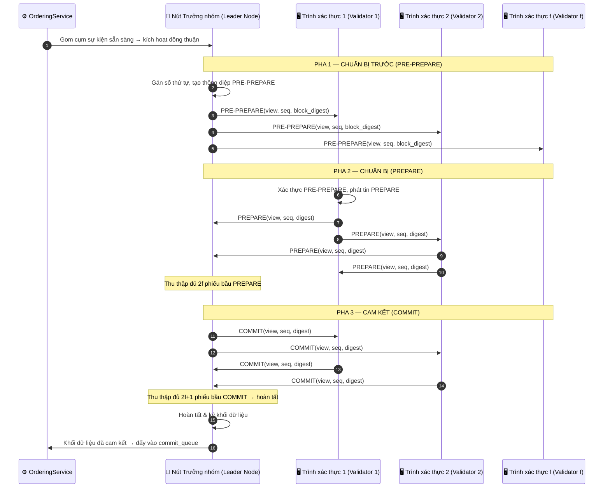
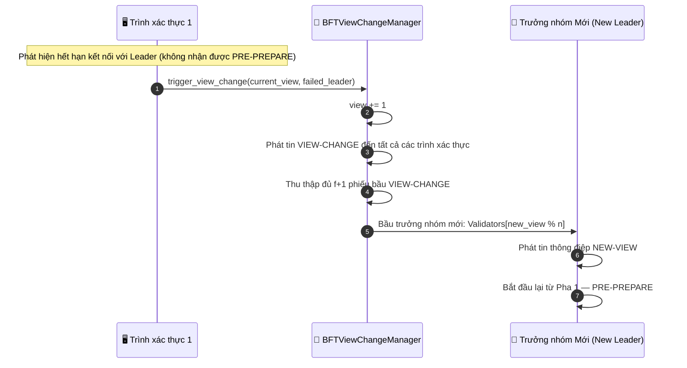

# Đồng thuận BFT (BFT Consensus)

## Tổng quan

Cơ chế đồng thuận **Chống lỗi Byzantine (BFT - Byzantine Fault-Tolerant)** chạy quy trình PBFT 3 pha khi hoàn tất các khối. Cơ chế này yêu cầu số lượng nút `n ≥ 3f + 1` để có thể chịu lỗi tối đa `f` nút hoạt động sai hoặc có hành vi gian lận. Cơ chế này thay thế hoàn toàn bước `finalize_block()` trong quy trình Gửi Sự kiện khi hệ thống chạy ở chế độ BFT.

Để xem chi tiết quy trình đồng thuận PoA và PoF, vui lòng tham khảo [Cơ chế Đồng thuận](./consensus_mechanisms.md).

**Yêu cầu hệ thống**: Tối thiểu 4 nút để chịu lỗi 1 nút Byzantine (n=4, f=1: 3×1+1=4).

---

## Biểu đồ luồng — PBFT 3 Pha (3-Phase PBFT)

---

## Biểu đồ luồng — Thay đổi Phiên (View Change - Lỗi Leader)

---

## Các bước thực hiện chi tiết

| Bước | Mô tả |
|:-----|:------|
| **PRE-PREPARE** | Nút Trưởng nhóm gán số thứ tự chuỗi và phát thông điệp chứa mã băm tóm tắt của khối (block digest) đến tất cả các trình xác thực. |
| **PREPARE** | Mỗi trình xác thực kiểm tra thông điệp PRE-PREPARE, sau đó phát đi phiếu bầu PREPARE của riêng mình. Leader thu thập đủ 2f phiếu bầu hợp lệ. |
| **COMMIT** | Leader phát thông điệp COMMIT. Mỗi nút thu thập đủ 2f+1 phiếu bầu COMMIT trước khi tiến hành xác nhận và hoàn tất khối tại cục bộ. |
| **View Change** | Nếu Leader không phản hồi trong khoảng thời gian chờ (timeout): các trình xác thực tăng chỉ số `view` lên 1, bầu nút `Validators[view % n]` làm Leader mới. |

---

## So sánh các Thuật toán Đồng thuận

| Thuật toán | Cơ chế | Khả năng Chịu lỗi | Trường hợp Sử dụng |
|:-----------|:-------|:------------------|:-------------------|
| **PoA** | Dựa trên định danh, các nút có thẩm quyền ký khối | Danh tiếng của Trình xác thực | Mạng lưới tư nhân / nội bộ doanh nghiệp |
| **PoF** | Luân chuyển Trưởng nhóm, đa số đồng thuận `height % n` | Phân tán sự tin cậy | Mạng liên doanh / đa tổ chức |
| **BFT** | PBFT 3 pha | Lên đến `f` nút Byzantine trong hệ thống `3f+1` | Môi trường quan trọng / có tính đối kháng |

---

## Xử lý lỗi

| Tình huống | Hành vi |
|:-----------|:--------|
| Trưởng nhóm không phản hồi | Kích hoạt cơ chế Thay đổi Phiên (View Change), bầu Leader mới (`Validators[new_view % n]`) |
| Trình xác thực gửi mã băm tóm tắt không hợp lệ | Phiếu bầu bị loại bỏ, không được tính vào số lượng biểu quyết tối thiểu (quorum) |
| Phân mảnh mạng lưới < f nút | Giao thức vẫn tiếp tục hoạt động nếu vẫn đạt đủ số phiếu tối thiểu (2f+1) |
| Phân mảnh mạng lưới ≥ f+1 nút | Giao thức tạm ngưng cho đến khi mạng lưới được kết nối lại (ưu tiên tính toàn vẹn và an toàn hơn tính sẵn sàng) |

---

## Các Class & Method quan trọng

| Bước | Class / Method | File |
|:-----|:--------------|:-----|
| PBFT 3 Pha | `BFTConsensus.run_consensus()` | `consensus/bft/consensus.py` |
| PRE-PREPARE | `BFTConsensus._send_pre_prepare()` | `consensus/bft/consensus.py` |
| Thu thập PREPARE | `BFTConsensus._handle_prepare()` | `consensus/bft/consensus.py` |
| Hoàn tất COMMIT | `BFTConsensus._handle_commit()` | `consensus/bft/consensus.py` |
| Thay đổi Phiên | `BFTViewChangeManager.trigger_view_change()` | `consensus/bft/consensus.py` |
| Giao thức mạng | `ZmqTransport.send()` / `receive()` | `network/zmq_transport.py` |

---

## Liên quan

- [Cơ chế Đồng thuận](./consensus_mechanisms.md) — Chi tiết về PoA và PoF
- [Gửi Sự kiện](./event-submission.md) — BFT thay thế hoàn toàn bước `finalize_block()`
- [Giảm thiểu Lỗi & Phục hồi](./error-recovery.md) — Xử lý khôi phục sau khi Leader gặp lỗi ở cấp hệ thống
