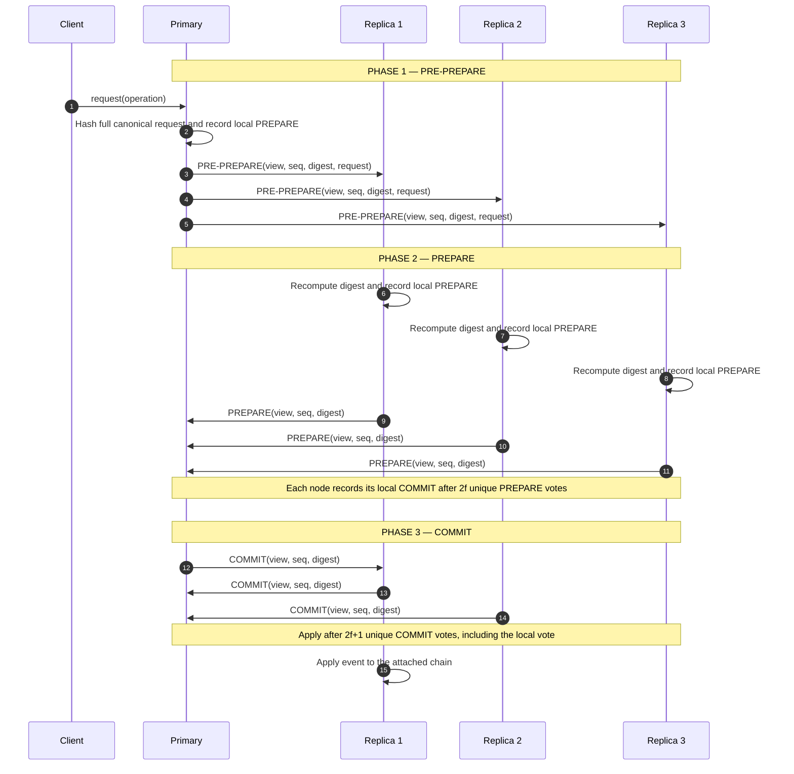
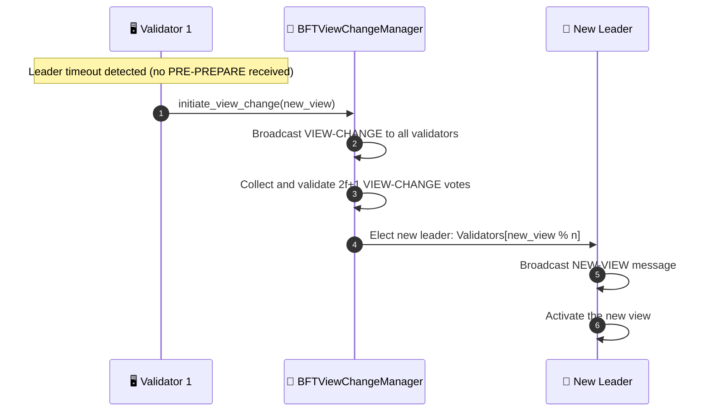

# Đồng thuận BFT

## Tổng quan

Thành phần thư viện BFT được export và demo độc lập sử dụng PBFT 3 pha. Nó yêu cầu `n >= 3f + 1` để chịu được `f` node lỗi hoặc gian lận. Luồng runtime MainChain và SubChain hiện tại không khởi tạo BFT; bên gọi sử dụng tường minh `BFTConsensus.request()`.

Với chi tiết PoA và PoF, xem [Cơ chế Đồng thuận](./consensus_mechanisms.md).

Yêu cầu hệ thống: tối thiểu 4 node để chịu 1 lỗi Byzantine (n=4, f=1: 3x1+1=4).

---

## Biểu đồ luồng: PBFT 3 pha

```mermaid
sequenceDiagram
    autonumber
    participant C as Client
    participant L as Primary
    participant R1 as Replica 1
    participant R2 as Replica 2
    participant R3 as Replica 3

    rect rgb(0, 0, 0, 0)
        Note over L,R3: PHASE 1 — PRE-PREPARE
        C->>L: request(operation)
        L->>L: Hash full canonical request and record local PREPARE
        L->>R1: PRE-PREPARE(view, seq, digest, request)
        L->>R2: PRE-PREPARE(view, seq, digest, request)
        L->>R3: PRE-PREPARE(view, seq, digest, request)
    end

    rect rgb(0, 0, 0, 0)
        Note over L,R3: PHASE 2 — PREPARE
        R1->>R1: Recompute digest and record local PREPARE
        R2->>R2: Recompute digest and record local PREPARE
        R3->>R3: Recompute digest and record local PREPARE
        R1->>L: PREPARE(view, seq, digest)
        R2->>L: PREPARE(view, seq, digest)
        R3->>L: PREPARE(view, seq, digest)
        Note over L,R3: Each node records its local COMMIT after 2f unique PREPARE votes
    end

    rect rgb(0, 0, 0, 0)
        Note over L,R3: PHASE 3 — COMMIT
        L->>R1: COMMIT(view, seq, digest)
        R1->>L: COMMIT(view, seq, digest)
        R2->>L: COMMIT(view, seq, digest)
        Note over L,R3: Apply after 2f+1 unique COMMIT votes, including the local vote
        R1->>R1: Apply event to the attached chain
    end
```

Primary và replica mỗi node đếm đúng một phiếu giai đoạn có chữ ký của chính mình. PRE-PREPARE bị từ chối nếu nội dung request không khớp với digest đã ký. Nếu thao tác ghi vào chain được gắn vào phát sinh lỗi hoặc trả về `False`, node giữ các message quorum và event ổn định trong bộ nhớ; một COMMIT hợp lệ được gửi lại có thể thử lại thao tác ghi. Node chỉ đánh dấu sequence đã cam kết sau khi thao tác ghi thành công.

Khi không gắn application chain, thành phần chạy ở chế độ chỉ đồng thuận và ghi nhận trạng thái consensus mà không ghi event, như demo độc lập.

---

## Biểu đồ luồng: Thay đổi phiên (View Change)

```mermaid
sequenceDiagram
    autonumber
    participant ledger as 🖥️ Validator 1
    participant VM as 🔄 BFTViewChangeManager
    participant NEW as 👑 New Leader

    Note over ledger: Leader timeout detected (no PRE-PREPARE received)

    ledger->>VM: initiate_view_change(new_view)
    VM->>VM: Broadcast VIEW-CHANGE to all validators
    VM->>VM: Collect and validate 2f+1 VIEW-CHANGE votes
    VM->>NEW: Elect new leader: Validators[new_view % n]
    NEW->>NEW: Broadcast NEW-VIEW message
    NEW->>NEW: Activate the new view
```

---

## Các bước chi tiết

| Bước | Mô tả |
|:-----|:------|
| **PRE-PREPARE** | Primary gán số thứ tự, băm toàn bộ request chuẩn, ký digest và phát request. |
| **PREPARE** | Mỗi node tính lại digest và ghi nhận đúng một phiếu PREPARE của mình. Mỗi node chuyển sang COMMIT sau `2f` phiếu PREPARE duy nhất, bao gồm phiếu của chính nó. |
| **COMMIT** | Mỗi node đã PREPARED ghi nhận và phát đúng một phiếu COMMIT của mình. Node áp dụng event sau `2f + 1` phiếu COMMIT duy nhất, bao gồm phiếu của chính nó. |
| **View Change** | Nếu leader im lặng quá timeout, manager thu thập `2f + 1` phiếu VIEW-CHANGE có chữ ký trước khi chấp nhận view mới. |

---

## So sánh thuật toán đồng thuận

| Thuật toán | Cơ chế | Khả năng chịu lỗi | Trường hợp dùng |
|:-----------|:-------|:------------------|:-------------------|
| **PoA** | Dựa trên danh tính, node có thẩm quyền ký khối | Danh tiếng validator | Mạng riêng / nội bộ |
| **PoF** | Luân phiên leader, đồng thuận đa số `height % n` | Phân tán niềm tin | Mạng liên doanh / đa tổ chức |
| **BFT** | Thành phần thư viện PBFT 3 pha | Chịu tới `f` node Byzantine trong `3f+1` | Bên gọi tường minh và demo độc lập |

---

## Xử lý lỗi

| Tình huống | Hành vi |
|:-----------|:--------|
| Leader không phản hồi | Kích hoạt View Change; primary mới là `all_nodes[new_view % n]` |
| Validator gửi digest không hợp lệ | Phiếu bị loại, không tính vào quorum |
| Chia mạng < f node | Giao thức tiếp tục nếu vẫn đủ quorum 2f+1 |
| Chia mạng >= f+1 node | Giao thức tạm dừng tới khi mạng nối lại (ưu tiên an toàn hơn sẵn sàng) |
| Ghi chain được gắn vào thất bại | Giữ quorum COMMIT hiện tại và thử lại cùng event khi COMMIT hợp lệ được gửi lại |

---

## Lớp và phương thức chính

| Bước | Lớp / Phương thức | Tệp |
|:-----|:--------------|:-----|
| Request và PRE-PREPARE | `BFTConsensus.request()` | `consensus/bft/consensus.py` |
| Xác thực PRE-PREPARE và PREPARE cục bộ | `BFTConsensusEngine.handle_pre_prepare()` | `consensus/bft/engine.py` |
| Quorum PREPARE và COMMIT cục bộ | `BFTConsensusEngine.handle_prepare()` | `consensus/bft/engine.py` |
| Quorum COMMIT và áp dụng event | `BFTConsensusEngine.process_commit_quorum()` | `consensus/bft/engine.py` |
| View Change | `BFTViewChangeManager.initiate_view_change()` | `consensus/bft/view_change.py` |
| Giao thức mạng | `BFTMessageDispatcher.broadcast_msg()` | `consensus/bft/dispatcher.py` |

---

## Liên quan

- [Cơ chế Đồng thuận](./consensus_mechanisms.md): chi tiết PoA và PoF
- [Gửi Sự kiện](./event-submission.md): luồng gửi sự kiện của MainChain và SubChain
- [Giảm thiểu Lỗi & Phục hồi](./error-recovery.md): khôi phục sau lỗi leader ở cấp hệ thống
