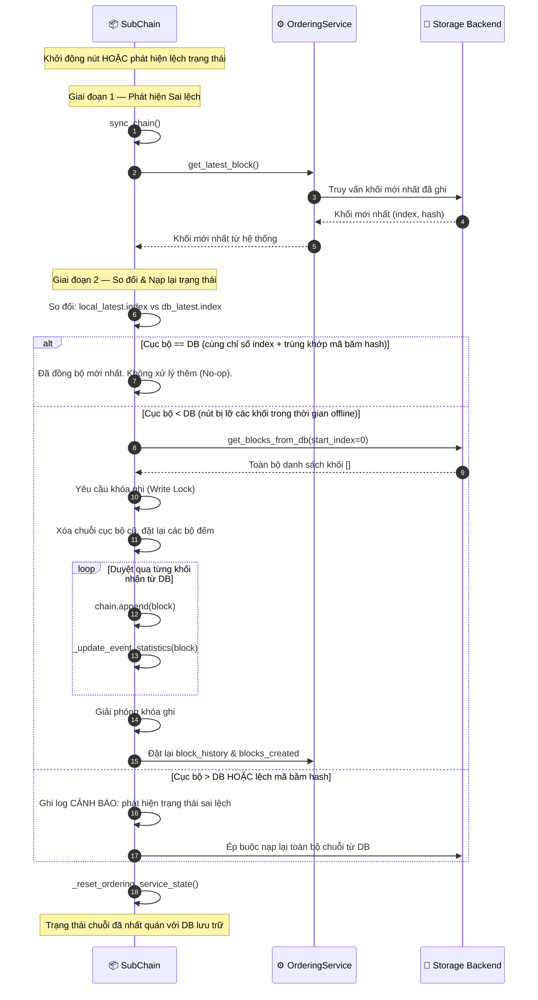

# Nạp lại Trạng thái Chuỗi (Chain Rehydration)

## Tổng quan

Khi một nút Chuỗi con (Sub-Chain) **khởi động lại** hoặc phát hiện **lệch trạng thái** (mã băm cục bộ không trùng khớp với mã băm trong DB), nút đó sẽ nạp lại chuỗi trong bộ nhớ từ cơ sở dữ liệu lưu trữ backend. Cơ chế này đảm bảo tính nhất quán tuyệt đối của sổ cái sau khi gặp sự cố crash, restart nút hoặc phân mảnh mạng.

Cơ sở dữ liệu lưu trữ (DB) luôn là **nguồn chân lý tối cao (authoritative source of truth)**. Nếu trạng thái cục bộ bị sai lệch, nó sẽ bị loại bỏ và xây dựng lại hoàn toàn từ dữ liệu trong DB.

---

## Biểu đồ luồng

---

## Các kịch bản sai lệch trạng thái

| Kịch bản | Cách thức phát hiện | Hành động khắc phục |
|:---------|:-------------------|:--------------------|
| **Khởi động nguội (Cold start)** | `local.index == 0` | Nạp toàn bộ danh sách khối dữ liệu từ DB |
| **Phục hồi sau sự cố crash** | `local.index < db.index` | Chỉ lấy và ghép thêm các khối bị thiếu |
| **Lệch mã băm (Hash mismatch)** | `local.hash != db.hash` (cùng chỉ số index) | Bắt buộc nạp lại toàn bộ từ cơ sở dữ liệu |
| **Đã đồng bộ** | Cùng chỉ số index VÀ mã băm trùng khớp | Không thực hiện gì thêm (No-op) |
| **Cục bộ chạy trước DB** | `local.index > db.index` | CẢNH BÁO: DB là nguồn dữ liệu chuẩn; ép buộc nạp lại từ DB |

---

## Các bước thực hiện chi tiết

| Bước | Mô tả |
|:-----|:------|
| **1. Kích hoạt** | Nút khởi động gọi hàm `sync_chain()`, hoặc bộ hẹn giờ `auto_sync` tự động kích hoạt. |
| **2. Truy vấn DB** | Lệnh `OrderingService.get_latest_block()` lấy thông tin khối được ghi nhận mới nhất từ cơ sở dữ liệu. |
| **3. So sánh đối chiếu**| So sánh cặp giá trị `(index, hash)` của chuỗi cục bộ với dữ liệu nhận từ DB. |
| **4. Đồng bộ hoàn tất**| Nếu trùng khớp hoàn toàn: bỏ qua. Tiếp tục hoạt động nghiệp vụ bình thường. |
| **5. Đồng bộ một phần**| Nếu `local < db`: chỉ tải về các khối dữ liệu còn thiếu. Tiến hành lấy khóa ghi để tránh xung đột luồng. |
| **6. Nạp lại toàn bộ** | Nếu phát hiện lệch mã băm hoặc chỉ số cục bộ lớn hơn DB: xóa bỏ bộ nhớ cục bộ, dựng lại toàn bộ từ DB. |
| **7. Đặt lại chỉ mục** | Lệnh `_update_event_statistics()` xây dựng lại chỉ mục tìm kiếm `entity_event_index` từ các khối vừa nạp. |
| **8. Đồng bộ bộ đếm** | Đồng bộ lại các bộ đếm số lượng khối giữa chuỗi hoạt động và dịch vụ sắp xếp thứ tự. |

---

## Xử lý lỗi

| Tình huống | Hành vi |
|:-----------|:--------|
| Lỗi đọc DB trong quá trình nạp lại | Ghi nhận lỗi ngoại lệ, thử lại ở chu kỳ đồng bộ tiếp theo |
| Khóa ghi bị giữ quá lâu | Tự động hết hạn (timeout) sau `lock_timeout` giây; gửi cảnh báo nguy hiểm qua Risk Alerts |
| Chỉ mục `entity_event_index` không nhất quán sau khi nạp | Kích hoạt dựng lại chỉ mục toàn phần |
| Cơ sở dữ liệu lưu trữ không thể kết nối | Nút chuyển sang chế độ Chỉ đọc (Read-only); sự kiện mới được đưa vào hàng đợi nhưng không ghi xuống đĩa |

---

## Các Class & Method quan trọng

| Bước | Class / Method | File |
|:-----|:--------------|:-----|
| Hàm khởi tạo | `SubChain.sync_chain()` | `hierarchical/sub_chain.py` |
| Đọc khối mới nhất từ DB | `OrderingService.get_latest_block()` | `consensus/ordering/service.py` |
| Tải toàn bộ khối | `storage.get_blocks_from_db()` | `adapters/database/sqlite_adapter.py` |
| Cập nhật chỉ mục | `SubChain._update_event_statistics()` | `hierarchical/sub_chain.py` |
| Đặt lại bộ đếm OS | `SubChain._reset_ordering_service_state()` | `hierarchical/sub_chain.py` |

---

## Liên quan

- [Giảm thiểu Lỗi & Phục hồi](./error-recovery.md): Việc khôi phục ảnh chụp trạng thái lỗi sẽ kích hoạt nạp lại chuỗi
- [Xác thực Tính toàn vẹn](./integrity-validation.md): Kiểm tra tính nhất quán của chuỗi sau khi nạp lại trạng thái
