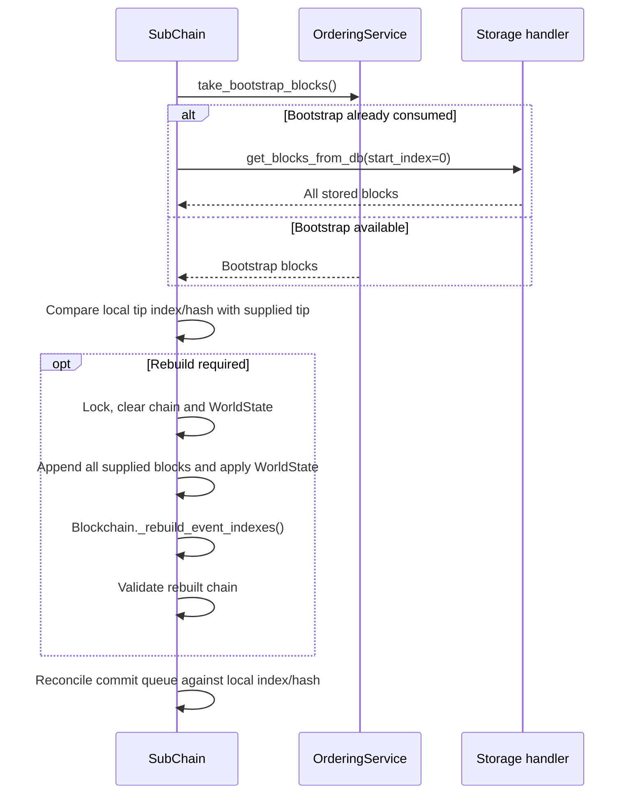

# Nạp lại trạng thái chuỗi

## Tổng quan

`SubChain.sync_chain()` dựng lại ledger cục bộ từ các khối do dịch vụ ordering cung cấp. Quá trình khởi động chạy bước đồng bộ này trước khi đăng ký chuỗi hoặc khởi chạy commit consumer. Quy trình không có bộ hẹn giờ `auto_sync` định kỳ; ứng dụng gọi `sync_chain()` sau đó phải phối hợp với các bên đang ghi dữ liệu.

Orderer cung cấp danh sách khối bootstrap một lần. Sau đó, quá trình đồng bộ đọc toàn bộ khối qua `storage_handler.get_blocks_from_db(start_index=0)`. Nó so sánh khối cuối cục bộ với khối cuối được cung cấp để quyết định có dựng lại hay không. Nó không chỉ lấy phần dữ liệu còn thiếu.

## Biểu đồ luồng

```mermaid
sequenceDiagram
    participant SC as SubChain
    participant OS as OrderingService
    participant DB as Storage handler
    SC->>OS: take_bootstrap_blocks()
    alt Bootstrap already consumed
        SC->>DB: get_blocks_from_db(start_index=0)
        DB-->>SC: All stored blocks
    else Bootstrap available
        OS-->>SC: Bootstrap blocks
    end
    SC->>SC: Compare local tip index/hash with supplied tip
    opt Rebuild required
        SC->>SC: Lock, clear chain and WorldState
        SC->>SC: Append all supplied blocks and apply WorldState
        SC->>SC: Blockchain._rebuild_event_indexes()
        SC->>SC: Validate rebuilt chain
    end
    SC->>SC: Reconcile commit queue against local index/hash
```

## So sánh và dựng lại

| Trạng thái | Hành vi |
|:------|:---------|
| Không có khối được cung cấp | Quá trình khôi phục trả về mà không xóa chuỗi cục bộ |
| Khối cuối cục bộ đứng sau khối cuối được cung cấp | Dựng lại từ toàn bộ danh sách khối được cung cấp |
| Cùng chỉ số và cùng hash | Giữ chuỗi cục bộ |
| Cùng chỉ số nhưng khác hash | Dựng lại từ các khối được cung cấp |
| Chỉ số cục bộ cao hơn, hash khối cuối khác | Ghi log phân kỳ và dựng lại |
| Chỉ số cục bộ cao hơn, hash khối cuối giống nhau | Giữ chuỗi cục bộ |

`_apply_rehydrated_blocks()` giữ khóa chuỗi trong khi xóa và dựng lại chuỗi, WorldState và chỉ mục sự kiện. Sau đó, nó gọi `is_chain_valid()` và phát sinh `ValueError` nếu xác thực thất bại. Nó không đặt lại bộ đếm khối của orderer đang hoạt động.

Bước đối soát lúc khởi động loại bỏ các khối trong hàng đợi có chỉ số và hash đã trùng với chuỗi vừa dựng lại. Các khối chưa có trong chuỗi vẫn ở hàng đợi. Khối có hash xung đột được giữ lại và gây `ValueError`, ngăn quá trình khởi động chấp nhận lịch sử xung đột.

## Lỗi và giới hạn vận hành

Lỗi đọc storage được truyền đến bên gọi. Lịch sử dựng lại không hợp lệ và xung đột hàng đợi cũng gây lỗi. Luồng này không có lịch thử lại, cảnh báo hết thời gian chờ khóa hay tự động chuyển sang chế độ chỉ đọc. Khôi phục quyền truy cập storage và cấu hình danh tính/tin cậy đã được phê duyệt trước khi khởi động lại; kiểm tra lỗi trước khi gửi thêm sự kiện.

## Lớp và phương thức chính

| Thao tác | Phương thức | Tệp |
|:----------|:-------|:-----|
| Điểm vào công khai | `SubChain.sync_chain()` | `hierachain/hierarchical/sub_chain/base.py` |
| Đồng bộ | `_sync_chain_for_sub_chain()` | `hierachain/hierarchical/sub_chain/ordering.py` |
| Nạp và so sánh | `_rehydrate_chain_from_ordering_service()` | `hierachain/hierarchical/sub_chain/ordering.py` |
| Dựng lại | `_apply_rehydrated_blocks()` | `hierachain/hierarchical/sub_chain/ordering.py` |
| Đối soát hàng đợi | `_discard_rehydrated_blocks_from_queue()` | `hierachain/hierarchical/sub_chain/ordering.py` |
| Chỉ mục sự kiện | `Blockchain._rebuild_event_indexes()` | `hierachain/core/blockchain.py` |

## Liên quan

- [Giảm thiểu lỗi](./error-recovery.md): các cơ chế khôi phục riêng
- [Kiểm tra tính toàn vẹn hệ thống](./integrity-validation.md): báo cáo tính toàn vẹn do bên gọi chủ động yêu cầu
