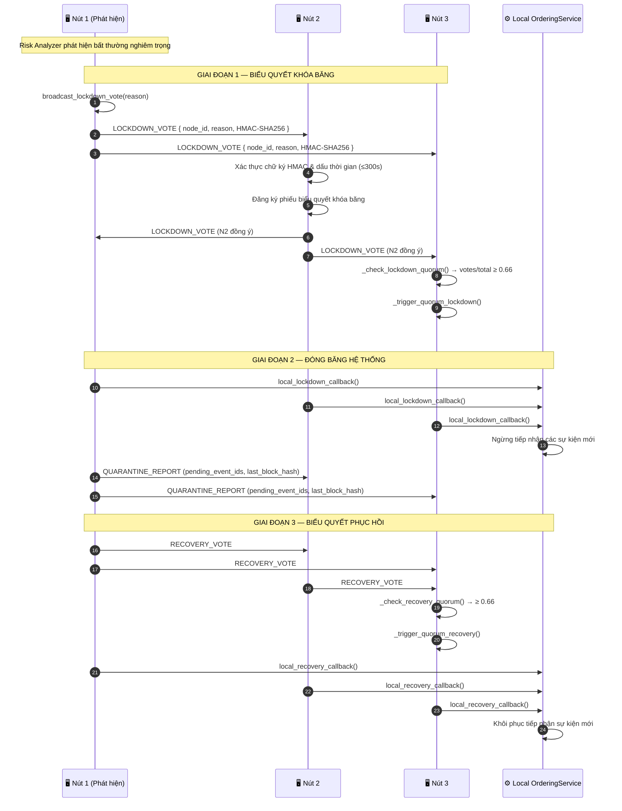
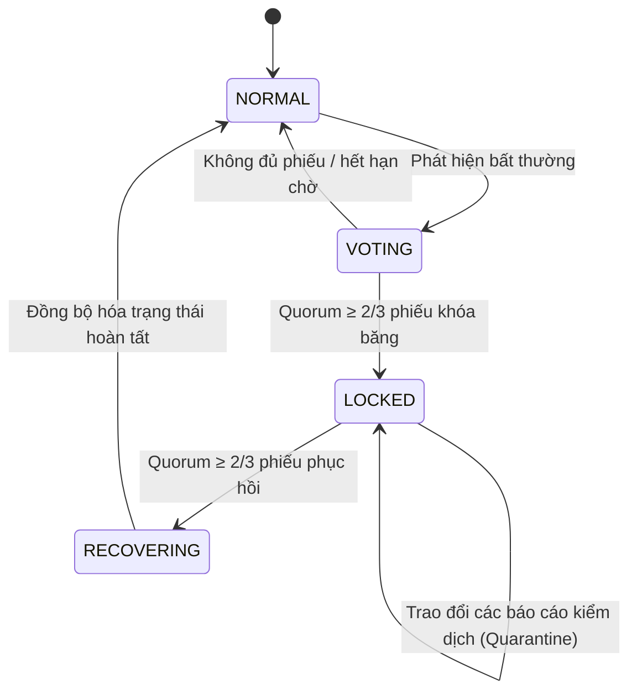

# Khóa băng Cụm (Cluster Lockdown)

## Tổng quan

**Giao thức Khóa băng Cụm (Cluster Lockdown Protocol)** điều phối việc đóng băng trạng thái của toàn bộ hệ thống trên tất cả các nút khi phát hiện sự bất thường nghiêm trọng. Cơ chế này sử dụng **giao thức tin nhắn ngang hàng P2P kiểu tin đồn (gossip) qua ZeroMQ** và yêu cầu **biểu quyết quá bán (tối thiểu 2/3)** của các nút đã đăng ký để kích hoạt cả quá trình khóa băng lẫn phục hồi. Tất cả thông điệp đều được xác thực bằng chữ ký **HMAC-SHA256** nhằm ngăn chặn các cuộc tấn công giả mạo yêu cầu khóa băng.

**Đặc tính quan trọng**: Không một nút đơn lẻ nào có thể đơn phương khóa băng toàn bộ cụm; đạt tỷ lệ biểu quyết tối thiểu (quorum) là điều bắt buộc.

---

## Biểu đồ luồng

---

## Máy trạng thái (State Machine)

---

## Các bước thực hiện chi tiết

| Bước | Mô tả |
|:-----|:------|
| **1. Phát hiện bất thường** | Lệnh `RiskAnalyzer` hoặc người vận hành hệ thống kích hoạt `broadcast_lockdown_vote(reason)` thủ công. |
| **2. Phát tin phiếu bầu** | Lan truyền thông điệp LOCKDOWN_VOTE dạng gossip tới tất cả các nút ngang hàng, được ký kèm HMAC-SHA256 + dấu thời gian. |
| **3. Xác thực phiếu bầu** | Mỗi nút nhận tin xác thực chữ ký HMAC và từ chối các phiếu bầu có thời gian trễ lớn hơn 300 giây. |
| **4. Kiểm tra Quorum** | Lệnh `_check_lockdown_quorum()`: nếu tỷ lệ `votes / total_nodes ≥ 0.66` $\rightarrow$ quy trình khóa băng được kích hoạt. |
| **5. Đóng băng hệ thống** | Mỗi nút gọi hàm gọi lại `local_lockdown_callback()` $\rightarrow$ `OrderingService` dừng hoàn toàn việc tiếp nhận sự kiện. |
| **6. Báo cáo kiểm dịch** | Các nút trao đổi danh sách ID các sự kiện đang chờ xử lý và các mã băm của khối cuối cùng để đối soát độ sai lệch trạng thái. |
| **7. Biểu quyết phục hồi** | Sau khi phân tích lỗi xong, người vận hành hoặc trigger tự động khởi tạo lan truyền `RECOVERY_VOTE` dạng gossip. |
| **8. Quorum phục hồi** | Yêu cầu ngưỡng tối thiểu tương tự (2/3). Khi đạt quorum: gọi hàm `local_recovery_callback()` $\rightarrow$ khôi phục hoạt động bình thường. |

---

## Xử lý lỗi

| Tình huống | Hành vi |
|:-----------|:--------|
| Xác thực HMAC thất bại | Phiếu biểu quyết bị loại bỏ, ghi nhật ký cảnh báo |
| Dấu thời gian phiếu bầu > 300 giây | Phiếu biểu quyết bị từ chối (ngăn chặn tấn công phát lại - replay attack) |
| Không đạt đủ tỷ lệ phiếu khóa băng | Hệ thống tiếp tục hoạt động bình thường, các phiếu bầu tự động hết hạn |
| Không đạt đủ tỷ lệ phiếu phục hồi | Toàn cụm tiếp tục bị khóa băng; phát đi cảnh báo leo thang thông qua hệ thống Cảnh báo Rủi ro |
| Nút mới tham gia cụm trong lúc khóa băng | Nút mới tự động nhận trạng thái LOCKED thông qua `StateSyncManager` |

---

## Các Class & Method quan trọng

| Bước | Class / Method | File |
|:-----|:--------------|:-----|
| Khởi tạo khóa băng | `ClusterLockdownManager.broadcast_lockdown_vote()` | `cluster/lockdown_protocol.py` |
| Xác thực tin nhắn | `_verify_lockdown_message()` | `cluster/lockdown_protocol.py` |
| Kiểm tra Quorum | `_check_lockdown_quorum()` | `cluster/lockdown_protocol.py` |
| Đóng băng hệ thống | `local_lockdown_callback()` | `cluster/lockdown_protocol.py` |
| Quorum phục hồi | `_check_recovery_quorum()` | `cluster/lockdown_protocol.py` |
| Đồng bộ trạng thái | `StateSyncManager.sync_state()` | `cluster/state_sync_manager.py` |
| Giao thức mạng | `ZmqTransport.broadcast()` | `network/zmq_transport.py` |

---

## Liên quan

- [Risk Analysis & Alerts](./risk-alerts.md): Việc vượt quá ngưỡng rủi ro cho phép sẽ kích hoạt quy trình này
- [Giảm thiểu Lỗi & Phục hồi](./error-recovery.md): Xử lý hoàn trả trạng thái (rollback) sau khi phục hồi thành công
- [Sao lưu & Khôi phục Khóa](./key-backup.md): Quá trình khóa băng cụm có thể kích hoạt cơ chế luân chuyển khóa $\rightarrow$ Sao lưu & Khôi phục Khóa
