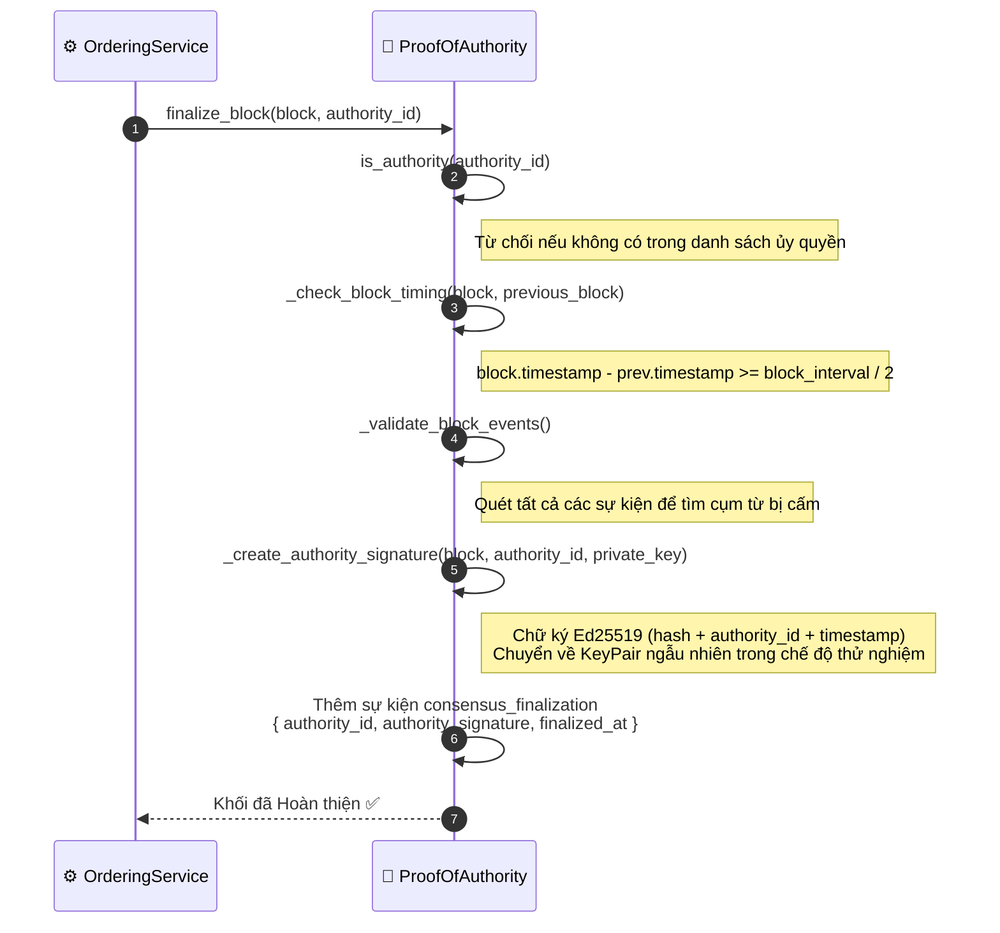
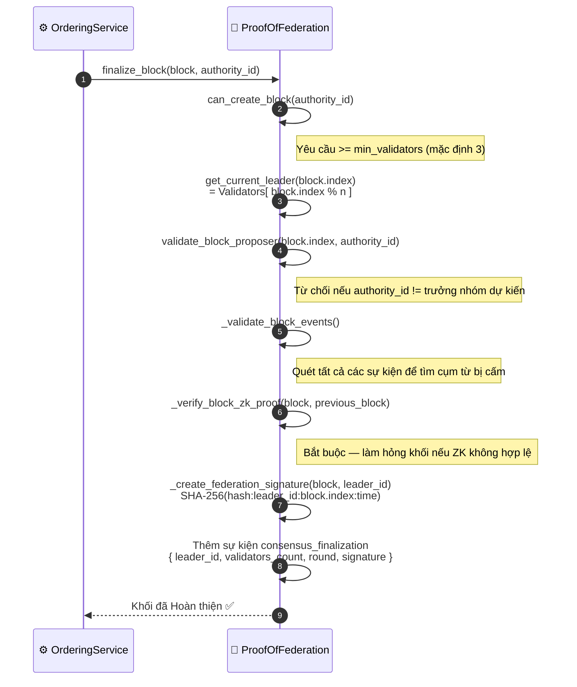

# Tài liệu tham khảo Cơ chế Đồng thuận

**Các luồng công việc liên quan**: [Gửi Sự kiện](./event-submission.md) · [Đồng thuận BFT](./bft-consensus.md)

HieraChain hỗ trợ ba cơ chế đồng thuận có thể cắm (pluggable), được cấu hình thông qua biến môi trường `HRC_CONSENSUS_TYPE`. Luồng gửi sự kiện (Gửi Sự kiện) là hoàn toàn giống nhau bất kể cơ chế nào được chọn — chỉ khác biệt ở bước `finalize_block()`.

---

## So sánh các Cơ chế

| Khía cạnh | PoA | PoF | BFT |
|:-------|:----|:----|:----|
| **Giá trị cấu hình** | `proof_of_authority` | `proof_of_federation` | `byzantine_fault_tolerant` |
| **Thành phần hoàn thiện** | Bất kỳ nút ủy quyền nào được đăng ký | Chỉ Trưởng nhóm xoay vòng: `Validators[index % n]` | 2f+1 trên tổng số n trình xác thực qua PBFT |
| **Loại chữ ký** | Ed25519 (bất đối xứng) | Chữ ký liên minh SHA-256 | Phiếu bầu PBFT tổng hợp |
| **Xoay vòng Trưởng nhóm** | Tùy chọn vòng tròn (round-robin) | Bắt buộc — xác định bởi chỉ số khối | Dựa trên View (Khung nhìn), thay đổi khi gặp lỗi |
| **Kiểm tra Bằng chứng ZK** | Tùy chọn | Bắt buộc trong `validate_block()` | Không áp dụng |
| **Trình xác thực tối thiểu** | Chỉ cần 1 nút ủy quyền | ≥ 3 (cấu hình `min_validators`) | n ≥ 3f + 1 |
| **Mô hình lỗi** | Tin cậy danh tính nút ủy quyền | Tin cậy phân tán, dung thứ cho việc thiếu trình xác thực | Dung thứ tối đa f nút lỗi Byzantine |
| **Trường hợp sử dụng** | Mạng nội bộ / riêng tư | Liên minh / đa tổ chức | Môi trường quan trọng / có tính đối kháng |

---

## Đồng thuận Ủy quyền (Proof of Authority - PoA)

> Kích hoạt khi `HRC_CONSENSUS_TYPE=proof_of_authority` (mặc định).
> Một nút ủy quyền duy nhất được đăng ký trước sẽ ký khối bằng khóa riêng tư Ed25519 của nó.

### Các Lớp Quan trọng — PoA

| Bước | Lớp / Phương thức | Tệp |
|:-----|:--------------|:-----|
| Kiểm tra quyền | `ProofOfAuthority.is_authority()` | `consensus/proof_of_authority.py` |
| Kiểm tra thời gian | `_check_block_timing()` | `consensus/proof_of_authority.py` |
| Ký khối | `_create_authority_signature()` | `consensus/proof_of_authority.py` |
| Hoàn thiện khối | `ProofOfAuthority.finalize_block()` | `consensus/proof_of_authority.py` |

---

## Đồng thuận Liên minh (Proof of Federation - PoF)

> Kích hoạt khi `HRC_CONSENSUS_TYPE=proof_of_federation`.
> Trưởng nhóm (Leader) được bầu chọn một cách xác định bằng chỉ số khối. Bắt buộc kiểm tra bằng chứng ZK.

### Các Lớp Quan trọng — PoF

| Bước | Lớp / Phương thức | Tệp |
|:-----|:--------------|:-----|
| Bầu chọn trưởng nhóm | `ProofOfFederation.get_current_leader()` | `consensus/proof_of_federation.py` |
| Kiểm tra người đề xuất | `validate_block_proposer()` | `consensus/proof_of_federation.py` |
| Xác thực ZK | `_verify_block_zk_proof()` | `consensus/proof_of_federation.py` |
| Chữ ký liên minh | `_create_federation_signature()` | `consensus/proof_of_federation.py` |
| Hoàn thiện khối | `ProofOfFederation.finalize_block()` | `consensus/proof_of_federation.py` |

---

## Chống lỗi Byzantine (BFT / PBFT)

> Kích hoạt khi `HRC_CONSENSUS_TYPE=byzantine_fault_tolerant`.
> Đầy đủ quy trình PBFT 3 giai đoạn. Xem [Đồng thuận BFT](./bft-consensus.md) để biết luồng chi tiết.

**Yêu cầu**: Cần n ≥ 3f + 1 nút để dung thứ tối đa f nút bị lỗi hoặc hoạt động sai (lỗi Byzantine).

**Thay đổi View (View Change)**: Nếu trưởng nhóm thất bại trong khoảng thời gian chờ (timeout), `view += 1`, trưởng nhóm mới = `Validators[view % n]`, giao thức sẽ khởi động lại từ Giai đoạn 1.

---

## Tài liệu Cấu hình

| Biến | Giá trị | Mô tả |
|:---------|:-------|:------------|
| `HRC_CONSENSUS_TYPE` | `proof_of_authority` (mặc định), `proof_of_federation`, `byzantine_fault_tolerant` | Cơ chế đồng thuận đang hoạt động |
| `HRC_ENABLE_ZK_PROOFS` | `true` / `false` | Bật/tắt xác thực ZK (bắt buộc đối với PoF trong môi trường chạy thực tế) |
| `HRC_ZK_MODE` | `mock`, `production` | Cách thức triển khai ZK: giả lập SHA-256 hoặc dùng các mạch ZoKrates thực tế |
