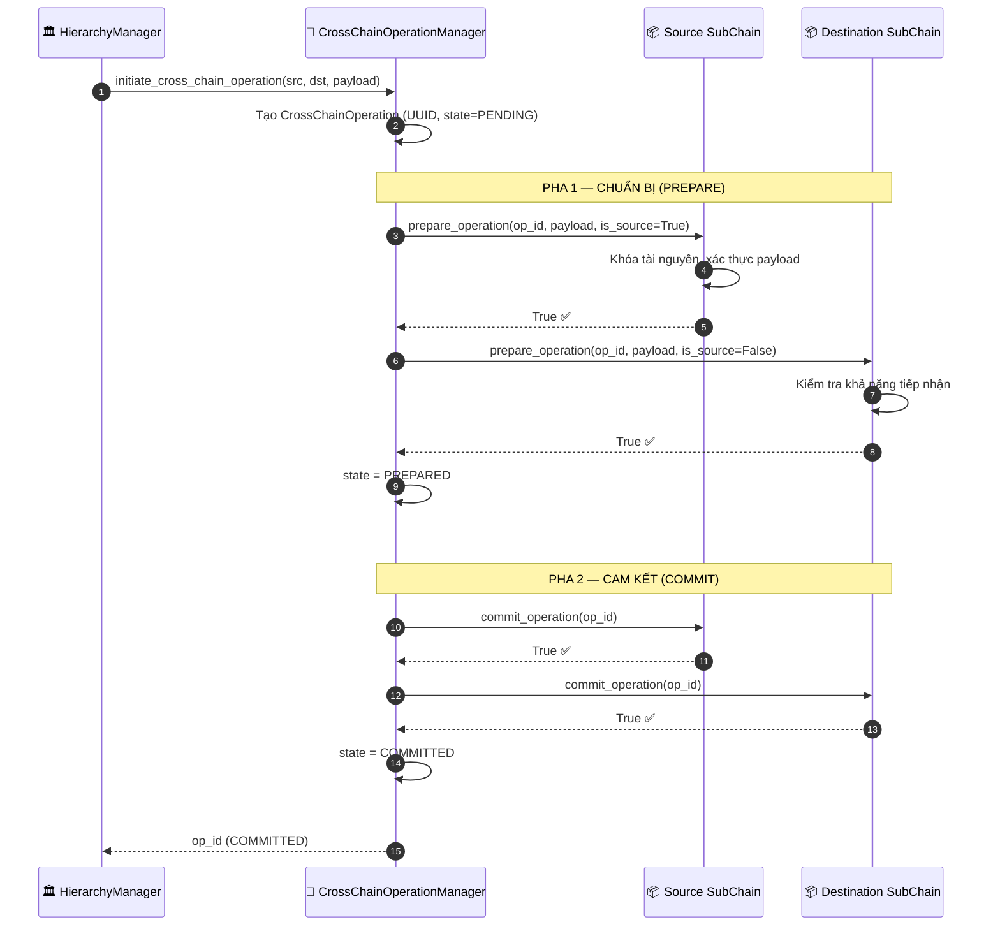
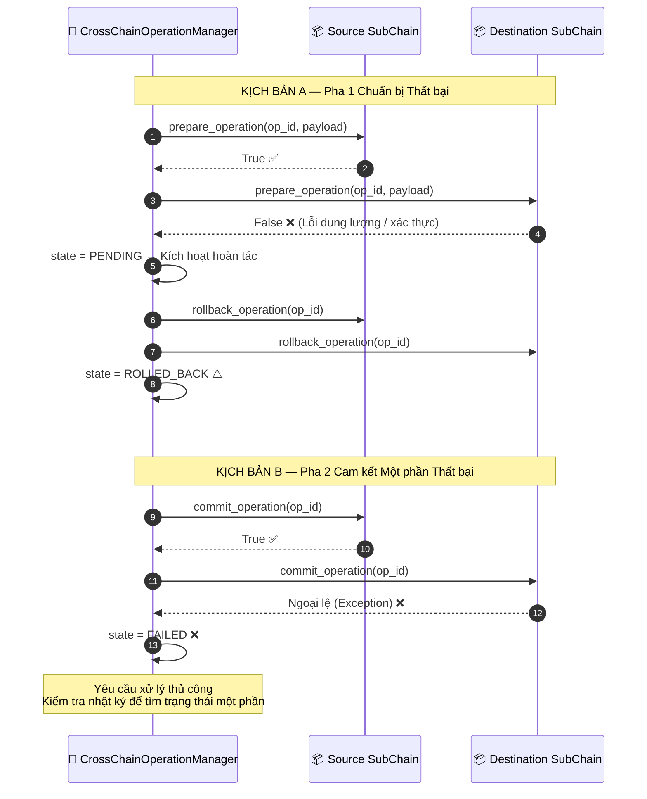
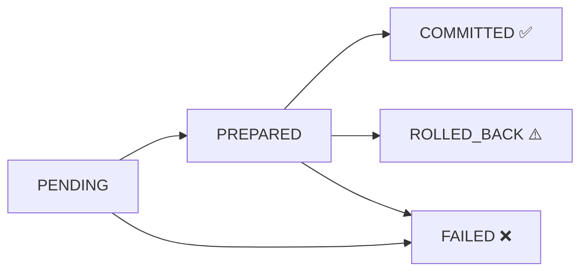

# Thao tác Liên chuỗi (2PC)

## Tổng quan

Khi một thao tác nghiệp vụ cần thực hiện một cách nguyên tử (atomic) trải dài trên hai Sub-Chain (ví dụ: chuyển tài sản từ Sub-Chain `logistics` sang Sub-Chain `finance`), HieraChain sử dụng giao thức **Cam kết Hai pha (Two-Phase Commit - 2PC)** để đảm bảo tính nguyên tử. Hoặc cả hai chuỗi cùng cam kết thay đổi, hoặc cả hai cùng hoàn tác (rollback). Không cho phép trạng thái dở dở dang dang.

**Ví dụ thực tế**: Chuyển một mặt hàng trong kho giữa hai phòng ban khác nhau. Chuỗi nguồn ghi nhận sự kiện `deduct` (trừ hàng); chuỗi đích ghi nhận sự kiện `receive` (nhận hàng). Cả hai hoạt động đều phải thành công hoặc không hoạt động nào được áp dụng.

---

## Biểu đồ Luồng: Kịch bản Thành công (Happy Path)

---

## Biểu đồ Luồng: Kịch bản Thất bại (Failure Paths)

---

## Máy trạng thái Giao dịch (Transaction State Machine)

---

## Các bước thực hiện chi tiết

| Bước | Mô tả |
|:-----|:------|
| **1. Khởi tạo** | `HierarchyManager` tạo một thực thể `CrossChainTransaction` với UUID duy nhất và trạng thái `state=PENDING`. |
| **2. Pha 1: Chuẩn bị nguồn** | Chuỗi nguồn khóa tài nguyên liên quan, xác thực lược đồ (schema) của payload. |
| **3. Pha 1: Chuẩn bị đích** | Chuỗi đích kiểm tra dung lượng lưu trữ khả dụng và các ràng buộc nghiệp vụ. |
| **4. Kết quả Pha 1** | Nếu cả hai trả về `True`: trạng thái → `PREPARED`. Nếu một bên thất bại: rollback ngay lập tức cả hai |
| **5. Pha 2: Cam kết nguồn** | Chuỗi nguồn hoàn tất hoạt động (phát ra sự kiện thông qua Gửi Sự kiện). |
| **6. Pha 2: Cam kết đích** | Chuỗi đích hoàn tất hoạt động (phát ra sự kiện thông qua Gửi Sự kiện). |
| **7. Kết quả** | Trạng thái chuyển thành `COMMITTED`. Mã `tx_id` được trả về cho bên gọi. |

---

## Xử lý lỗi

| Tình huống | Trạng thái chuyển dịch | Cách thức phục hồi |
|:-----------|:-----------------------|:-------------------|
| Lỗi Pha 1 trên Chuỗi Nguồn | `ROLLED_BACK` | Tự động hoàn trả trạng thái (rollback) trên Chuỗi Đích |
| Lỗi Pha 1 trên Chuỗi Đích | `ROLLED_BACK` | Tự động hoàn trả trạng thái (rollback) trên Chuỗi Nguồn |
| Lỗi Pha 2 khi cam kết trên một trong hai chuỗi | `FAILED` | Phải đối soát thủ công thông qua nhật ký kiểm toán (audit log) |
| Hết hạn kết nối mạng (Timeout) trong Pha 2 | `FAILED` | Người vận hành hệ thống phải kiểm tra trạng thái cam kết cuối cùng |

---

## Các Class & Method quan trọng

| Bước | Class / Method | File |
|:-----|:--------------|:-----|
| Khởi tạo | `HierarchyManager.initiate_cross_chain_transaction()` | `hierarchical/hierarchy_manager.py` |
| Tạo giao dịch | `CrossChainTransactionManager.__init__()` | `domains/generic/chains/domain_chain.py` |
| Chuẩn bị | `DomainChain.prepare_transaction()` | `domains/generic/chains/domain_chain.py` |
| Cam kết | `DomainChain.commit_transaction()` | `domains/generic/chains/domain_chain.py` |
| Khôi phục | `DomainChain.rollback_transaction()` | `domains/generic/chains/domain_chain.py` |

---

## Liên quan

- [Gửi Sự kiện](./event-submission.md): mỗi phương thức `commit_transaction()` bên trong sẽ gọi đến `add_event()`
- [Giảm thiểu Lỗi & Phục hồi](./error-recovery.md): quản lý khôi phục trạng thái ở cấp độ hệ thống
