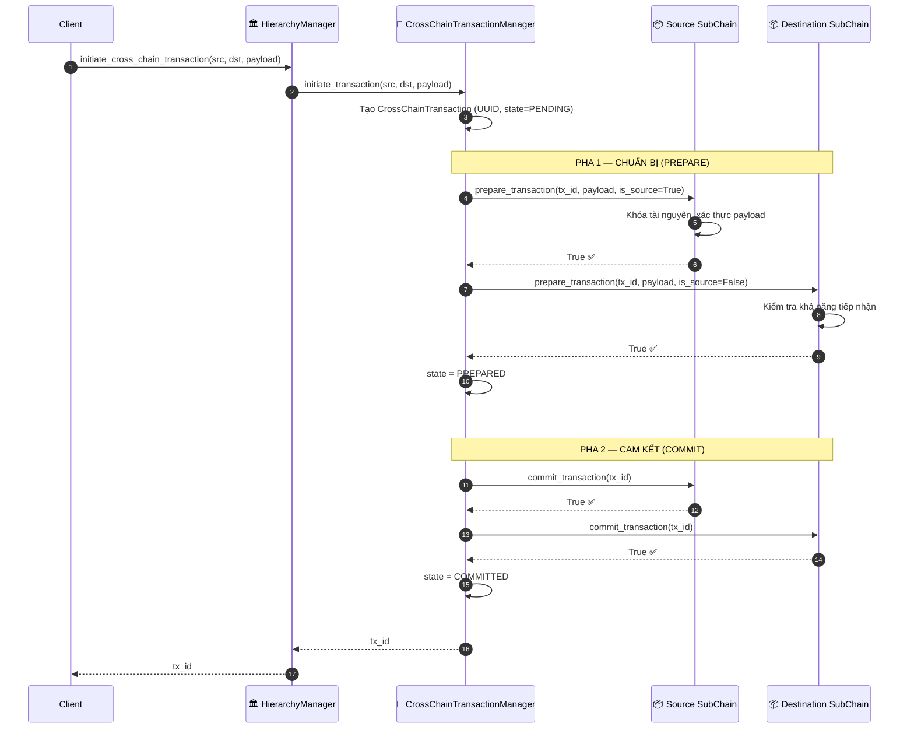
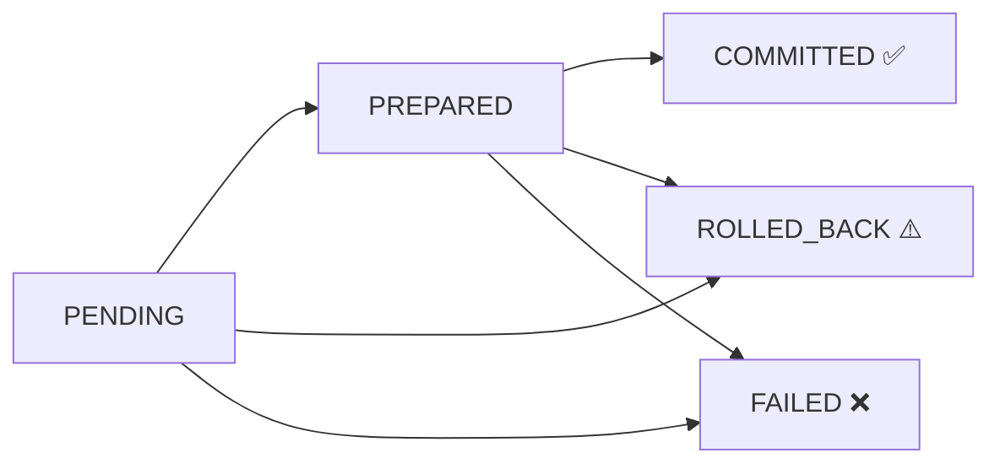

# Thao tác Liên chuỗi (2PC)

## Tổng quan

**Cam kết Hai pha (Two-Phase Commit - 2PC)** chuẩn bị cả hai Sub-Chain, sau đó commit chain nguồn rồi đến chain đích. Nếu commit thất bại, transaction manager đánh dấu giao dịch là thất bại và thử rollback chain nguồn. Rollback có thể trả về `False` hoặc phát sinh exception; manager bỏ qua kết quả `False` và ghi log khi có exception. Ví dụ, một giao dịch chuyển tài sản có thể liên quan đến hai chain `logistics` và `finance`.

**Ví dụ thực tế**: Chuyển một mặt hàng trong kho giữa hai phòng ban khác nhau. Chain nguồn ghi nhận event `deduct` (trừ hàng), chain đích ghi nhận event `receive` (nhận hàng). Mục tiêu là commit cả hai event; nếu chain đích commit thất bại sau khi chain nguồn đã commit, giao dịch có thể chỉ được áp dụng một phần và cần đối soát thủ công.

---

## Biểu đồ Luồng: Kịch bản Thành công (Happy Path)

```mermaid
sequenceDiagram
    autonumber
    participant Client as Client
    participant HM as 🏛️ HierarchyManager
    participant TM as 🔄 CrossChainTransactionManager
    participant SRC as 📦 Source SubChain
    participant DST as 📦 Destination SubChain

    Client->>HM: initiate_cross_chain_transaction(src, dst, payload)
    HM->>TM: initiate_transaction(src, dst, payload)
    TM->>TM: Tạo CrossChainTransaction (UUID, state=PENDING)

    rect rgb(0, 0, 0, 0)
        Note over TM,DST: PHA 1 — CHUẨN BỊ (PREPARE)
        TM->>SRC: prepare_transaction(tx_id, payload, is_source=True)
        SRC->>SRC: Khóa tài nguyên, xác thực payload
        SRC-->>TM: True ✅

        TM->>DST: prepare_transaction(tx_id, payload, is_source=False)
        DST->>DST: Kiểm tra khả năng tiếp nhận
        DST-->>TM: True ✅

        TM->>TM: state = PREPARED
    end

    rect rgb(0, 0, 0, 0)
        Note over TM,DST: PHA 2 — CAM KẾT (COMMIT)
        TM->>SRC: commit_transaction(tx_id)
        SRC-->>TM: True ✅
        TM->>DST: commit_transaction(tx_id)
        DST-->>TM: True ✅
        TM->>TM: state = COMMITTED
    end

    TM-->>HM: tx_id
    HM-->>Client: tx_id
```

---

## Biểu đồ Luồng: Kịch bản Thất bại (Failure Paths)

```mermaid
sequenceDiagram
    autonumber
    participant TM as 🔄 CrossChainTransactionManager
    participant SRC as 📦 Source SubChain
    participant DST as 📦 Destination SubChain

    rect rgb(0, 0, 0, 0)
        Note over TM,DST: KỊCH BẢN A — Pha 1 Chuẩn bị Thất bại
        TM->>SRC: prepare_transaction(tx_id, payload, is_source=True)
        SRC-->>TM: True ✅
        TM->>DST: prepare_transaction(tx_id, payload, is_source=False)
        DST-->>TM: False ❌  (Lỗi dung lượng / xác thực)
        TM->>TM: state = ROLLED_BACK
        TM->>SRC: rollback_transaction(tx_id)
        TM->>DST: rollback_transaction(tx_id)
        Note over TM,DST: Kết quả rollback False bị bỏ qua; exception dừng các lệnh sau và có thể khiến lệnh khởi tạo không trả tx_id
    end

    rect rgb(0, 0, 0, 0)
        Note over TM,DST: KỊCH BẢN B — Pha 2 Cam kết Một phần Thất bại
        TM->>SRC: commit_transaction(tx_id)
        SRC-->>TM: True ✅
        TM->>DST: commit_transaction(tx_id)
        DST-->>TM: Ngoại lệ (Exception) ❌
        TM->>TM: state = FAILED ❌
        TM->>SRC: rollback_transaction(tx_id)
        SRC-->>TM: True, False hoặc Exception
        Note over TM,SRC: Manager bỏ qua kết quả False và ghi log exception; kiểm tra trạng thái chain để xác nhận rollback
    end
```

---

## Máy trạng thái Giao dịch (Transaction State Machine)

```mermaid
flowchart LR
    P["PENDING"] --> PR["PREPARED"]
    PR --> C["COMMITTED ✅"]
    PR --> RB["ROLLED_BACK ⚠️"]
    P --> RB
    P --> F["FAILED ❌"]
    PR --> F
```

---

## Các bước thực hiện chi tiết

| Bước | Mô tả |
|:-----|:------|
| **1. Khởi tạo** | `HierarchyManager.initiate_cross_chain_transaction()` gọi `CrossChainTransactionManager.initiate_transaction()`. Phương thức này tạo `CrossChainTransaction` với UUID và trạng thái `state=PENDING`. |
| **2. Pha 1: Chuẩn bị nguồn** | Chuỗi nguồn khóa tài nguyên liên quan, xác thực lược đồ (schema) của payload. |
| **3. Pha 1: Chuẩn bị đích** | Chuỗi đích kiểm tra dung lượng lưu trữ khả dụng và các ràng buộc nghiệp vụ. |
| **4. Kết quả Pha 1** | Nếu cả hai trả về `True`, trạng thái chuyển thành `PREPARED`. Nếu một bên thất bại, manager đặt trạng thái `ROLLED_BACK` rồi gọi `rollback_transaction()` trên chain nguồn, sau đó chain đích. Kết quả `False` bị bỏ qua; exception dừng các lệnh sau và có thể khiến lệnh khởi tạo không trả `tx_id`. |
| **5. Pha 2: Cam kết nguồn** | Manager gọi `DomainChain.commit_transaction()` trên chain nguồn. |
| **6. Pha 2: Cam kết đích** | Nếu chain nguồn commit thành công, manager gọi `DomainChain.commit_transaction()` trên chain đích. |
| **7. Kết quả** | Nếu lời gọi kết thúc bình thường, manager trả `tx_id`. Trạng thái là `COMMITTED` khi thành công, `ROLLED_BACK` sau khi Pha 1 thất bại, hoặc `FAILED` nếu thiếu chain hay Pha 2 thất bại. Trạng thái `ROLLED_BACK` không xác nhận rollback thành công vì kết quả `False` bị bỏ qua. |

---

## Xử lý lỗi

| Tình huống | Trạng thái chuyển dịch | Cách thức phục hồi |
|:-----------|:-----------------------|:-------------------|
| Lỗi Pha 1 trên một trong hai chain | `ROLLED_BACK` | Manager thử rollback chain nguồn rồi chain đích. Kết quả `False` bị bỏ qua; nếu một lệnh phát sinh exception, các lệnh sau bị bỏ qua và khởi tạo có thể ném exception trước khi trả `tx_id`. |
| Thiếu chain nguồn hoặc chain đích | `FAILED` | Manager dừng trước khi chạy prepare hoặc rollback. |
| Lỗi commit ở Pha 2 | `FAILED` | Manager thử rollback chain nguồn. Kết quả `False` bị bỏ qua, còn exception được ghi log; kiểm tra trạng thái chain nguồn và đối soát thủ công nếu cần. |
| Timeout mạng trong Pha 2 | `FAILED` | Kết quả commit cuối có thể chưa xác định. Kiểm tra trạng thái của cả hai chain; trạng thái `FAILED` không cho biết chain đích đã commit hay chưa. Đối soát thủ công nếu cần. |

---

## Các Class & Method quan trọng

| Bước | Class / Method | File |
|:-----|:--------------|:-----|
| Khởi tạo | `HierarchyManager.initiate_cross_chain_transaction()` | `hierachain/hierarchical/hierarchy_manager/base.py` |
| Tạo giao dịch | `CrossChainTransactionManager.initiate_transaction()` | `hierachain/hierarchical/transaction_manager.py` |
| Chuẩn bị | `DomainChain.prepare_transaction()` | `hierachain/domains/chains/domain_chain.py` |
| Cam kết | `DomainChain.commit_transaction()` | `hierachain/domains/chains/domain_chain.py` |
| Khôi phục | `DomainChain.rollback_transaction()` | `hierachain/domains/chains/domain_chain.py` |

---

## Liên quan

- [Gửi Sự kiện](./event-submission.md): mỗi phương thức `commit_transaction()` bên trong sẽ gọi đến `add_event()`
- [Giảm thiểu Lỗi & Phục hồi](./error-recovery.md): quản lý khôi phục trạng thái ở cấp độ hệ thống
