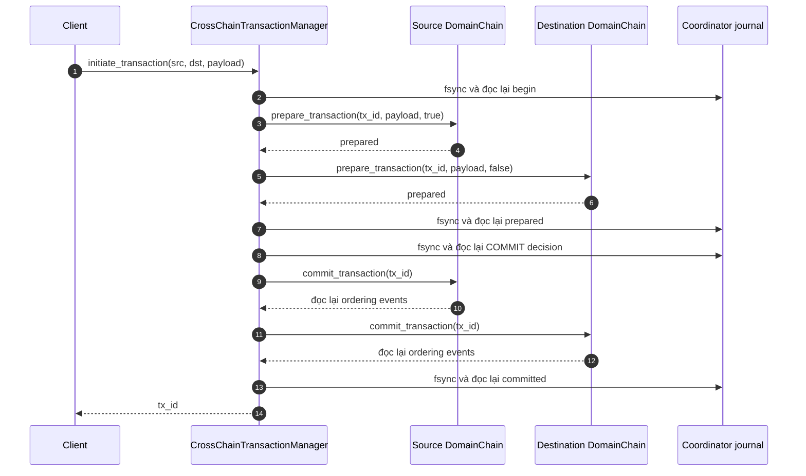
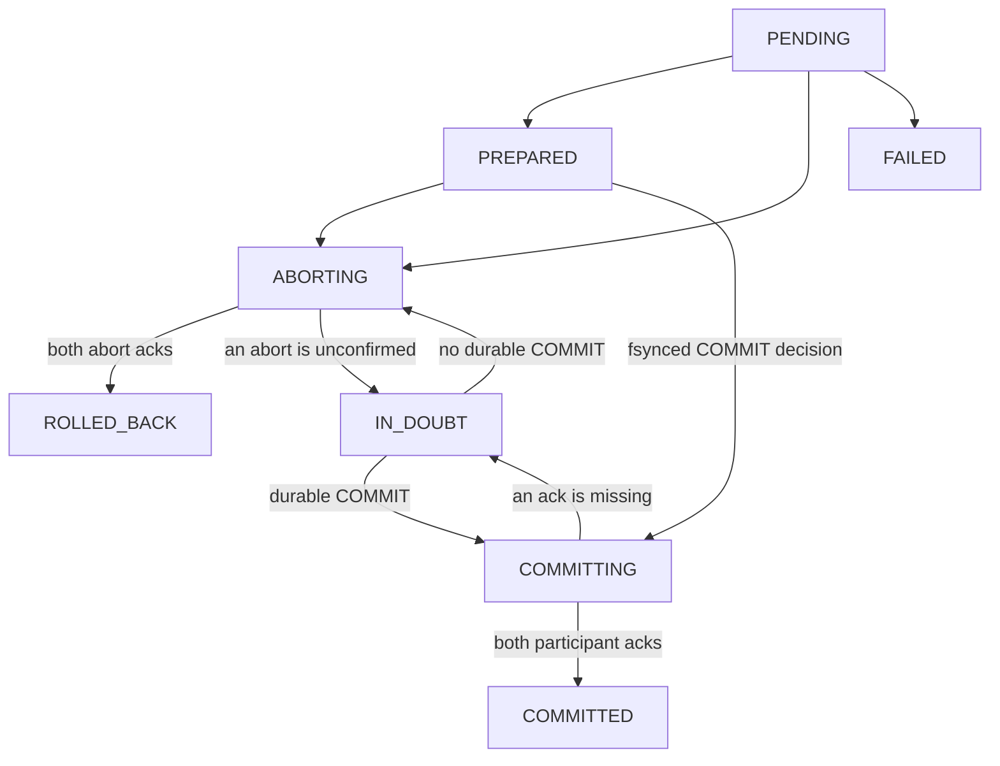

# Thao tác Liên chuỗi (2PC)

## Tổng quan

Coordinator chuẩn bị cả hai participant `DomainChain`, sau đó fsync và đọc lại quyết định COMMIT từ journal riêng trước khi yêu cầu bất kỳ participant nào commit. Participant chỉ xác nhận khi cả hai event thao tác có gắn mã giao dịch đọc lại được từ ordering journal của chain đó; việc hoàn thiện block vẫn chạy bất đồng bộ. Bản ghi `committed` cuối cùng cũng phải đọc lại được trước khi báo `COMMITTED`. Sau khi COMMIT đã bền vững, quá trình phục hồi luôn retry theo hướng commit và không rollback participant.

Trước khi COMMIT bền vững, coordinator yêu cầu cả hai participant abort. Trạng thái chỉ là `ROLLED_BACK` khi cả hai xác nhận. Nếu không thể xác nhận một trong hai lệnh abort, giao dịch giữ trạng thái `IN_DOUBT`; coordinator retry abort khi cả hai participant khả dụng.

Khi khởi động, các bản ghi coordinator chưa hoàn tất xác định những chain đã lưu cần participant `DomainChain`. Các chain đã lưu khác vẫn là `SubChain` chung. Có thể chủ động thay placeholder chung bằng cách gọi `create_sub_chain()` với cùng tên và domain type; chain cũ chỉ được dừng sau khi chain thay thế kết nối thành công.

## Luồng thành công

```mermaid
sequenceDiagram
    autonumber
    participant Client
    participant TM as CrossChainTransactionManager
    participant SRC as Source DomainChain
    participant DST as Destination DomainChain
    participant CJ as Coordinator journal

    Client->>TM: initiate_transaction(src, dst, payload)
    TM->>CJ: fsync và đọc lại begin
    TM->>SRC: prepare_transaction(tx_id, payload, true)
    SRC-->>TM: prepared
    TM->>DST: prepare_transaction(tx_id, payload, false)
    DST-->>TM: prepared
    TM->>CJ: fsync và đọc lại prepared
    TM->>CJ: fsync và đọc lại COMMIT decision
    TM->>SRC: commit_transaction(tx_id)
    SRC-->>TM: đọc lại ordering events
    TM->>DST: commit_transaction(tx_id)
    DST-->>TM: đọc lại ordering events
    TM->>CJ: fsync và đọc lại committed
    TM-->>Client: tx_id
```

## Lỗi và phục hồi

```mermaid
flowchart TD
    PENDING --> PREPARED
    PENDING --> ABORTING
    PREPARED --> ABORTING
    ABORTING -->|both abort acks| ROLLED_BACK
    ABORTING -->|an abort is unconfirmed| IN_DOUBT
    IN_DOUBT -->|no durable COMMIT| ABORTING
    PREPARED -->|fsynced COMMIT decision| COMMITTING
    COMMITTING -->|both participant acks| COMMITTED
    COMMITTING -->|an ack is missing| IN_DOUBT
    IN_DOUBT -->|durable COMMIT| COMMITTING
    PENDING --> FAILED
```

| Tình huống | Trạng thái | Phục hồi |
|:-----------|:-----------|:--------|
| Participant không prepare được | Chỉ `ROLLED_BACK` sau khi cả hai xác nhận abort; nếu không thì `IN_DOUBT` | Retry cả hai lệnh abort khi participant khả dụng. |
| Thiếu chain hoặc chain không hỗ trợ 2PC trước prepare | `FAILED` | Đăng ký các participant `DomainChain` cần thiết rồi bắt đầu giao dịch mới. |
| Kết quả ghi quyết định COMMIT chưa xác định | `IN_DOUBT` | Đọc coordinator journal trước khi hành động. COMMIT đã bền vững thì retry commit; nếu không có COMMIT thì retry abort. |
| Commit participant lỗi sau COMMIT bền vững | `IN_DOUBT` | Không rollback. Bản ghi `prepared` bền vững xác nhận cả hai participant đã xác thực payload; khôi phục trạng thái còn thiếu từ payload và marker journal, rồi chỉ retry event còn thiếu. |
| Tiến trình khởi động lại khi còn bản ghi chưa hoàn tất | `IN_DOUBT` cho tới khi participant khả dụng | Khôi phục các participant đã ghi tên thành `DomainChain` rồi retry. |

## Cam kết và giới hạn

- Coordinator journal được lưu riêng với OrderingService event journal, vì vậy các bản ghi của nó không bị replay như ledger event.
- Giao dịch `COMMITTED` nghĩa là đã đọc lại được hai cặp event của participant và bản ghi cuối cùng của coordinator từ các journal bền vững. Điều đó không có nghĩa block đã được hoàn thiện.
- Marker event của participant chứa transaction ID và bước thao tác. Khi retry, participant bỏ qua start hoặc completion event đã được chấp nhận, kể cả sau khi khởi động lại.
- Sau COMMIT bền vững, phục hồi participant dùng payload đã được coordinator xác thực trước đó và marker event đã nhận; không chạy lại xác thực nghiệp vụ dựa trên entity registry chỉ tồn tại trong bộ nhớ.
- `IN_DOUBT` là trạng thái có thể phục hồi, không phải thất bại cuối cùng. Gọi `transaction_manager.retry_pending()` để retry sau lỗi participant trong lúc chạy; khởi động lại và đăng ký participant cũng kích hoạt retry.

## Method chính

| Hành động | Method | File |
|:----------|:-------|:-----|
| Khởi tạo | `HierarchyManager.initiate_cross_chain_transaction()` | `hierachain/hierarchical/hierarchy_manager/base.py` |
| Điều phối và phục hồi | `CrossChainTransactionManager.initiate_transaction()` / `retry_pending()` | `hierachain/hierarchical/transaction_manager.py` |
| Chuẩn bị, commit hoặc abort | `DomainChain.prepare_transaction()` / `commit_transaction()` / `rollback_transaction()` | `hierachain/domains/chains/domain_chain.py` |

## Liên quan

- [Gửi Sự kiện](./event-submission.md): operation event được đưa vào ordering journal của từng chain trước khi block hoàn thiện bất đồng bộ.
- [Giảm thiểu Lỗi](./error-recovery.md): xử lý lỗi cấp hệ thống và phục hồi journal.
