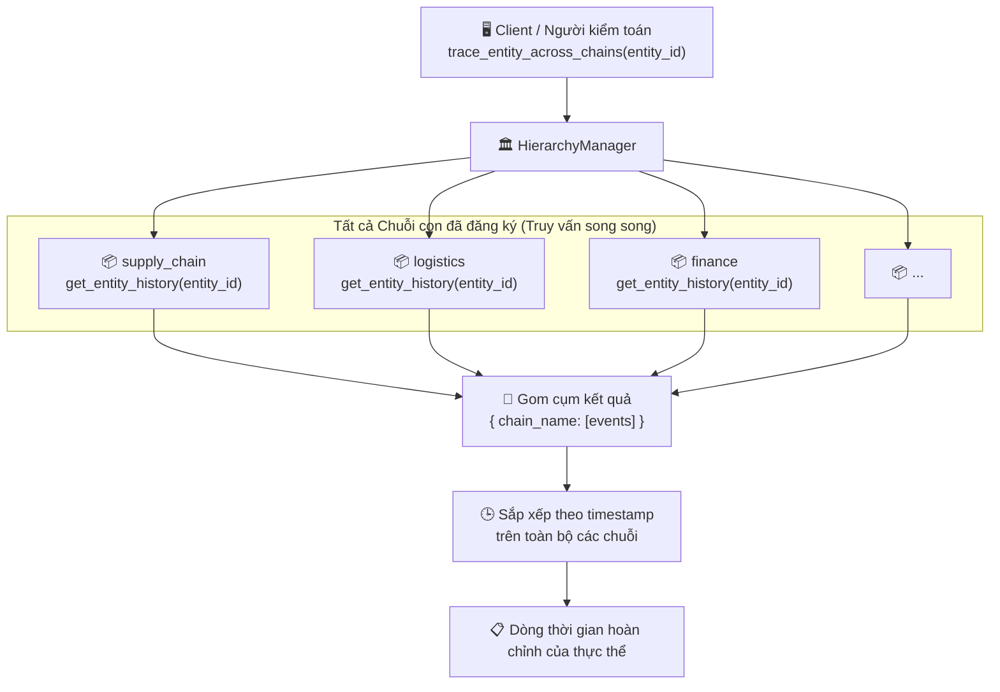

# Truy vết Thực thể (Entity Tracing)

## Tổng quan

Vì cùng một thực thể vật lý (ví dụ: mã hàng hóa `SKU-001`, hợp đồng `C-2024`) có thể phát sinh các sự kiện trên nhiều Chuỗi con (Sub-Chain) khác nhau trong suốt vòng đời của nó, HieraChain cung cấp **cơ chế truy vết thực thể liên chuỗi** để tái cấu trúc lại một luồng kiểm toán đầy đủ, bất biến cho bất kỳ định danh thực thể `entity_id` nào.

Mỗi Chuỗi con duy trì một chỉ mục trong bộ nhớ `entity_event_index` theo `entity_id`, giúp thực hiện **truy vấn với độ phức tạp O(1)** mà không cần quét toàn bộ dữ liệu chuỗi.

---

## Biểu đồ luồng



---

## Ví dụ thực tế

```
Thực thể (Entity): product-SKU-001 (Lô cảm biến công nghiệp)

Dòng thời gian tái cấu trúc liên chuỗi:
────────────────────────────────────────────────────────
[supply_chain]  block 3   quality_check      → passed (Đạt)
[supply_chain]  block 7   packaging_complete → confirmed (Xác nhận)
[logistics]     block 2   shipment_dispatch  → warehouse A → B (Xuất kho)
[logistics]     block 9   customs_cleared    → port XYZ (Thông quan)
[finance]       block 4   invoice_issued     → INV-2024-0471 (Phát hóa đơn)
[finance]       block 12  payment_confirmed  → ref: WIRE-9821 (Xác nhận thanh toán)
────────────────────────────────────────────────────────
```

---

## Cấu trúc Chỉ mục Thực thể (Entity Index)

Mỗi Chuỗi con duy trì một cấu trúc `entity_event_index` ngay trong bộ nhớ cache:

```python
entity_event_index = {
    "product-SKU-001": [
        {"block_index": 3, "event": {"event": "quality_check", "timestamp": 1714000000.0, ...}},
        {"block_index": 7, "event": {"event": "packaging_complete", "timestamp": 1714003600.0, ...}},
    ]
}
```

Các sự kiện được đánh chỉ mục ngay khi ghi khối (`add_block()`), do đó tốc độ đọc trên mỗi chuỗi là O(1). Việc tổng hợp kết quả trên n chuỗi có độ phức tạp O(n).

---

## Các bước thực hiện chi tiết

| Bước | Mô tả |
|:-----|:------|
| **1. Gọi truy vết** | Client gọi hàm `HierarchyManager.trace_entity_across_chains(entity_id)`. |
| **2. Truy vấn song song** | `HierarchyManager` truy vấn đồng thời tới tất cả các Chuỗi con đã đăng ký trong mạng lưới. |
| **3. Đọc dữ liệu đơn chuỗi**| Mỗi Chuỗi con gọi hàm `get_entity_history(entity_id)` $\rightarrow$ đọc dữ liệu cực nhanh O(1) từ bộ chỉ mục. |
| **4. Gom cụm** | Kết quả được gom về dưới dạng cấu trúc dictionary `{ chain_name: [event_list] }`. |
| **5. Sắp xếp** | Các sự kiện được sắp xếp thứ tự theo dấu thời gian (`timestamp`) để tạo lập dòng lịch sử chuẩn xác. |
| **6. Trả về** | Trả lại toàn bộ lịch sử vòng đời sự kiện đã sắp xếp cho bên yêu cầu. |

---

## Xử lý lỗi

| Tình huống | Hành vi |
|:-----------|:--------|
| Không tìm thấy thực thể trên chuỗi nào | Trả về từ điển rỗng `{}` |
| Có Chuỗi con ngoại tuyến hoặc lỗi | Kết quả của chuỗi đó được coi là `[]`; hệ thống vẫn tiếp tục đọc từ các chuỗi khác |
| Chỉ mục thực thể chưa xây dựng xong (khi khởi động)| Tự động chuyển cấu hình sang quét toàn bộ chuỗi (full scan); ghi nhật ký cảnh báo |

---

## Các Class & Method quan trọng

| Bước | Class / Method | File |
|:-----|:--------------|:-----|
| Điểm gọi chính | `HierarchyManager.trace_entity_across_chains()` | `hierarchical/hierarchy_manager.py` |
| Truy vết đơn chuỗi | `SubChain.get_entity_history()` | `hierarchical/sub_chain.py` |
| Bộ truy vết nâng cao | `EntityTracer.trace_entity()` | `domains/generic/utils/entity_tracer.py` |
| Cập nhật chỉ mục | `SubChain._update_event_statistics()` | `hierarchical/sub_chain.py` |
| REST API | `GET /ledger/entities/{entity_id}/trace` | `api/ledger/routes.py` |

---

## Liên quan

- [Xác thực Tính toàn vẹn](./integrity-validation.md): Xác thực độ tin cậy của các chuỗi đang được thực hiện truy vết
- [Đồng bộ Tích hợp ERP](./erp-integration.md): Các sự kiện ERP là dữ liệu chính được theo dõi qua cơ chế này
