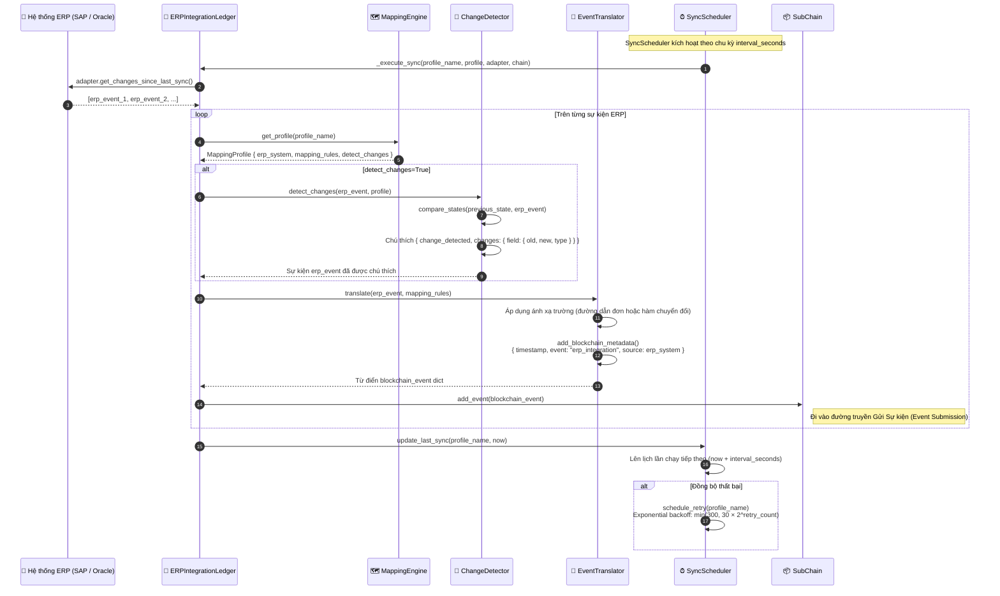
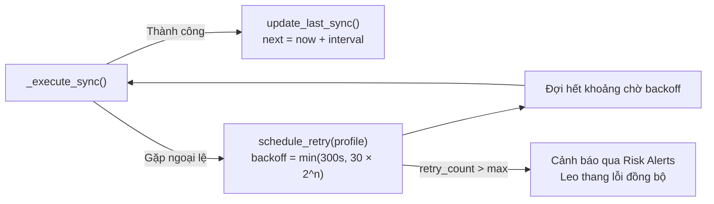

# Đồng bộ Tích hợp ERP (ERP Integration Sync)

## Tổng quan

HieraChain tích hợp với các hệ thống ERP doanh nghiệp (SAP, Oracle, Dynamics) thông qua cấu trúc **bộ điều phối (adapter) + bộ máy ánh xạ (mapping engine)**. Lớp `SyncScheduler` thăm dò các adapter ERP theo khoảng thời gian cấu hình, dịch chuyển các sự kiện ERP gốc thành định dạng sự kiện của HieraChain thông qua `EventTranslator`, phát hiện các thay đổi dữ liệu có ý nghĩa và gửi chúng dưới dạng các sự kiện nghiệp vụ. Các lượt đồng bộ lỗi sẽ được thử lại theo cơ chế khoảng chờ tăng dần (exponential backoff).

Quy trình này đóng vai trò là **cầu nối tiếp nhận dữ liệu (ingestion bridge)** giữa các hệ thống Web2 ERP truyền thống và sổ cái HieraChain.

---

## Biểu đồ luồng



---

## Biểu đồ luồng: Cơ chế Thử lại khi Thất bại (Retry on Failure)



---

## Ví dụ Chuyển đổi Sự kiện ERP (ERP Event Translation Example)

```python
# Sự kiện thô từ hệ thống SAP (trước khi chuyển đổi)
erp_event = {
    "MBLNR": "5000012345",       # Số chứng từ vật tư (Material document number)
    "BUDAT": "2024-04-23",       # Ngày ghi sổ (Posting date)
    "MATNR": "MAT-00789",        # Mã số vật tư (Material number)
    "MENGE": 150,                 # Số lượng (Quantity)
    "WERKS": "PLANT-01"          # Nhà máy (Plant)
}

# Sau khi qua bộ EventTranslator.translate() sử dụng profile ánh xạ của SAP
blockchain_event = {
    "entity_id": "MAT-00789",            # ánh xạ từ trường MATNR
    "event": "erp_integration",
    "timestamp": 1714000000.0,           # tự động thêm bởi add_blockchain_metadata()
    "details": {
        "document_number": "5000012345", # ánh xạ từ trường MBLNR
        "posting_date": "2024-04-23",    # ánh xạ từ trường BUDAT
        "quantity": 150,                  # ánh xạ từ trường MENGE
        "plant": "PLANT-01",             # ánh xạ từ trường WERKS
        "source": "SAP",
        "changes": {                      # tự động thêm bởi ChangeDetector nếu bật
            "quantity": {"old": 100, "new": 150, "type": "numeric_change"}
        }
    }
}
```

---

## Các hệ thống ERP hỗ trợ

| Hệ thống ERP | Lớp Adapter tương ứng | Khóa Cấu hình |
|:-------------|:----------------------|:--------------|
| SAP S/4HANA | `SAPAdapter` | `erp_system: "SAP"` |
| Oracle ERP Cloud | `OracleAdapter` | `erp_system: "Oracle"` |
| Microsoft Dynamics 365 | `DynamicsAdapter` | `erp_system: "Dynamics"` |
| Generic REST | `GenericERPAdapter` | `erp_system: "Generic"` |

---

## Các bước thực hiện chi tiết

| Bước | Mô tả |
|:-----|:------|
| **1. Kích hoạt bộ lịch**| Lớp `SyncScheduler` gọi hàm `_execute_sync()` cho từng cấu hình profile đã đăng ký. |
| **2. Đọc các thay đổi** | Adapter ERP gọi hàm `get_changes_since_last_sync()` sử dụng timestamp của lần đồng bộ trước đó. |
| **3. Phát hiện thay đổi**| Lớp `ChangeDetector` so sánh trạng thái mới với trạng thái trước đó, chú thích các trường dữ liệu bị thay đổi. |
| **4. Ánh xạ dịch nghĩa**| Lớp `EventTranslator` áp dụng các quy tắc `mapping_rules` để tạo ra sự kiện HieraChain hợp lệ. |
| **5. Chèn Metadata** | Lớp `add_blockchain_metadata()` tự động thêm các thông tin `timestamp`, `source`, `event: "erp_integration"`. |
| **6. Gửi lên chuỗi** | Gọi hàm `SubChain.add_event(blockchain_event)`: sự kiện chính thức đi vào luồng Gửi Sự kiện. |
| **7. Lưu mốc thời gian**| Cập nhật giá trị `last_sync` cho profile; lên lịch chạy tiếp theo. |
| **8. Cơ chế thử lại** | Nếu xảy ra lỗi $\rightarrow$ thử lại với thời gian chờ tăng dần tối đa 300 giây; vượt quá số lần thử tối đa $\rightarrow$ phát tín hiệu cảnh báo rủi ro. |

---

## Xử lý lỗi

| Tình huống | Hành vi |
|:-----------|:--------|
| Lỗi kết nối tới ERP adapter | Thử lại với khoảng chờ tăng dần (30s, 60s, 120s, 240s, tối đa 300s) |
| Thiếu khóa ánh xạ trường | Ghi nhật ký cảnh báo rủi ro; tiếp tục gửi sự kiện lên chuỗi với phần dữ liệu có sẵn |
| Gọi `add_event()` lỗi (từ khóa cấm) | Loại bỏ sự kiện; ghi nhận log kèm dữ liệu ERP thô để đối soát |
| Vượt quá số lần thử lại tối đa | Kích hoạt cảnh báo qua Risk Alerts với mã lỗi `erp_sync_failure` |

---

## Các Class & Method quan trọng

| Bước | Class / Method | File |
|:-----|:--------------|:-----|
| Điểm đồng bộ chính | `ERPIntegrationLedger.start_scheduled_sync()` | `integration/erp_ledger.py` |
| Thực thi đồng bộ | `ERPIntegrationLedger._execute_sync()` | `integration/erp_ledger.py` |
| Phát hiện thay đổi | `ChangeDetector.detect_changes()` | `integration/erp_ledger.py` |
| Ánh xạ dịch nghĩa | `EventTranslator.translate()` | `integration/erp_ledger.py` |
| Quản lý profile | `MappingEngine.create_profile()` | `integration/erp_ledger.py` |
| Lên lịch thử lại | `SyncScheduler.schedule_retry()` | `integration/erp_ledger.py` |

---

## Liên quan

- [Gửi Sự kiện](./event-submission.md): Các sự kiện sau khi dịch nghĩa sẽ đi vào luồng này
- [Truy vết Thực thể](./entity-tracing.md): Các sự kiện có nguồn gốc từ ERP có thể được truy vết qua `entity_id`
- [Cảnh báo Rủi ro](./risk-alerts.md): Các lỗi đồng bộ sẽ được chuyển tới đây để leo thang xử lý
