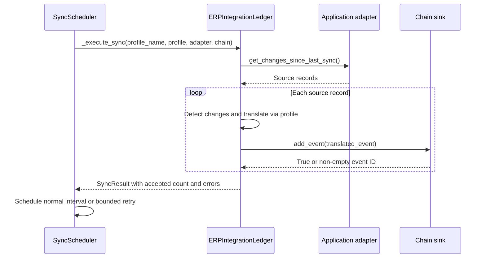

# Đồng bộ tích hợp ERP

## Phạm vi runtime

`ERPIntegrationLedger` (`hierachain/integration/erp_ledger.py`, dùng `erp/base.py`) cung cấp mapping, dịch event và lập lịch. Ứng dụng đăng ký adapter có `get_changes_since_last_sync()` và chain sink có `add_event()`. API server không tự khởi động đồng bộ ERP.

`SAPIntegration`, `OracleIntegration` và `DynamicsIntegration` trong `enterprise.py` là fixture tổng hợp, chỉ bật với `simulation_mode=True`. Chúng tách biệt với adapter do ứng dụng cấp và không kết nối SAP, Oracle hay Dynamics. Không có transport `SAPAdapter`, `OracleAdapter`, `DynamicsAdapter` hoặc `GenericERPAdapter` tích hợp sẵn.

## Luồng thực thi

```mermaid
sequenceDiagram
    participant Scheduler as SyncScheduler
    participant Ledger as ERPIntegrationLedger
    participant Adapter as Application adapter
    participant Sink as Chain sink
    Scheduler->>Ledger: _execute_sync(profile_name, profile, adapter, chain)
    Ledger->>Adapter: get_changes_since_last_sync()
    Adapter-->>Ledger: Source records
    loop Each source record
        Ledger->>Ledger: Detect changes and translate via profile
        Ledger->>Sink: add_event(translated_event)
        Sink-->>Ledger: True or non-empty event ID
    end
    Ledger-->>Scheduler: SyncResult with accepted count and errors
    Scheduler->>Scheduler: Schedule normal interval or bounded retry
```

## Xác nhận và thử lại

Thiếu sink làm thất bại trước khi truy vấn adapter. Lỗi dịch/gửi event làm run thành `failed`. `events_processed` chỉ đếm record được sink xác nhận; event ID từ Sub-Chain là xác nhận journal/queue, chưa phải lưu block hoàn tất. Đọc block đã finalize để kiểm chứng commit.

Retry mặc định sau 30, 60 và 120 giây, giới hạn delay 300 giây. Sau ba retry ngoài lần đầu, task báo `retry_exhausted` và dừng lập lịch. Scheduler không tích hợp escalation sang Risk Alerts; ứng dụng phải theo dõi trạng thái và lỗi. Trạng thái scheduler và change detector nằm trong bộ nhớ.

Retry batch lỗi một phần có thể gửi lại record đã được nhận. Ứng dụng cần cursor giao nhận và deduplication/đối soát; module không bảo đảm exactly-once delivery. Dừng task hủy timer tương lai nhưng không hủy được lệnh adapter đang chạy.

## Mapping

`ERPIntegrationLedger` dùng chung `MappingEngine` với `EventTranslator`. Transformer tùy chỉnh nhận `(value, params)`. Đường dẫn đích dạng dotted tạo field event lồng nhau. Transformer thiếu hoặc lỗi làm bỏ field bị ảnh hưởng và ghi cảnh báo; kiểm tra field event bắt buộc trước khi gửi. Change detection dùng `key_fields` đã cấu hình; identity thiếu/null/chuỗi rỗng gây lỗi, còn giá trị số 0 vẫn hợp lệ.

## Liên quan

* [Module tích hợp và ví dụ adapter](../modules/integration.md)
* [Gửi event](event-submission.md)
* [Truy vết entity](entity-tracing.md)
